Module 08
================

Statistical Inference - Probabilities and Distributions
=======================================================

Objectives
----------

> The objective of this module is to begin our discussion of *statistical inference* from a frequentist/classical statistics approach. Doing so means that we need to cover basics of probability and distributions.

Important Terms and Concepts to Reiterate
-----------------------------------------

-   **Population** = includes **all** of the elements from a set of data = ***N***
-   **Sample** = one or more observations from a population = ***n***
-   **Parameter** = a measurable characteristic of a *population*
-   **Statistic** = a measureable characteristic about a *sample*

When we do **statistical inference** we are basically trying to draw conclusions about a *population* based on measurements from a noisy *sample* or trying to evaluate whether it is reasonable to assume that our sample is drawn from a particular population.

This process of trying to draw conclusions is complicated by the fact that...

-   our sample may be biased, non-random, or non-representative in some way
-   there may be unknown or unobserved variables that impact how the sample is related to the population
-   the assumptions we make about the population that our sample is drawn from might not be correct

### Probability

The term **probability** is applied to population level variables that describe the magnitude of chance associated with particular observations or event. Probabilities summarize the relative frequencies of possible outcomes.

Example: if we roll a (fair) die, there are 6 possible outcomes, each has a probability of occurring of 1 in 6. This is referred to as a *frequentist* or *classical* way of thinking about the probability of different outcomes... the relative frequency with which an event occurs over numerous identical, objective trials.

#### Simulating Die Rolling

We will use the {manipulate} package and the `sample()` function to explore the effects of sample size on estimates of the probability of different outcomes. The probability of each outcome (rolling a "1", "2",..., "6") is 1 in 6, but our estimate of the probability of each possible outcome will change with sample size.

``` r
> library(manipulate)
> outcomes <- c(1, 2, 3, 4, 5, 6)
> manipulate(hist(sample(outcomes, n, replace = TRUE), breaks = c(0.5, 1.5, 2.5, 
+     3.5, 4.5, 5.5, 6.5), probability = TRUE, main = paste("Histogram of Outcomes of ", 
+     n, " Die Rolls", sep = ""), xlab = "roll", ylab = "probability"), n = slider(0, 
+     10000, initial = 100, step = 100))
```

#### CHALLENGE:

Write a function to simulate rolling a die where you pass the number of rolls as an argument. Then, use your function to simulate rolling two dice 1000 times and take the sum of the rolls. Plot a histogram of those results.

``` r
> nrolls <- 1000
> roll <- function(x) {
+     sample(1:6, x, replace = TRUE)
+ }
> two_dice <- roll(nrolls) + roll(nrolls)
> hist(two_dice, breaks = c(1.5:12.5), probability = TRUE, main = "Rolling Two Dice", 
+     xlab = "sum of rolls", ylab = "probability")
```


### Rules of Probability

1.  *Pr* ( + ) = Probability that something occurs = 1
2.  *Pr* (∅) = Probability that nothing occurs = 0
3.  *Pr* (*A*) = Probability that a particular event *A* occurs

    0 ≤ *Pr* (*A*) ≤ 1

4.  *Pr* (*A* ⋃ *B*) = Probability that a particular event *A* *or* a particular event *B* occurs = **UNION**

    *Pr* (*A* ⋃ *B*) = *Pr* (*A*) + *Pr* (*B*) - *Pr* (*A* ⋂ *B*)

    If event *A* and *B* are *mutually exclusive*, then this simplifies to *Pr* (*A*) + *Pr* (*B*)

5.  *Pr* (*A* ⋂ *B*) = Probability that both *A* *and* *B* occur simultaneously = **INTERSECTION**

    *Pr* (*A* ⋂ *B*) = *Pr* (*A* | *B*) × *Pr* (*B*) = *Pr* (*B* | *A*) × *Pr* (*A*)

    where the pipe operator ( | ) can be read as "given".

    If the 2 events are *independent* (i.e., if the probability of one does not depend on the probability of the other), then *Pr* (*A* ⋂ *B*) simplifies to...

    *Pr* (*A*) × *Pr* (*B*)

    If *Pr* (*A* ⋂ *B*) = 0, then we say the events are *mutually exclusive* (e.g., you cannot have a die roll be 1 *and* 2)

6.  *Pr* (*Ā*) = Probability of the complement of *A* (i.e., *not* *A*) = 1 - *Pr* (*A*)

7.  *Conditional Probability* is the probability of an event occuring after taking into account the occurrence of another event, i.e., one event is *conditioned* on the occurrence of a different event.

    For example, the probability of a die coming up as a "1" given that we know the die came up as an odd number ("1", "3", or "5").

    *Pr* (*A* | *B*) = *Pr* (*A* ⋂ *B*) ÷ *Pr* (*B*)

    If event *A* and event *B* are *independent*, then *Pr* (*A* | *B*) = \[ *Pr* (*A*) × *Pr* (*B*) \] ÷ *Pr* (*B*) = *Pr* (*A*)

    If event *A* and *B* are *dependent*, then *Pr* (*A* | *B*) ≠ *Pr* (*A*)

#### CHALLENGE:

You have a deck of 52 cards, Ace to 10 + 3 face cards in each suit. You draw a card at random.

-   What is the probability that you draw a *face card*?
-   What is the probability that you draw a *King*?
-   What is the probability that you draw a *spade*?
-   What is the probability that you draw a *spade* given that you draw a *face card*?
-   What is the probability that you draw a *King* given that you draw a *face card*?
-   What is the probability that you draw a card that is both from a *red* suit (hearts or diamonds) and a *face card*?

    *Pr* (*A*) = *red suit* = 26/52 = 1/2

    *Pr* (*B*) = *face card* = 12/52 =

    *Pr* (*A* | *B*) = *red suit given face card* = 6/12

    *Pr* (*A* ⋂ *B*) = *Pr* (*A* | *B*) × *Pr* (*B*) = 6/12 × 12/52 = 6/52 = 0.1153846

-   What is the probability that you draw a card that is either a *club* or *not a face card*?

    *Pr* (*A*) = *club* = 13/52 = 13/52

    *Pr* (*B*) = *not a face card* = 40/52

    *Pr* (*A* ⋂ *B*) = *club* and *not a face card* = 10/52

    *Pr* (*A* ⋃ *B*) = *Pr* (*A*) + *Pr* (*B*) - *Pr* (*A* ⋂ *B*) = 13/52 + 40/52 - 10/52 = 43/52

### Random Variables

A **random variable** is a variable whose outcomes are assumed to arise by chance or according to some random or stochastic mechanism. The chances of observing a specific outcome or an outcome value within a specific interval has associated with it a **probability**.

Random variables come in two varieties:

1.  *Discrete Random Variables* are random variables that can assume only a countable number of discrete possibilities (e.g., counts of outcomes in a particular category). We can assign a probability to each possible outcome.

2.  *Continuous Random Variables* are random variables that can assume any real number value within a given range (e.g., measurements). We cannot assign a specific probability to each possible outcome value as the set of possible outcomes is infinite, but we can assign probabilites to intervals of outcome values.

With these basics in mind, we can define a few more terms:

A **probability function** is a mathematical function that describes the chance associated with a random variable having a particular outcome or falling within a given range of outcome values.

We can also distinguish two types of probability functions:

1.  *Probability Mass Functions (PMFs)* are associated with discrete random variables. These functions describe the probability that a random variable takes a particular discrete value.

To be a valid *PMF*, a function *f*(*x*) must satisfy the following:

1.  There are *k* distinct outcomes *x*<sub>1</sub>, *x*<sub>2</sub>, ..., *x*<sub>*k*</sub>
2.  0 ≤ *Pr* (*X* = *x*<sub>*i*</sub>) ≤ 1 for all *x*<sub>*i*</sub>
3.  ∑ *Pr* (*X* = *x*<sub>*i*</sub>) for all *x* from *x*<sub>1</sub> to *x*<sub>*k*</sub> = 1

#### Flipping a Fair Coin

``` r
> outcomes <- c("heads", "tails")
> prob <- c(1/2, 1/2)
> barplot(prob, ylim = c(0, 0.6), names.arg = outcomes, space = 0.1, xlab = "outcome", 
+     ylab = "Pr(X = outcome)", main = "Probability Mass Function")
```


``` r
> cumprob <- cumsum(prob)
> barplot(cumprob, names.arg = outcomes, space = 0.1, xlab = "outcome", ylab = "Cumulative Pr(X)", 
+     main = "Cumulative Probability")
```


#### Rolling a Fair Die

``` r
> outcomes <- c(1, 2, 3, 4, 5, 6)
> prob <- c(1/6, 1/6, 1/6, 1/6, 1/6, 1/6)
> barplot(prob, ylim = c(0, 0.5), names.arg = outcomes, space = 0.1, xlab = "outcome", 
+     ylab = "Pr(X = outcome)", main = "Probability Mass Function")
```


``` r
> cumprob <- cumsum(prob)
> barplot(cumprob, names.arg = outcomes, space = 0.1, xlab = "outcome", ylab = "Cumulative Pr(X)", 
+     main = "Cumulative Probability")
```

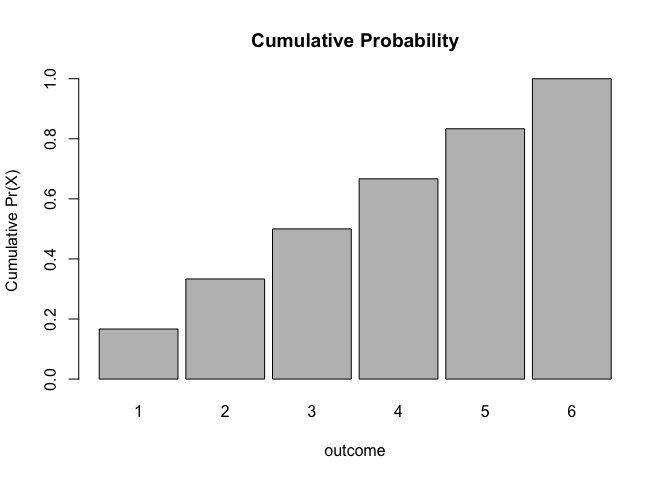

1.  *Probability Density Functions (PDFs)* are associated with continuous random variables. These functions describe the probability that a random variable falls within a given range of outcome values.

To be a valid *PDF*, a function *f*(*x*) must satisfy the following:

1.  *f*(*x*) ≥ 0 for all −∞ ≤ *x* ≤ +∞
2.  ∫<sub>−∞</sub><sup>+∞</sup> *f*(*x*) d*x* = 1. That is, the total area under *f*(*x*) = 1

#### An Example

The **Beta Distribution** refers to a family of continuous probability distributions defined over the interval \[0, 1\] and parametrized by two positive shape parameters, denoted by *α* and *β*, that appear as exponents of the random variable *x* and control the shape of the distribution.

*f*(*x*) = *K* *x*<sup>*α* − 1</sup>(1 − *x*)<sup>*β* − 1</sup>

If we set *K* = 2, *α* = 2, and *β* = 1 and restrict the domain of *x* to \[0, 1\], it gives us a triangular function that we can graph as follows:

``` r
> library(ggplot2)
> a <- 2
> b <- 1
> K <- 2
> x <- seq(from = 0, to = 1, by = 0.025)
> fx <- K * x^(a - 1) * (1 - x)^(b - 1)
> lower_x <- seq(from = -0.25, to = 0, by = 0.025)  # add some values of x less than zero
> upper_x <- seq(from = 1, to = 1.25, by = 0.025)  # add some values of x greater than one
> lower_fx <- rep(0, 11)  # add fx=0 values to x<0
> upper_fx <- rep(0, 11)  # add fx=0 values to x>1
> x <- c(lower_x, x, upper_x)  # paste xs together
> fx <- c(lower_fx, fx, upper_fx)  # paste fxs together
> d <- as.data.frame(cbind(x, fx))
> p <- ggplot(data = d, aes(x = x, y = fx)) + xlab("x") + ylab("f(x)") + geom_line()
> p
```

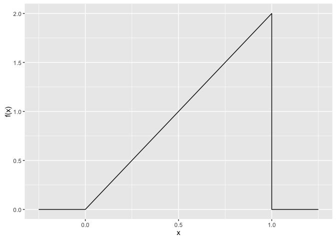

Is this a *PDF*? Why or why not? Yes... it satisfies both criteria for a *PDF*.

1.  *f*(*x*) ≥ 0 for all −∞ ≤ *x* ≤ +∞
2.  The total area under *f*(*x*) = 1

We can show this interactively using the code below:

``` r
> library(manipulate)
> manipulate(
>   ggplot(data = d, aes(x=x, y=fx)) +
>       xlab("x") + ylab("f(x)") +
>       geom_line() +
>       geom_polygon(data=data.frame(xvals=c(0,n,n,0),fxvals=c(0,K*n^(a-1)*(1-n)^(b-1),0,0)), aes(x=xvals,y=fxvals)) +
>       ggtitle(paste("Area Under Function = ", 0.5 * n * K*n^(a-1)*(1-n)^(b-1),sep=" ")),
>   #define variable that will be changed in plot
>     n=slider(0, 1, initial=0.5, step=0.01)
> )
```

The shaded area here represents the **cumulative probability** integrated across *f*(*x*) from −inf to *x*.

The **cumulative distribution function**, or **CDF**, of a random variable is defined as the probability of observing a random variable *X* taking the value of *x* or less, i.e., *f*(*x*) = *Pr* (*X* ≤ *x*)

-   This definition applies regardless of whether *X* is discrete or continuous.

``` r
> x <- seq(from = 0, to = 1, by = 0.005)
> prob <- 0.5 * x * K * x^(a - 1) * (1 - x)^(b - 1)
> barplot(prob, names.arg = x, space = 0, main = "Cumulative Probability", xlab = "x", 
+     ylab = "Pr(X ≤ x)")
```

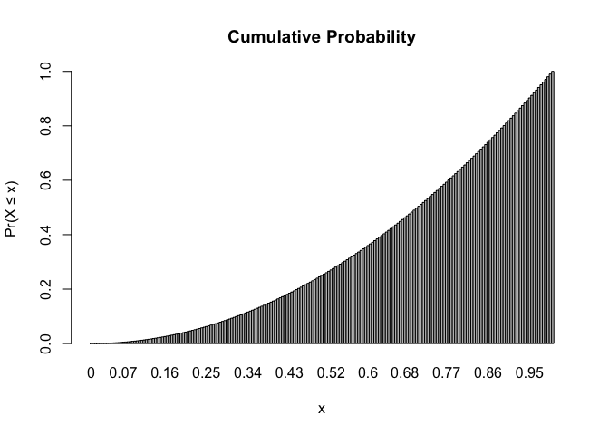

The built in ***R*** function for the **Beta Distribution**, `pbeta()`, can give us the cumulative probability directly, if we specify the values of *α* = 2 and *β* = 1.

``` r
> pbeta(0.75, 2, 1)  # cumulative probability for x ≤ 0.75
```

    ## [1] 0.5625

``` r
> pbeta(0.5, 2, 1)  # cumulative probability for x ≤ 0.50
```

    ## [1] 0.25

In general, we find the cumulative probability for a continuous random variable by calculating the area under the probability density function of interest from −∞ to *x*. This is what is is being returned from `pbeta()`. The other related **Beta Distribution** functions, e.g., `rbeta()`, `dbeta()`, and `qbeta()`, are also useful. `rbeta()` draws random observations from a specfied beta distribution. `dbeta()` gives the point estimate of the beta density function at the value of the argument *x*, and `qbeta()` is essentially the converse of `pbeta()`, i.e., it tells you the value of *x* that is associated with a particular cumulative probability, or quantile, of the cumulative distribution function. Other *PMFs* and *PDFs* have comparable `r`, `d`, `p`, and `q` functions.

Note the relationship between the `p` and `q` functions:

``` r
> pbeta(0.7, 2, 1)  # yields .49
```

    ## [1] 0.49

``` r
> qbeta(0.49, 2, 1)  # yield 0.7
```

    ## [1] 0.7

Finally, we can define the **survival function** for a random variable *X* as *S*(*x*) = *Pr* (*X* &gt; *x*) = 1 - *Pr* (*X* ≤ *x*) = 1 - *f*(*x*)

Expected Mean and Variance of Random Variables
----------------------------------------------

The mean value (or expectation) and the expected variance for a random varible with a given *probability mass function* can be expressed generally as follows:

*μ*<sub>*X*</sub> = Expectation for *X* = ∑ *x*<sub>*i*</sub> × *Pr* (*X* = *x*<sub>*i*</sub>) for all *x* from *x*<sub>*i*</sub> to *x*<sub>*k*</sub>

*σ*<sub>*X*</sub><sup>2</sup> = Variance of *X* = ∑ (*x*<sub>*i*</sub> − *μ*<sub>*X*</sub>)<sup>2</sup> × *Pr* (*X* = *x*<sub>*i*</sub>) for all *x* from *x*<sub>*i*</sub> to *x*<sub>*k*</sub>

Applying these formulae to die rolls, we could calculate the expectation for *X* for a large set of die rolls...

(1 \* 1/6) + (2 \* 1/6) + ... + (6 \* 1/6) = 3.5

``` r
> m <- sum(seq(1:6) * 1/6)
> m
```

    ## [1] 3.5

And the expected variance...

\[(1 - 3.5)^2 \* (1/6)\] + \[(2 - 3.5)^2 \* (1/6)\] + ... + \[(6 - 3.5)^2 \* (1/6)\] =

``` r
> var <- sum((seq(1:6) - mean(seq(1:6)))^2 * (1/6))
> var
```

    ## [1] 2.916667

Likewise, we can calculate the expectation and variance for a random varible *X* with a given *probability density function* generally as follows:

*μ*<sub>*X*</sub> = Expectation for *X* = ∫<sub>−∞</sub><sup>+∞</sup> *x* *f*(*x*) d*x*

*σ*<sub>*X*</sub><sup>2</sup> = Variance of *X* = ∫<sub>−∞</sub><sup>+∞</sup> (*x* − *μ*<sub>*X*</sub>)<sup>2</sup> *f*(*x*) d*x*

To demonstrate these numerically would require a bit of calculus, i.e., *integration*.

Useful Probability Distributions for Random Variables
-----------------------------------------------------

### Probability Mass Functions

#### The Bernoulli Distribution

The **Bernoulli Distribution** is the probability distribution of a *binary* random variable, i.e., a variable that has only two possible outcomes, such as success or failure, heads or tails, true or false. If *p* is the probability of one outcome, then 1 − *p* has to be the probabilty of the alternative. For flipping a fair coin, for example, *p* = 0.5 and 1 − *p* also = 0.5.

For the **BERNOULLI DISTRIBUTION**, the probability mass function is:

*f*(*x*) = *p*<sup>*x*</sup>(1 − *p*)<sup>1 − *x*</sup> where *x* = {0 or 1}

For this distribution, *μ*<sub>*X*</sub> = *p* and *σ*<sub>*X*</sub><sup>2</sup> = *p*(1 − *p*)

#### CHALLENGE:

Using the Bernoulli distribution, calculate the expectation for drawing a *spade* from a deck of cards? What is the variance in this expectation across a large number of draws?

*Pr* (spade) = (13/52)<sup>1</sup> × (39/52)<sup>0</sup> = 0.25

*Var* (spade) = (13/52) × (1 − 13/52) = (0.25) × (0.75) = 0.1875

#### Binomial Distribution

The Bernoulli distribution is a special case of the **Binomial Distribution**. The binomial distribution is typically used to model the probability of a number of "successes" *k* out of a set of "trials" *n*, i.e., for *counts* of a particular outcome.

Again, the probability of *success* on each trial = *p* and the probability of *not success* = 1 − *p*.

For the **BINOMIAL DISTRIBUTION**, the probability mass function is:

*f*(*x*) = $\\binom{n}{k}$ *p*<sup>*k*</sup>(1 − *p*)<sup>*n* − *k*</sup> where *x* = {0, 1, 2, ... , n}

and where $\\binom{n}{k}$ = $\\frac{n!}{k!(n-k)!}$

This is read as "*n* choose *k*", i.e., the probability of *k* successes out of *n* trials.

For this distribution, *μ*<sub>*X*</sub> = *np* and *σ*<sub>*X*</sub><sup>2</sup> = *np*(1-*p*). Recall, *μ*<sub>*X*</sub> = expected number of successes in *n* trials

Where *n* = 1, this simplifies to the Bernoulli distribution.

#### CHALLENGE:

What is the chance of getting a "1" on each of six consecutive rolls of a die? What about of getting exactly three "1"s? What is the expected number of "1"s to occur in six consecutive rolls?

``` r
> n <- 6  # number of trials
> k <- 6  # number of successes
> p <- 1/6
> prob <- (factorial(n)/(factorial(k) * factorial(n - k))) * (p^k) * (1 - p)^(n - 
+     k)
> prob
```

    ## [1] 2.143347e-05

``` r
> k <- 3  # number of successes
> prob <- (factorial(n)/(factorial(k) * factorial(n - k))) * (p^k) * (1 - p)^(n - 
+     k)
> prob
```

    ## [1] 0.05358368

As for other distributions, ***R*** has a built in `density` function, the `dbinom()` function, that you can use to solve for the probability of a given outcome, i.e., *Pr* (*X* = *x*).

``` r
> dbinom(x = k, size = n, prob = p)
```

    ## [1] 0.05358368

We can also use the built in function `pbinom()` to return the value of the **cumulative distribution function** for the binomial distribution, i.e., the probability of observing up to and including a given number of successes in *n* trials.

So, for example, the chances of observing exactly 0, 1, 2, 3, ... 6 rolls of "1" on 6 rolls of a die are...

``` r
> probset <- dbinom(x = 0:6, size = 6, prob = 1/6)  # x is number of successes, size is number of trials
> barplot(probset, names.arg = 0:6, space = 0, xlab = "outcome", ylab = "Pr(X = outcome)", 
+     main = "Probability Mass Function")
```

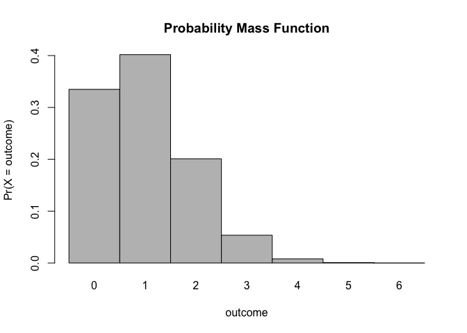

``` r
> cumprob = cumsum(probset)
> barplot(cumprob, names.arg = 0:6, space = 0.1, xlab = "outcome", ylab = "Cumulative Pr(X)", 
+     main = "Cumulative Probability")
```

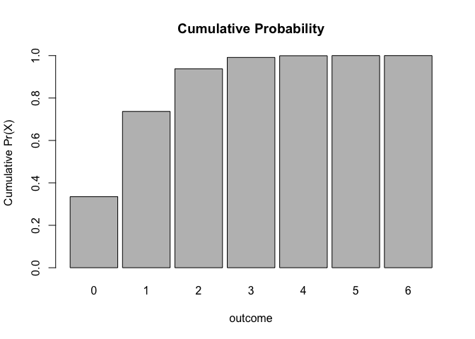

``` r
> sum(probset)  # equals 1, as it should
```

    ## [1] 1

The chance of observing exactly 3 rolls of "1" is...

``` r
> dbinom(x = 3, size = 6, prob = 1/6)
```

    ## [1] 0.05358368

And the chance of observing up to and including 3 rolls of "1" is...

``` r
> pbinom(q = 3, size = 6, prob = 1/6)  # note the name of the argument is q not x
```

    ## [1] 0.991298

... which can also be calculated by summing the relevant individual outcome probabilities...

``` r
> sum(dbinom(x = 0:3, size = 6, prob = 1/6))  # this sums the probabilities of 0, 1, 2, and 3 successes
```

    ## [1] 0.991298

#### Poisson Distribution

The **Poisson Distribution** is often used to model open ended counts of independently occuring events, for example the number of cars that pass a traffic intersection over a given interval of time or the number of times a monkey scratches itself during a given observation interval. The *probability mass function* for the Poisson distribution is described by a single parameter, *λ*, where *λ* can be interpreted as the mean number of occurrences of the event in the given interval.

The probability mass function for the **POISSON DISTRIBUTION** is:

*f*(*x*) = $\\frac{\\lambda^xexp(-\\lambda)}{x!}$ where *x* = {0, 1, 2, ...}

For this distribution, *μ*<sub>*X*</sub> = *λ* and *σ*<sub>*X*</sub><sup>2</sup> = *λ*

Note that the mean and the variance are the same!

Let's use ***R*** to look at the probability mass functions for different values of *λ*:

``` r
> x <- 0:10
> l = 3.5
> probset <- dpois(x = x, lambda = l)
> barplot(probset, names.arg = x, space = 0, xlab = "x", ylab = "Pr(X = x)", main = "Probability Mass Function")
```

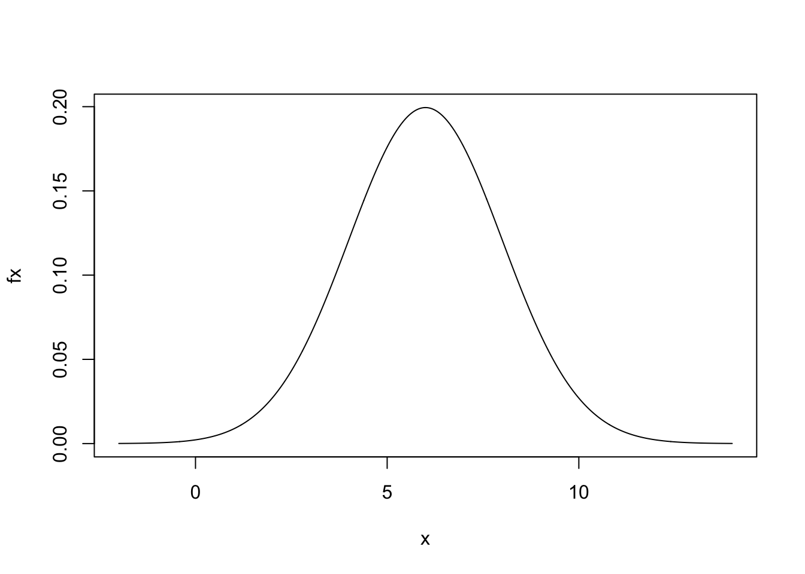

``` r
> x <- 0:20
> l = 10
> probset <- dpois(x = x, lambda = l)
> barplot(probset, names.arg = x, space = 0, xlab = "x", ylab = "Pr(X = x)", main = "Probability Mass Function")
```

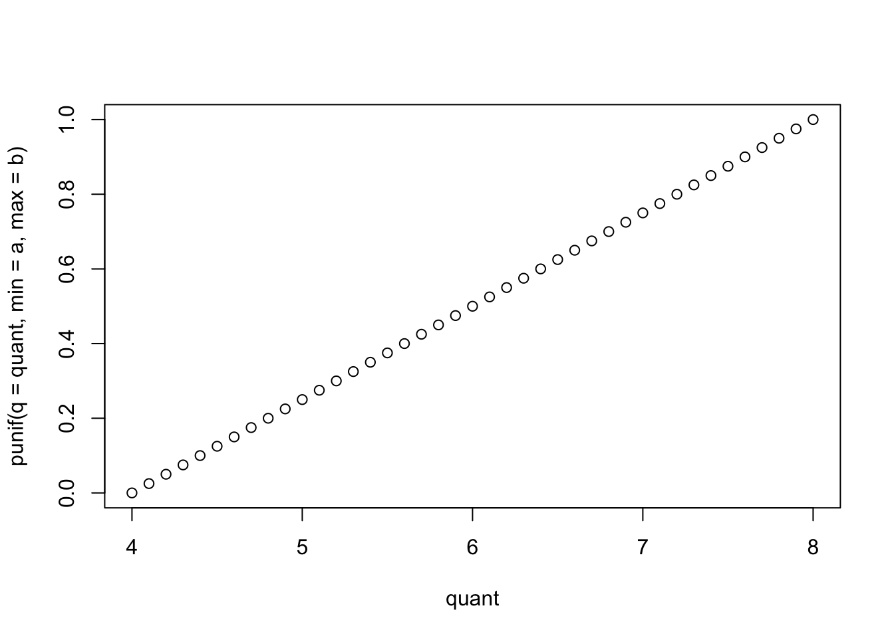

``` r
> x <- 0:50
> l = 20
> probset <- dpois(x = x, lambda = l)
> barplot(probset, names.arg = x, space = 0, xlab = "x", ylab = "Pr(X = x)", main = "Probability Mass Function")
```

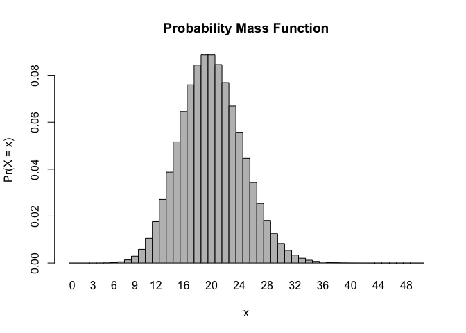

As we did for other distributions, we can also use the built in `probability` function for the Poisson distribution, `ppois()`, to return the value of the **cumulative distribution function**, i.e., the probability of observing up to and including a specific number of events in the given interval.

``` r
> x <- 0:10
> l <- 3.5
> barplot(ppois(q = x, lambda = l), ylim = 0:1, space = 0, names.arg = x, xlab = "x", 
+     ylab = "Pr(X ≤ x)", main = "Cumulative Probability")
```


``` r
> x <- 0:20
> l <- 10
> barplot(ppois(q = x, lambda = l), ylim = 0:1, space = 0, names.arg = x, xlab = "x", 
+     ylab = "Pr(X ≤ x)", main = "Cumulative Probability")
```

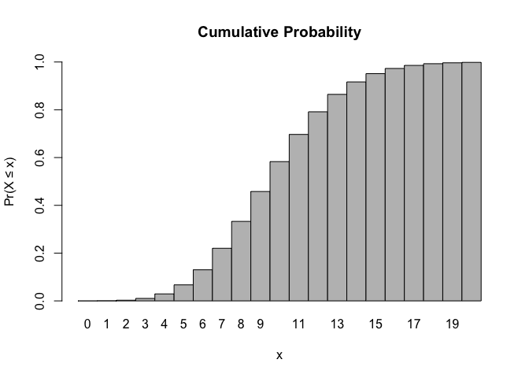

``` r
> x <- 0:50
> l <- 20
> barplot(ppois(q = x, lambda = l), ylim = 0:1, space = 0, names.arg = x, xlab = "x", 
+     ylab = "Pr(X ≤ x)", main = "Cumulative Probability")
```

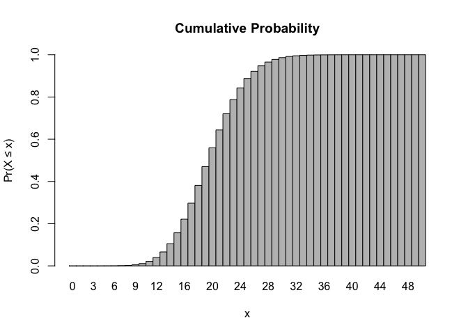

#### HOMEWORK:

Create a new ***GitHub*** repository and a new ***R*** Project named "homework-week-4". In your repo, create an **R Markdown** file and answer the following problems. When you are done, "knit" your **R Markdown** file to `.html` and push your `.Rmd` and `.html` files up to ***GitHub*** for me to look at.

Problem 1:

Every Saturday, at the same time, a primatologist goes and sits in the forest in the morning and listens for titi monkey calls, counting the number of calls they hear in a 2 hour window from 5am to 7am. Based on previous knowledge, she believes that the mean number calls she will hear in that time is exactly 15. Let *X* represent the appropriate Poisson random variable of the number of calls heard in each monitoring session.

-   What is the probability that she will hear more than 8 calls during any given session?
-   What is the probability that she will hear no calls in a session?
-   What is the probability that she will hear exactly 3 calls in a session?
-   Plot the relevant Poisson mass function over the values in range 0 ≤ *x* ≤ 30.
-   Simulate 104 results from this distribution (i.e., 2 years of Saturday monitoring sessions).
-   Plot the simulated results using `hist()` and use `xlim()` to set the horizontal limits to be from 0 to 30. How does your histogram compare to the shape of the probability mass function you plotted above?

### Probability Density Functions

#### Uniform Distribution

The **Uniform Distribution** is the simplest probability density function describing a continuous random variable. The probability is uniform and does not fluctuate across the range of *x* values in a given interval.

The probability density function for the **UNIFORM DISTRIBUTION** is:

*f*(*x*) = $\\frac{1}{b-a}$ where *a* ≤ *x* ≤ *b* and 0 for *x* &lt; *a* and *x* &gt; *b*

#### CHALLENGE:

What would you predict the expectation (mean) should be for a uniform distribution?

For this distribution *μ*<sub>*X*</sub> = $\\frac{b-a}{2}$ and *σ*<sub>*X*</sub><sup>2</sup> = $\\frac{(b-a)^2}{12}$

Let's plot a uniform distribution across a given range, from *a* = 4 to *b* = 8...

``` r
> a <- 4
> b <- 8
> x <- seq(from = a - (b - a), to = b + (b - a), by = 0.01)
> fx <- dunif(x, min = a, max = b)  # dunif() evaluates the density at each x
> plot(x, fx, type = "l", xlab = "x", ylab = "f(x)", main = "Probability Density Function")
```

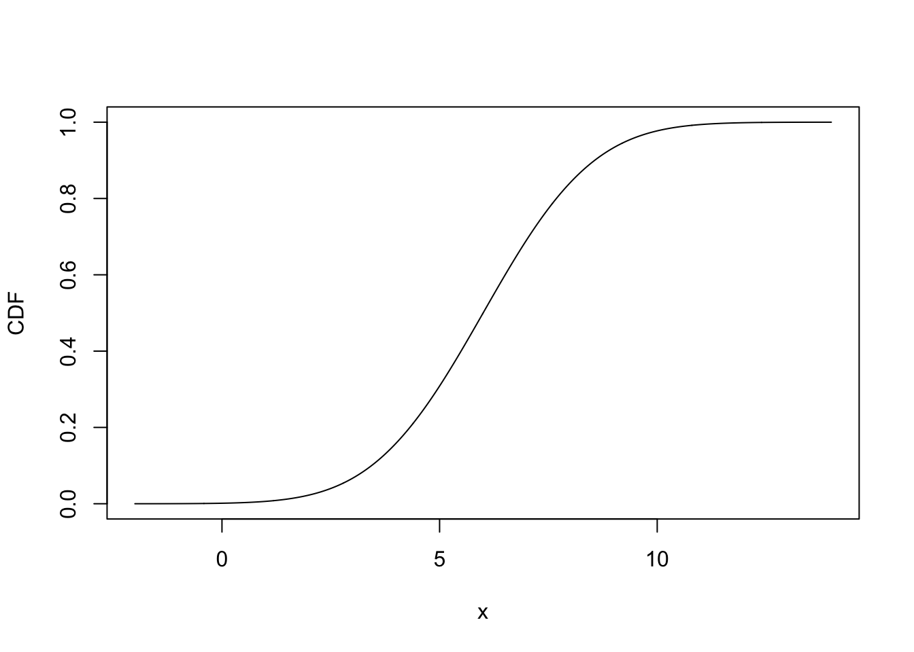

``` r
> # punif() is the cumulative probability density up to a given x
> plot(x, punif(q = x, min = a, max = b), type = "l", xlab = "x", ylab = "Pr(X ≤ x)", 
+     main = "Cumulative Probability")  # the CDF increases linearly over the given interval
```

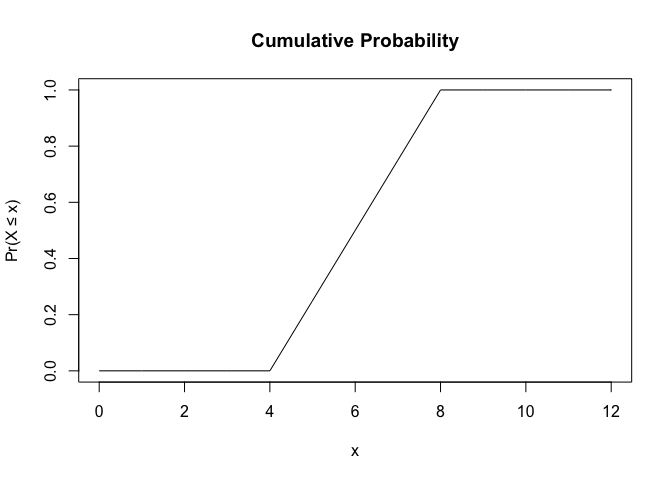

#### CHALLENGE:

Simulate a sample of 10000 random numbers from a uniform distribution in the interval between *a* = 6 and *b* = 8. Calculate the mean and variance of this simulated sample and compare it to the expectation for these parameters, i.e., *μ*<sub>*X*</sub> = $\\frac{b-a}{2}$ and *σ*<sub>*X*</sub><sup>2</sup> = $\\frac{(b-a)^2}{12}$.

#### Normal Distribution

The **Normal** or **Gaussian Distribution** is perhaps the most familiar and most commonly applied probability density functions for modeling continuous random variables. Two parameters, *μ* and *σ*, are used to describe a normal distribution.

We can get an idea of the shape of a normal distribution with different *μ* and *σ* using the ***R*** code below. Type it in and then play with values of *μ*, *σ*, and *nsigma* (which shades in the proportion of the distribution falling within that number of standard deviations of the mean). Also, look carefully at the code to try to figure out what each bit is doing.

The function, `dnorm()` gives the value of the normal density function at a given value of *x*. *x* can range from -∞ to +∞. Recall, it does not make sense to talk about the "probability" associated with a given value of *x* as this isa density not a mass functions, but we can talk about the probability of *x* falling within a given interval.

``` r
> manipulate(plot(seq(from = (mu - 6 * sigma), to = (mu + 6 * sigma), length.out = 1000), 
+     dnorm(seq(from = (mu - 6 * sigma), to = (mu + 6 * sigma), length.out = 1000), 
+         mean = mu, sd = sigma), type = "l", xlim = c(-20, 20), xlab = "x", ylab = "f(x)", 
+     main = "Probability Density Function") + polygon(rbind(c(mu - nsigma * sigma, 
+     0), cbind(seq(from = (mu - nsigma * sigma), to = (mu + nsigma * sigma), 
+     length.out = 1000), dnorm(seq(from = (mu - nsigma * sigma), to = (mu + nsigma * 
+     sigma), length.out = 1000), mean = mu, sd = sigma)), c(mu + nsigma * sigma, 
+     0)), border = NA, col = "gray") + abline(h = 0) + abline(v = c(mu - nsigma * 
+     sigma, mu + nsigma * sigma)), mu = slider(-10, 10, initial = 0, step = 0.25), 
+     sigma = slider(0.25, 10, initial = 1, step = 0.25), nsigma = slider(0, 4, 
+         initial = 0, step = 0.5))
```

The `pnorm()` function, as with the `p-` variant function for other distributions, returns the cumulative probability of observing a value less than or equal to *x*, i.e., *Pr* (*X* ≤ *x*). Type it the code below and then play with values of *μ* and *σ* to look at how the *cumulative distibution function* changes.

``` r
> manipulate(plot(seq(from = (mu - 6 * sigma), to = (mu + 6 * sigma), length.out = 1000), 
+     pnorm(seq(from = (mu - 6 * sigma), to = (mu + 6 * sigma), length.out = 1000), 
+         mean = mu, sd = sigma), type = "l", xlim = c(-20, 20), xlab = "x", ylab = "f(x)", 
+     main = "Cumulative Probability"), mu = slider(-10, 10, initial = 0, step = 0.25), 
+     sigma = slider(0.25, 10, initial = 1, step = 0.25))  # plots the cumulative distribution function
```

You can also use `pnorm()` to calculate the probability of an observation's value falling within a particular interval. For example, for a normal distribution with *μ* = 6 and *σ* = 2, the probability of an random observation falling between 7 and 8 is...

``` r
> p <- pnorm(8, mean = 6, sd = 2) - pnorm(7, mean = 6, sd = 2)
> p
```

    ## [1] 0.1498823

Likewise, the you can use `pnorm()` to calculate, for example, the probability that an observation falls within 2 standard deviations of the mean a particular normal distribution is...

``` r
> mu <- 0
> sigma <- 1
> p <- pnorm(mu + 2 * sigma, mean = mu, sd = sigma) - pnorm(mu - 2 * sigma, mean = mu, 
+     sd = sigma)
> p
```

    ## [1] 0.9544997

So... about 95% of the normal distribution falls within 2 standard deviations of the mean. And about 68% of the distribution falls within 1 standard deviation.

``` r
> p <- pnorm(mu + 1 * sigma, mean = mu, sd = sigma) - pnorm(mu - 1 * sigma, mean = mu, 
+     sd = sigma)
> p
```

    ## [1] 0.6826895

Is this true for different values of *μ* and *σ* as well?

The `qnorm()` function will tell us the value of *x* below which a given proportion of the cumulative probability function falls. As we saw earlier, we can use `qnorm()` to calculate confidence intervals.

``` r
> manipulate(plot(seq(from = (mu - 6 * sigma), to = (mu + 6 * sigma), length.out = 1000), 
+     dnorm(seq(from = (mu - 6 * sigma), to = (mu + 6 * sigma), length.out = 1000), 
+         mean = mu, sd = sigma), type = "l", xlim = c(-20, 20), xlab = "x", ylab = "f(x)", 
+     main = "Probability Density Function") + abline(h = 0) + abline(v = c(qnorm((1 - 
+     CI)/2, mean = mu, sd = sigma), qnorm(1 - (1 - CI)/2, mean = mu, sd = sigma))), 
+     mu = slider(-10, 10, initial = 0, step = 0.25), sigma = slider(0.25, 10, 
+         initial = 1, step = 0.25), CI = slider(0.5, 0.99, initial = 0.9, step = 0.01))
```

#### CHALLENGE:

-   Create a vector containing **N** random numbers selected from a normal distribution with mean *μ* and standard deviation *σ*. Use 1000 for **N**, 3.5 for *μ*, and 4 for *σ*. **HINT:** such a function exists! `rnorm()`.
-   Calculate the mean, variance, and standard error of the mean in your set of random numbers.
-   Plot a histogram of your random numbers.

``` r
> N <- 1000
> mu <- 3.5
> sigma <- 4
> v <- rnorm(N, mu, sigma)
> mean(v)
```

    ## [1] 3.661033

``` r
> var(v)
```

    ## [1] 16.43401

``` r
> se <- sqrt(var(v)/N)
> se
```

    ## [1] 0.1281952

``` r
> hist(v, breaks = seq(from = -15, to = 20, by = 0.5), probability = TRUE)
```


A quantile-quantile plot can be used to look at whether the

``` r
> qqnorm(v, main = "Normal QQ plot random normal variables")
> qqline(v, col = "gray")
```

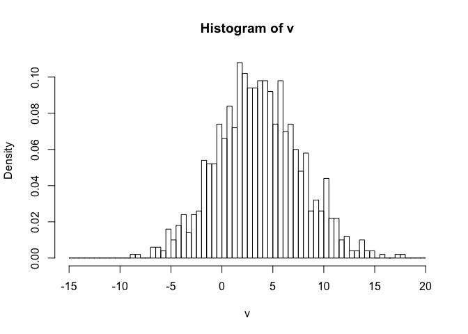

#### HOMEWORK (Continued)

Answer this question in the same `.Rmd` and `.html` file you started for Problem 1.

Problem 2:
