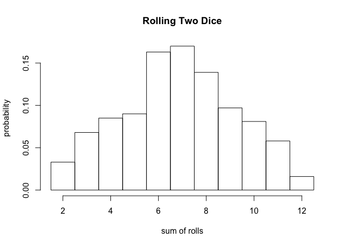
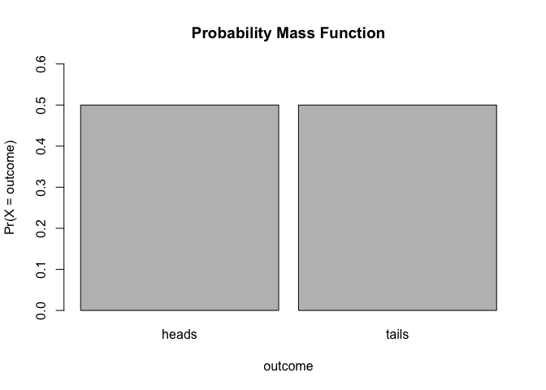
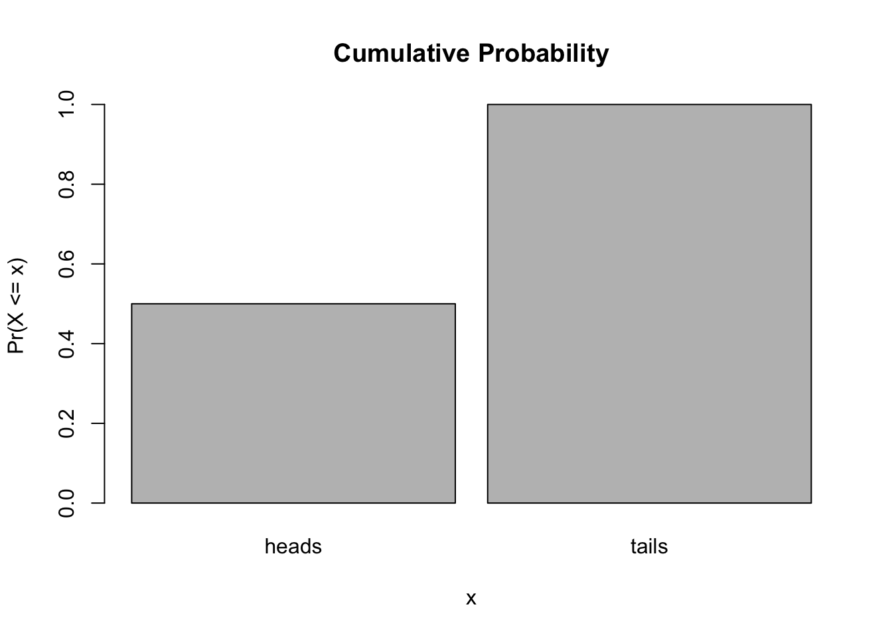
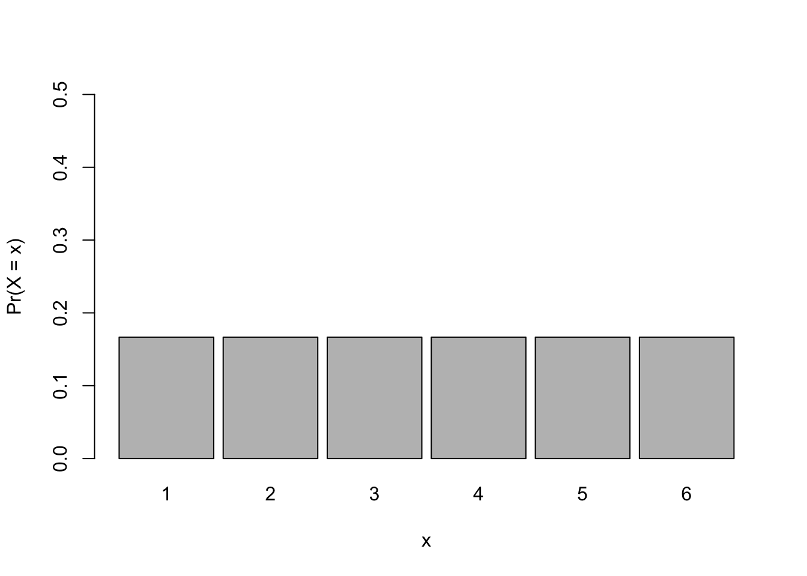
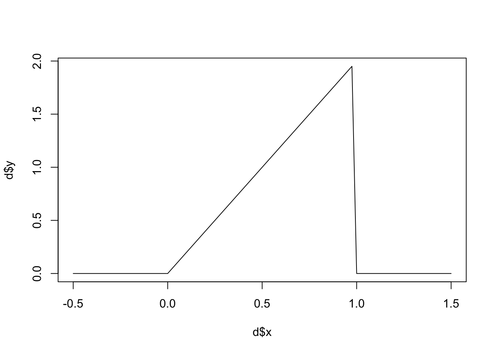

Module 08
================

Statistical Inference
=====================

Objectives
----------

> The objective of this module to begin our discussion of statistical inference from a frequentist statistics approach. Doing so means that we need to cover basics of probability and distributions

Important Terms and Concepts to Reiterate
-----------------------------------------

-   **Population** = includes **all** of the elements from a set of data = ***N***
-   **Sample** = one or more observations from a population = ***n***
-   **Parameter** = a measurable characteristic of a *population*
-   **Statistic** = a measureable characteristic about a *sample*

When we do **statistical inference** we are basically trying to draw conclusions about a *population* based on measurements from a noisy *sample* or we are trying to evaluate whether it is reasonable to assume that our sample is drawn from a particular population.

This process of trying to draw conclusions is complicated by the fact that...

-   our sample may be biased, non-random, or non-representative in some way
-   there may be unknown or unobserved variables that impact how the sample is related to the population
-   the assumptions we make about the population that our sample is drawn from might not be correct

PROBABILITY
-----------

The term **PROBABILITY** is applied to a population level variables that describe the magnitude of chance associated with a particular observation or event. Probabilities summarize the relative frequencies of possible outcomes of an experiment.

Example: if we roll a (fair) die, there are 6 possible outcomes, each has a probability of occurring of 1 in 6. This is referred to as a *frequentist* or *classical* way of thinking about the probability of different outcomes... the relative frequency with which an event occurs over numerous identical, objective trials.

Simulating die rolling with the `sample()` function... let's play with changing the number of rolls.

``` r
> library(manipulate)
> outcomes <- c(1,2,3,4,5,6)
> manipulate(
>   hist(sample(outcomes, n, replace = TRUE),
>            breaks=c(0.5,1.5,2.5,3.5,4.5,5.5,6.5),
>            probability = TRUE,
>            main = paste("Histogram of Outcomes of ", n, " Die Rolls", sep=""),
>            xlab = "roll",
>            ylab = "probability"),
>   n=slider(0, 10000, initial=100, step=100)
> )
> 
> #### CHALLENGE 1:
> Write a function to simulate die rolling where you pass the number of rolls as an argument. Then, use your function to simulate rolling two dice 1000 times and take the sum of the rolls. Plot a histogram of those results.
```

``` r
> roll <- function(x) {
+     sample(1:6, x, replace = TRUE)
+ }
> two_dice <- roll(2000) + roll(2000)
> hist(two_dice, breaks = c(1.5:12.5), probability = TRUE, main = "Rolling Two Dice", 
+     xlab = "sum of rolls", ylab = "probability")
```



**RULES OF PROBABILITY**

1.  Pr (+) = Probability that something occurs = 1
2.  Pr (0) = Probability that nothing occurs = 0
3.  Pr (A) = Probability that a particular event, A, occurs

    Pr (A) ≥ 0 and Pr (A) ≤ 1

4.  Pr (A ⋃ B) = Probability that particular event A *or* event B occurs = **UNION**

    Pr (A ⋃ B) = Pr(A) + Pr(B) - Pr (A ⋂ B)

    If A and B are mutually exclusive, then this simplifies to Pr (A) + Pr (B)

5.  Pr (A ⋂ B) = Probability that both A *and* B occur simultaneously = **INTERSECTION**.

    Pr (A ⋂ B) = Pr (A|B) × Pr (B) = Pr (B|A) × Pr (A)

    Where the pipe operator ("|") can be read as "given".

    If the 2 events are *independent* (i.e., the probability of one does not depend on the probability of the other), then Pr (A ⋂ B) simplifies to Pr (A) × Pr (B). E.g., the probability that a roll is "odd" and less than 4 = 1/2 \* 1/2

    If Pr (A ⋂ B) = 0, then we say the events are *mutually exclusive* (e.g., you cannot have a die roll be 1 *and* 2)

6.  *E*<sup>*c*</sup> or $\\bar E$ is

Pr $\\bar A$ = Probabilty of the complement of A (i.e., *not* A) = 1 - Pr (A)

$\\bar{\\mathbb{R}}~~\\overline{\\mathbb{R}}~~\\xoverline{\\mathbb{R}}$

**CONDITIONAL PROBABILITY** probability that one event occurs after taking into account the occurrence of another event, i.e., a second event is *conditioned* on the occurrence of a first event

e.g., the probability of a die coming up as a "1" given that we know the die came up as "odd""

library(plotmath)

Pr (A|B) = Pr (A ⋂ B) / Pr (B)

If A and B are independent, then Pr (A|B) = (Pr (A) × Pr (B)) / Pr (B) = Pr (A)

**RANDOM VARIABLE** -- a variable whose outcomes are assumed to arise by chance or according to some random or stochastic mechanism; the chances of observing a specific value or a value within a specific interval for this random variable has associated with it a probability

Random variables come in two varieties:

*Discrete random variables* - random variables that can assume only a countable number of discrete possibilities (e.g., counts of occurrences, categories an observation may fall into); we can assign probabilities to the occurence of each value

-   *P*(*X* = *k*)

*Continuous random variables* - random variables that can assume any real number value within a given range (e.g., measurements). We cannot assign probabilities to the occurrence of each value, but we can assign probabilites to intervals of values.

-   *P*(*X* ∈ *A*)

**PROBABILITY FUNCTION** - a mathematical function that describes the chance associated with a random variable having a particular value or falling within a given range of values.

We can distinguish two types of such functions:

*Probability Mass Functions (PMF)* - associated with discrete random variables; describes the probability that a random variable takes a particular value

To be a valid *PMF*, a function, *f*, must satisfy the following:

1.  There are *k* distinct outcomes *x*<sub>1</sub>, *x*<sub>2</sub>, ..., *x*<sub>*k*</sub>
2.  *P*(*X* = *x*<sub>*i*</sub>) ≥ 0 and ≤ 1 for all *x*<sub>*i*</sub>
3.  $\\sum\_i^k kjsgkl=1$

P(X=x\_i) = 1

where the sum is taken over all possible values for *x*.

Example:

``` r
> outcomes <- c("heads", "tails")
> prob <- c(1/2, 1/2)
> barplot(prob, ylim = c(0, 0.6), names.arg = outcomes, space = 0.1, xlab = "x", 
+     ylab = "Pr(X = x)")
```



``` r
> outcomes <- c(1, 2, 3, 4, 5, 6)
> prob <- c(1/6, 1/6, 1/6, 1/6, 1/6, 1/6)
> barplot(prob, ylim = c(0, 0.5), names.arg = outcomes, space = 0.1, xlab = "x", 
+     ylab = "Pr(X = x)")
```



``` r
> cumprob <- cumsum(prob)
> 
> barplot(cumprob, names.arg = outcomes, space = 0.1, xlab = "x", ylab = "Pr(X <= x)")
```



*Probability Density Function (PDF)* - associated with continuous random variables; describes the probability that a random variable falls within a given range of values

To be a valid *PDF*, a function *f* must satisfy

1.  *f*(*x*)≥0 for all *x*
2.  The total area under *f*(*x*) = 1

Example: The beta distribution refers to a family of continuous probability distributions defined over the interval \[0, 1\], parametrized by two positive shape parameters, denoted by α and β, that appear as exponents of the random variable and control the shape of the distribution.

*f*(*x*; *α*, *β*)=*x*<sup>*α* − 1</sup>(1 − *x*)<sup>*β* − 1</sup>

Let's set α = 2 and β = 1 and restrict the domain to \[0, 1\] - this will give us a triangular function

``` r
> a <- 2
> b <- 1
> x <- seq(from = -0.5, to = 1.5, by = 0.025)
> y <- 2 * x^(a - 1) * (1 - x)^(b - 1)
> d <- as.data.frame(cbind(x, y))
> d$y[d$x <= 0 | d$x >= 1] <- 0
> plot(d$x, d$y, type = "l")
```



If this a *PDF*? Why or why not?

The **cumulative distribution function** (CDF) of a random variable is defined as the function
*f*(*x*)=*P*(*X* ≤ *x*)

-   This definition applies regardless of whether *X* is discrete or continuous.

The CDF gives the probability of a random variable being ≤*x*

returns the probability that the random variable is less than or equal to the value *x*

-   The **survival function** of a random variable *X* is defined as
    *S*(*x*)=*P*(*X* &gt; *x*)
-   Notice that *S*(*x*)=1 − *F*(*x*)
-   For continuous random variables, the PDF is the derivative of the CDF You find a cumulative probability for a continuous random variable by calculating the area under the density function of interest from −∞ to w

``` p
> 
+ pbeta(0.5,2,1)
```
