Module 08
================

Probabilities and Distributions
===============================

Preliminaries
-------------

-   Install this packages in ***R***: {manipulate}

Objectives
----------

> The objective of this module is to begin our discussion of *statistical inference* from a frequentist/classical statistics approach. Doing so means that we need to cover basics of probability and distributions.

Important Terms and Concepts to Reiterate
-----------------------------------------

-   **Population** = includes **all** of the elements from a set of data = ***N***
-   **Sample** = one or more observations from a population = ***n***
-   **Parameter** = a measurable characteristic of a *population*
-   **Statistic** = a measureable characteristic about a *sample*

When we do **statistical inference** we are basically trying to draw conclusions about a *population* based on measurements from a noisy *sample* or trying to evaluate whether it is reasonable to assume that our sample is drawn from a particular population.

This process of trying to draw conclusions is complicated by the fact that...

-   our sample may be biased, non-random, or non-representative in some way
-   there may be unknown or unobserved variables that impact how the sample is related to the population
-   the assumptions we make about the population that our sample is drawn from might not be correct

### Probability

The term **probability** is applied to **population level** variables that describe the magnitude of chance associated with particular observations or event. Probabilities summarize the relative frequencies of possible outcomes. Probabilities are properties of **distributions**. Probabilities vary between zero and one. Outcomes that are impossible have *Pr = 0*, those that are certain have *Pr = 1*.

Example: if we roll a (fair) die, there are 6 possible outcomes, each has a probability of occurring of 1 in 6. This is referred to as a *frequentist* or *classical* way of thinking about the probability of different outcomes... the relative frequency with which an event occurs over numerous identical, objective trials.

#### Simulating Die Rolling

We will use the {manipulate} package and the `sample()` function to explore the effects of sample size on estimates of the probability of different outcomes. The probability of each outcome (rolling a "1", "2",..., "6") is 1 in 6, but our estimate of the probability of each possible outcome will change with sample size.

``` r
> library(manipulate)
> outcomes <- c(1, 2, 3, 4, 5, 6)
> manipulate(hist(sample(outcomes, n, replace = TRUE), breaks = c(0.5, 1.5, 2.5, 
+     3.5, 4.5, 5.5, 6.5), probability = TRUE, main = paste("Histogram of Outcomes of ", 
+     n, " Die Rolls", sep = ""), xlab = "roll", ylab = "probability"), n = slider(0, 
+     10000, initial = 100, step = 100))
```

#### CHALLENGE 1:

Write a function to simulate rolling a die where you pass the number of rolls as an argument. Then, use your function to simulate rolling two dice 1000 times and take the sum of the rolls. Plot a histogram of those results.

``` r
> nrolls <- 1000
> roll <- function(x) {
+     sample(1:6, x, replace = TRUE)
+ }
> two_dice <- roll(nrolls) + roll(nrolls)
> hist(two_dice, breaks = c(1.5:12.5), probability = TRUE, main = "Rolling Two Dice", 
+     xlab = "sum of rolls", ylab = "probability")
```

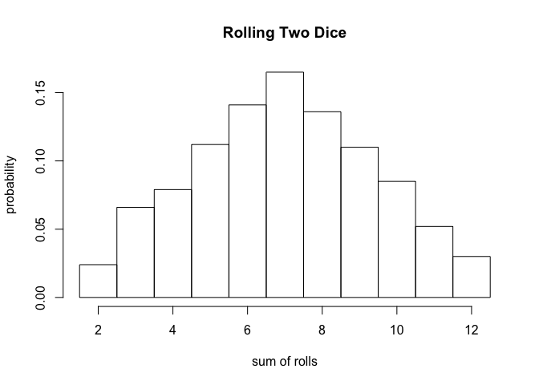

### Rules of Probability

1.  *Pr* ( + ) = Probability that something occurs = 1
2.  *Pr* (∅) = Probability that nothing occurs = 0
3.  *Pr* (*A*) = Probability that a particular event *A* occurs

    0 ≤ *Pr* (*A*) ≤ 1

4.  *Pr* (*A* ⋃ *B*) = Probability that a particular event *A* *or* a particular event *B* occurs = **UNION**

    *Pr* (*A* ⋃ *B*) = *Pr* (*A*) + *Pr* (*B*) - *Pr* (*A* ⋂ *B*)

    If event *A* and *B* are *mutually exclusive*, then this simplifies to *Pr* (*A*) + *Pr* (*B*)

5.  *Pr* (*A* ⋂ *B*) = Probability that both *A* *and* *B* occur simultaneously = **INTERSECTION**

    *Pr* (*A* ⋂ *B*) = *Pr* (*A* | *B*) × *Pr* (*B*) = *Pr* (*B* | *A*) × *Pr* (*A*)

    where the pipe operator ( | ) can be read as "given".

    If the 2 events are *independent* (i.e., if the probability of one does not depend on the probability of the other), then *Pr* (*A* ⋂ *B*) simplifies to...

    *Pr* (*A*) × *Pr* (*B*)

    If *Pr* (*A* ⋂ *B*) = 0, then we say the events are *mutually exclusive* (e.g., you cannot have a die roll be 1 *and* 2)

6.  *Pr* (*Ā*) = Probability of the complement of *A* (i.e., *not* *A*) = 1 - *Pr* (*A*)

7.  *Conditional Probability* is the probability of an event occuring after taking into account the occurrence of another event, i.e., one event is *conditioned* on the occurrence of a different event.

    For example, the probability of a die coming up as a "1" given that we know the die came up as an odd number ("1", "3", or "5").

    *Pr* (*A* | *B*) = *Pr* (*A* ⋂ *B*) ÷ *Pr* (*B*)

    If event *A* and event *B* are *independent*, then *Pr* (*A* | *B*) = \[ *Pr* (*A*) × *Pr* (*B*) \] ÷ *Pr* (*B*) = *Pr* (*A*)

    If event *A* and *B* are *dependent*, then *Pr* (*A* | *B*) ≠ *Pr* (*A*)

#### CHALLENGE 2:

You have a deck of 52 cards, Ace to 10 + 3 face cards in each suit. You draw a card at random.

-   What is the probability that you draw a *face card*?
-   What is the probability that you draw a *King*?
-   What is the probability that you draw a *spade*?
-   What is the probability that you draw a *spade* given that you draw a *face card*?
-   What is the probability that you draw a *King* given that you draw a *face card*?
-   What is the probability that you draw a card that is both from a *red* suit (hearts or diamonds) and a *face card*?

    *Pr* (*A*) = *red suit* = 26/52 = 1/2

    *Pr* (*B*) = *face card* = 12/52 =

    *Pr* (*A* | *B*) = *red suit given face card* = 6/12

    *Pr* (*A* ⋂ *B*) = *Pr* (*A* | *B*) × *Pr* (*B*) = 6/12 × 12/52 = 6/52 = 0.1153846

-   What is the probability that you draw a card that is either a *club* or *not a face card*?

    *Pr* (*A*) = *club* = 13/52 = 13/52

    *Pr* (*B*) = *not a face card* = 40/52

    *Pr* (*A* ⋂ *B*) = *club* and *not a face card* = 10/52

    *Pr* (*A* ⋃ *B*) = *Pr* (*A*) + *Pr* (*B*) - *Pr* (*A* ⋂ *B*) = 13/52 + 40/52 - 10/52 = 43/52

### Random Variables

A **random variable** is a variable whose outcomes are assumed to arise by chance or according to some random or stochastic mechanism. The chances of observing a specific outcome or an outcome value within a specific interval has associated with it a **probability**.

Random variables come in two varieties:

1.  *Discrete Random Variables* are random variables that can assume only a countable number of discrete possibilities (e.g., counts of outcomes in a particular category). We can assign a probability to each possible outcome.

2.  *Continuous Random Variables* are random variables that can assume any real number value within a given range (e.g., measurements). We cannot assign a specific probability to each possible outcome value as the set of possible outcomes is infinite, but we can assign probabilites to intervals of outcome values.

With these basics in mind, we can define a few more terms:

A **probability function** is a mathematical function that describes the chance associated with a random variable having a particular outcome or falling within a given range of outcome values.

We can also distinguish two types of probability functions:

1.  *Probability Mass Functions (PMFs)* are associated with discrete random variables. These functions describe the probability that a random variable takes a particular discrete value.

To be a valid *PMF*, a function *f*(*x*) must satisfy the following:

1.  There are *k* distinct outcomes *x*<sub>1</sub>, *x*<sub>2</sub>, ..., *x*<sub>*k*</sub>
2.  0 ≤ *Pr* (*X* = *x*<sub>*i*</sub>) ≤ 1 for all *x*<sub>*i*</sub>
3.  ∑ *Pr* (*X* = *x*<sub>*i*</sub>) for all *x* from *x*<sub>1</sub> to *x*<sub>*k*</sub> = 1

#### Flipping a Fair Coin

``` r
> outcomes <- c("heads", "tails")
> prob <- c(1/2, 1/2)
> barplot(prob, ylim = c(0, 0.6), names.arg = outcomes, space = 0.1, xlab = "outcome", 
+     ylab = "Pr(X = outcome)", main = "Probability Mass Function")
```


``` r
> cumprob <- cumsum(prob)
> barplot(cumprob, names.arg = outcomes, space = 0.1, xlab = "outcome", ylab = "Cumulative Pr(X)", 
+     main = "Cumulative Probability")
```

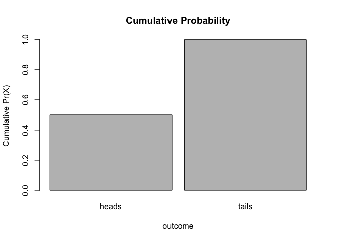

#### Rolling a Fair Die

``` r
> outcomes <- c(1, 2, 3, 4, 5, 6)
> prob <- c(1/6, 1/6, 1/6, 1/6, 1/6, 1/6)
> barplot(prob, ylim = c(0, 0.5), names.arg = outcomes, space = 0.1, xlab = "outcome", 
+     ylab = "Pr(X = outcome)", main = "Probability Mass Function")
```


``` r
> cumprob <- cumsum(prob)
> barplot(cumprob, names.arg = outcomes, space = 0.1, xlab = "outcome", ylab = "Cumulative Pr(X)", 
+     main = "Cumulative Probability")
```


1.  *Probability Density Functions (PDFs)* are associated with continuous random variables. These functions describe the probability that a random variable falls within a given range of outcome values. The probability associated with that range equals the area under the density function for that range.

To be a valid *PDF*, a function *f*(*x*) must satisfy the following:

1.  *f*(*x*) ≥ 0 for all −∞ ≤ *x* ≤ +∞. That is, the function *f*(*x*) is non-negative everywhere.
2.  ∫<sub>−∞</sub><sup>+∞</sup> *f*(*x*) d*x* = 1. That is, the total area under the function *f*(*x*) = 1

#### An Example

The **Beta Distribution** refers to a family of continuous probability distributions defined over the interval \[0, 1\] and parametrized by two positive shape parameters, denoted by *α* and *β*, that appear as exponents of the random variable *x* and control the shape of the distribution.

*f*(*x*) = *K* *x*<sup>*α* − 1</sup>(1 − *x*)<sup>*β* − 1</sup>

If we set *K* = 2, *α* = 2, and *β* = 1 and restrict the domain of *x* to \[0, 1\], it gives us a triangular function that we can graph as follows:

``` r
> library(ggplot2)
> a <- 2
> b <- 1
> K <- 2
> x <- seq(from = 0, to = 1, by = 0.025)
> fx <- K * x^(a - 1) * (1 - x)^(b - 1)
> lower_x <- seq(from = -0.25, to = 0, by = 0.025)  # add some values of x less than zero
> upper_x <- seq(from = 1, to = 1.25, by = 0.025)  # add some values of x greater than one
> lower_fx <- rep(0, 11)  # add fx=0 values to x<0
> upper_fx <- rep(0, 11)  # add fx=0 values to x>1
> x <- c(lower_x, x, upper_x)  # paste xs together
> fx <- c(lower_fx, fx, upper_fx)  # paste fxs together
> d <- as.data.frame(cbind(x, fx))
> p <- ggplot(data = d, aes(x = x, y = fx)) + xlab("x") + ylab("f(x)") + geom_line()
> p
```


Is this a *PDF*? Why or why not? Yes... it satisfies both criteria for a *PDF*.

1.  *f*(*x*) ≥ 0 for all −∞ ≤ *x* ≤ +∞
2.  The total area under *f*(*x*) = 1

We can show this interactively using the code below:

``` r
> library(manipulate)
> manipulate(ggplot(data = d, aes(x = x, y = fx)) + xlab("x") + ylab("f(x)") + 
+     geom_line() + geom_polygon(data = data.frame(xvals = c(0, n, n, 0), fxvals = c(0, 
+     K * n^(a - 1) * (1 - n)^(b - 1), 0, 0)), aes(x = xvals, y = fxvals)) + ggtitle(paste("Area Under Function = ", 
+     0.5 * n * K * n^(a - 1) * (1 - n)^(b - 1), sep = " ")), n = slider(0, 1, 
+     initial = 0.5, step = 0.01))
```

The shaded area here represents the **cumulative probability** integrated across *f*(*x*) from −inf to *x*.

The **cumulative distribution function**, or **CDF**, of a random variable is defined as the probability of observing a random variable *X* taking the value of *x* or less, i.e., *F*(*x*) = *Pr* (*X* ≤ *x*).

-   This definition applies regardless of whether *X* is discrete or continuous. Note here we are using *F*(*x*) for the cumulative distribution function rather than *f*(*x*), which we use for the probability density function. For a continuous variable, the *PDF* is simply the first derivative of the *CDF*, i.e., $f(x) = *d* *F*(*x*)

``` r
> x <- seq(from = 0, to = 1, by = 0.005)
> prob <- 0.5 * x * K * x^(a - 1) * (1 - x)^(b - 1)
> barplot(prob, names.arg = x, space = 0, main = "Cumulative Probability", xlab = "x", 
+     ylab = "Pr(X ≤ x)")
```


The built in ***R*** function for the **Beta Distribution**, `pbeta()`, can give us the cumulative probability directly, if we specify the values of *α* = 2 and *β* = 1.

``` r
> pbeta(0.75, 2, 1)  # cumulative probability for x ≤ 0.75
```

    ## [1] 0.5625

``` r
> pbeta(0.5, 2, 1)  # cumulative probability for x ≤ 0.50
```

    ## [1] 0.25

In general, we find the cumulative probability for a continuous random variable by calculating the area under the probability density function of interest from −∞ to *x*. This is what is is being returned from `pbeta()`. The other related **Beta Distribution** functions, e.g., `rbeta()`, `dbeta()`, and `qbeta()`, are also useful. `rbeta()` draws random observations from a specfied beta distribution. `dbeta()` gives the point estimate of the beta density function at the value of the argument *x*, and `qbeta()` is essentially the converse of `pbeta()`, i.e., it tells you the value of *x* that is associated with a particular cumulative probability, or quantile, of the cumulative distribution function. Other *PMFs* and *PDFs* have comparable `r`, `d`, `p`, and `q` functions.

Note the relationship between the `p` and `q` functions:

``` r
> pbeta(0.7, 2, 1)  # yields .49
```

    ## [1] 0.49

``` r
> qbeta(0.49, 2, 1)  # yield 0.7
```

    ## [1] 0.7

We can define the **survival function** for a random variable *X* as *S*(*x*) = *Pr* (*X* &gt; *x*) = 1 - *Pr* (*X* ≤ *x*) = 1 - *f*(*x*)

Finally, we can define the "qth"" *quantile* of a *cumulative distibution function* as the value of *x* at which the CDF has the value "q", i.e., *F*(*x*<sub>*q*</sub>)=*q*.

Expected Mean and Variance of Random Variables
----------------------------------------------

The mean value (or expectation) and the expected variance for a random varible with a given *probability mass function* can be expressed generally as follows:

*μ*<sub>*X*</sub> = Expectation for *X* = ∑ *x*<sub>*i*</sub> × *Pr* (*X* = *x*<sub>*i*</sub>) for all *x* from *x*<sub>*i*</sub> to *x*<sub>*k*</sub>

*σ*<sub>*X*</sub><sup>2</sup> = Variance of *X* = ∑ (*x*<sub>*i*</sub> − *μ*<sub>*X*</sub>)<sup>2</sup> × *Pr* (*X* = *x*<sub>*i*</sub>) for all *x* from *x*<sub>*i*</sub> to *x*<sub>*k*</sub>

Applying these formulae to die rolls, we could calculate the expectation for *X* for a large set of die rolls...

(1 \* 1/6) + (2 \* 1/6) + ... + (6 \* 1/6) = 3.5

``` r
> m <- sum(seq(1:6) * 1/6)
> m
```

    ## [1] 3.5

And the expected variance...

\[(1 - 3.5)^2 \* (1/6)\] + \[(2 - 3.5)^2 \* (1/6)\] + ... + \[(6 - 3.5)^2 \* (1/6)\] =

``` r
> var <- sum((seq(1:6) - mean(seq(1:6)))^2 * (1/6))
> var
```

    ## [1] 2.916667

Likewise, we can calculate the expectation and variance for a random varible *X* with a given *probability density function* generally as follows:

*μ*<sub>*X*</sub> = Expectation for *X* = ∫<sub>−∞</sub><sup>+∞</sup> *x* *f*(*x*) d*x*

*σ*<sub>*X*</sub><sup>2</sup> = Variance of *X* = ∫<sub>−∞</sub><sup>+∞</sup> (*x* − *μ*<sub>*X*</sub>)<sup>2</sup> *f*(*x*) d*x*

To demonstrate these numerically would require a bit of calculus, i.e., *integration*.

Useful Probability Distributions for Random Variables
-----------------------------------------------------

### Probability Mass Functions

#### The Bernoulli Distribution

The **Bernoulli Distribution** is the probability distribution of a *binary* random variable, i.e., a variable that has only two possible outcomes, such as success or failure, heads or tails, true or false. If *p* is the probability of one outcome, then 1 − *p* has to be the probabilty of the alternative. For flipping a fair coin, for example, *p* = 0.5 and 1 − *p* also = 0.5.

For the **BERNOULLI DISTRIBUTION**, the probability mass function is:

*f*(*x*) = *p*<sup>*x*</sup>(1 − *p*)<sup>1 − *x*</sup> where *x* = {0 or 1}

For this distribution, *μ*<sub>*X*</sub> = *p* and *σ*<sub>*X*</sub><sup>2</sup> = *p*(1 − *p*)

#### CHALLENGE 3:

Using the Bernoulli distribution, calculate the expectation for drawing a *spade* from a deck of cards? What is the variance in this expectation across a large number of draws?

*Pr* (spade) = (13/52)<sup>1</sup> × (39/52)<sup>0</sup> = 0.25

*Var* (spade) = (13/52) × (1 − 13/52) = (0.25) × (0.75) = 0.1875

#### Binomial Distribution

The Bernoulli distribution is a special case of the **Binomial Distribution**. The binomial distribution is typically used to model the probability of a number of "successes" *k* out of a set of "trials" *n*, i.e., for *counts* of a particular outcome.

Again, the probability of *success* on each trial = *p* and the probability of *not success* = 1 − *p*.

For the **BINOMIAL DISTRIBUTION**, the probability mass function is:


where *x* = {0, 1, 2, ... , n} and where


This is read as "*n* choose *k*", i.e., the probability of *k* successes out of *n* trials.

For this distribution, *μ*<sub>*X*</sub> = *np* and *σ*<sub>*X*</sub><sup>2</sup> = *np*(1-*p*). Recall, *μ*<sub>*X*</sub> = expected number of successes in *n* trials

Where *n* = 1, this simplifies to the Bernoulli distribution.

#### CHALLENGE 4:

What is the chance of getting a "1" on each of six consecutive rolls of a die? What about of getting exactly three "1"s? What is the expected number of "1"s to occur in six consecutive rolls?

``` r
> n <- 6  # number of trials
> k <- 6  # number of successes
> p <- 1/6
> prob <- (factorial(n)/(factorial(k) * factorial(n - k))) * (p^k) * (1 - p)^(n - 
+     k)
> prob
```

    ## [1] 2.143347e-05

``` r
> k <- 3  # number of successes
> prob <- (factorial(n)/(factorial(k) * factorial(n - k))) * (p^k) * (1 - p)^(n - 
+     k)
> prob
```

    ## [1] 0.05358368

As for other distributions, ***R*** has a built in `density` function, the `dbinom()` function, that you can use to solve for the probability of a given outcome, i.e., *Pr* (*X* = *x*).

``` r
> dbinom(x = k, size = n, prob = p)
```

    ## [1] 0.05358368

We can also use the built in function `pbinom()` to return the value of the **cumulative distribution function** for the binomial distribution, i.e., the probability of observing up to and including a given number of successes in *n* trials.

So, for example, the chances of observing exactly 0, 1, 2, 3, ... 6 rolls of "1" on 6 rolls of a die are...

``` r
> probset <- dbinom(x = 0:6, size = 6, prob = 1/6)  # x is number of successes, size is number of trials
> barplot(probset, names.arg = 0:6, space = 0, xlab = "outcome", ylab = "Pr(X = outcome)", 
+     main = "Probability Mass Function")
```


``` r
> cumprob = cumsum(probset)
> barplot(cumprob, names.arg = 0:6, space = 0.1, xlab = "outcome", ylab = "Cumulative Pr(X)", 
+     main = "Cumulative Probability")
```


``` r
> sum(probset)  # equals 1, as it should
```

    ## [1] 1

The chance of observing exactly 3 rolls of "1" is...

``` r
> dbinom(x = 3, size = 6, prob = 1/6)
```

    ## [1] 0.05358368

And the chance of observing up to and including 3 rolls of "1" is...

``` r
> pbinom(q = 3, size = 6, prob = 1/6)  # note the name of the argument is q not x
```

    ## [1] 0.991298

... which can also be calculated by summing the relevant individual outcome probabilities...

``` r
> sum(dbinom(x = 0:3, size = 6, prob = 1/6))  # this sums the probabilities of 0, 1, 2, and 3 successes
```

    ## [1] 0.991298

#### Poisson Distribution

The **Poisson Distribution** is often used to model open ended counts of independently occuring events, for example the number of cars that pass a traffic intersection over a given interval of time or the number of times a monkey scratches itself during a given observation interval. The *probability mass function* for the Poisson distribution is described by a single parameter, *λ*, where *λ* can be interpreted as the mean number of occurrences of the event in the given interval.

The probability mass function for the **POISSON DISTRIBUTION** is:


where *x* = {0, 1, 2, ...}

For this distribution, *μ*<sub>*X*</sub> = *λ* and *σ*<sub>*X*</sub><sup>2</sup> = *λ*

Note that the mean and the variance are the same!

Let's use ***R*** to look at the probability mass functions for different values of *λ*:

``` r
> x <- 0:10
> l = 3.5
> probset <- dpois(x = x, lambda = l)
> barplot(probset, names.arg = x, space = 0, xlab = "x", ylab = "Pr(X = x)", main = "Probability Mass Function")
```


``` r
> x <- 0:20
> l = 10
> probset <- dpois(x = x, lambda = l)
> barplot(probset, names.arg = x, space = 0, xlab = "x", ylab = "Pr(X = x)", main = "Probability Mass Function")
```

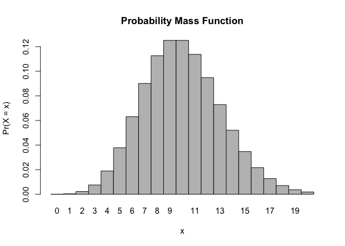

``` r
> x <- 0:50
> l = 20
> probset <- dpois(x = x, lambda = l)
> barplot(probset, names.arg = x, space = 0, xlab = "x", ylab = "Pr(X = x)", main = "Probability Mass Function")
```


As we did for other distributions, we can also use the built in `probability` function for the Poisson distribution, `ppois()`, to return the value of the **cumulative distribution function**, i.e., the probability of observing up to and including a specific number of events in the given interval.

``` r
> x <- 0:10
> l <- 3.5
> barplot(ppois(q = x, lambda = l), ylim = 0:1, space = 0, names.arg = x, xlab = "x", 
+     ylab = "Pr(X ≤ x)", main = "Cumulative Probability")
```

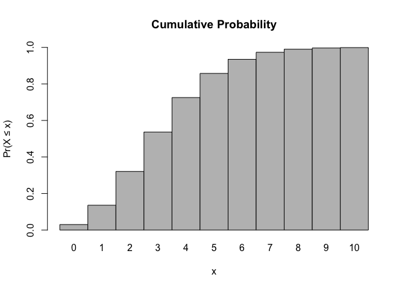

``` r
> x <- 0:20
> l <- 10
> barplot(ppois(q = x, lambda = l), ylim = 0:1, space = 0, names.arg = x, xlab = "x", 
+     ylab = "Pr(X ≤ x)", main = "Cumulative Probability")
```


``` r
> x <- 0:50
> l <- 20
> barplot(ppois(q = x, lambda = l), ylim = 0:1, space = 0, names.arg = x, xlab = "x", 
+     ylab = "Pr(X ≤ x)", main = "Cumulative Probability")
```


#### HOMEWORK PROBLEM 1:

Create a new ***GitHub*** repository and a new ***R*** Project named "homework-week-4". In your repo, create an **R Markdown** file and answer the following problems. When you are done, "knit" your **R Markdown** file to `.html` and push your `.Rmd` and `.html` files up to ***GitHub*** for me to look at.

Every Saturday, at the same time, a primatologist goes and sits in the forest in the morning and listens for titi monkey calls, counting the number of calls they hear in a 2 hour window from 5am to 7am. Based on previous knowledge, she believes that the mean number calls she will hear in that time is exactly 15. Let *X* represent the appropriate Poisson random variable of the number of calls heard in each monitoring session.

-   What is the probability that she will hear more than 8 calls during any given session?
-   What is the probability that she will hear no calls in a session?
-   What is the probability that she will hear exactly 3 calls in a session?
-   Plot the relevant Poisson mass function over the values in range 0 ≤ *x* ≤ 30.
-   Simulate 104 results from this distribution (i.e., 2 years of Saturday monitoring sessions).
-   Plot the simulated results using `hist()` and use `xlim()` to set the horizontal limits to be from 0 to 30. How does your histogram compare to the shape of the probability mass function you plotted above?

### Probability Density Functions

#### Uniform Distribution

The **Uniform Distribution** is the simplest probability density function describing a continuous random variable. The probability is uniform and does not fluctuate across the range of *x* values in a given interval.

The probability density function for the **UNIFORM DISTRIBUTION** is:


where *a* ≤ *x* ≤ *b* and 0 for *x* &lt; *a* and *x* &gt; *b*

#### CHALLENGE:

What would you predict the expectation (mean) should be for a uniform distribution?

For this distribution:


Let's plot a uniform distribution across a given range, from *a* = 4 to *b* = 8...

``` r
> a <- 4
> b <- 8
> x <- seq(from = a - (b - a), to = b + (b - a), by = 0.01)
> fx <- dunif(x, min = a, max = b)  # dunif() evaluates the density at each x
> plot(x, fx, type = "l", xlab = "x", ylab = "f(x)", main = "Probability Density Function")
```

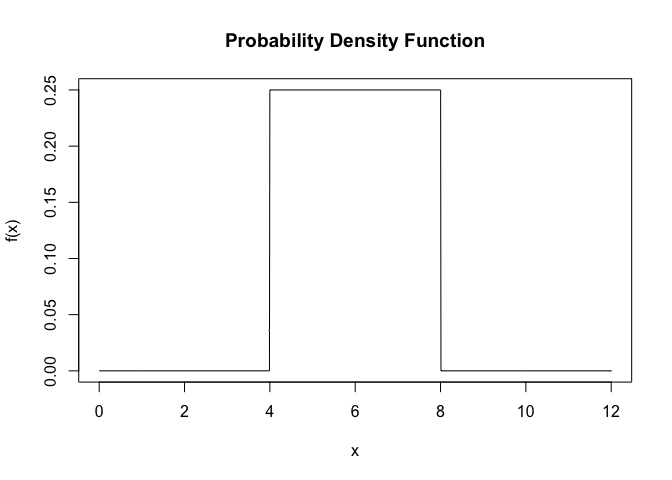

Note that for the uniform distribution, the *cumulative density function* increases linearly over the given interval.

``` r
> plot(x, punif(q = x, min = a, max = b), type = "l", xlab = "x", ylab = "Pr(X ≤ x)", 
+     main = "Cumulative Probability")  # punif() is the cumulative probability density up to a given x
```


#### CHALLENGE 5:

Simulate a sample of 10000 random numbers from a uniform distribution in the interval between *a* = 6 and *b* = 8. Calculate the mean and variance of this simulated sample and compare it to the expectation for these parameters.

#### Normal Distribution

The **Normal** or **Gaussian Distribution** is perhaps the most familiar and most commonly applied probability density functions for modeling continuous random variables. Why is the normal so important? Many traits are normally distributed, and the additive combination of many random factors is also commonly normally distributed.

Two parameters, *μ* and *σ*, are used to describe a normal distribution.

We can get an idea of the shape of a normal distribution with different *μ* and *σ* using the simple ***R*** code below. Try playing with *μ* and *σ*.

``` r
> mu <- 4
> sigma <- 1.5
> curve(dnorm(x, mu, sigma), mu - 4 * sigma, mu + 4 * sigma, main = "Normal Curve", 
+     xlab = "x", ylab = "f(x)")
```

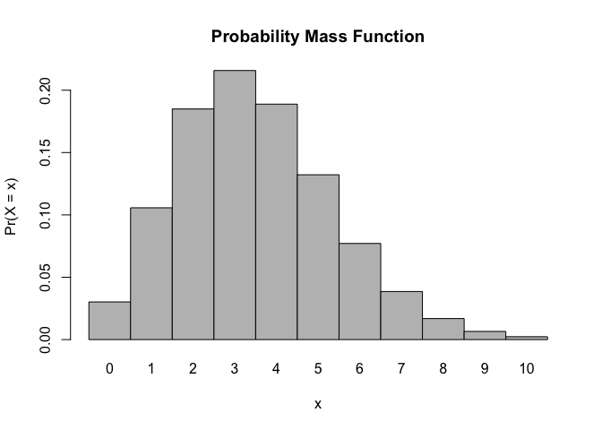

The function, `dnorm()` gives the point value of the normal density function at a given value of *x*. *x* can range from -∞ to +∞. Recall, it does not make sense to talk about the "probability" associated with a given value of *x* as this isa density not a mass functions, but we can talk about the probability of *x* falling within a given interval.

The code below lets you play interactively with *μ*, *σ*, and *nsigma* (which shades in the proportion of the distribution falling within that number of standard deviations of the mean). Also, look carefully at the code to try to figure out what each bit is doing.

``` r
> manipulate(plot(seq(from = (mu - 4 * sigma), to = (mu + 4 * sigma), length.out = 1000), 
+     dnorm(seq(from = (mu - 4 * sigma), to = (mu + 4 * sigma), length.out = 1000), 
+         mean = mu, sd = sigma), type = "l", xlim = c(mu - 4 * sigma, mu + 4 * 
+         sigma), xlab = "x", ylab = "f(x)", main = "Normal Probability Density Function") + 
+     polygon(rbind(c(mu - nsigma * sigma, 0), cbind(seq(from = (mu - nsigma * 
+         sigma), to = (mu + nsigma * sigma), length.out = 1000), dnorm(seq(from = (mu - 
+         nsigma * sigma), to = (mu + nsigma * sigma), length.out = 1000), mean = mu, 
+         sd = sigma)), c(mu + nsigma * sigma, 0)), border = NA, col = "salmon") + 
+     abline(v = mu, col = "blue") + abline(h = 0) + abline(v = c(mu - nsigma * 
+     sigma, mu + nsigma * sigma), col = "salmon"), mu = slider(-10, 10, initial = 0, 
+     step = 0.25), sigma = slider(0.25, 4, initial = 1, step = 0.25), nsigma = slider(0, 
+     4, initial = 0, step = 0.25))
```

The `pnorm()` function, as with the `p-` variant function for other distributions, returns the cumulative probability of observing a value less than or equal to *x*, i.e., *Pr* (*X* ≤ *x*). Type it the code below and then play with values of *μ* and *σ* to look at how the *cumulative distibution function* changes.

``` r
> manipulate(plot(seq(from = (mu - 6 * sigma), to = (mu + 6 * sigma), length.out = 1000), 
+     pnorm(seq(from = (mu - 6 * sigma), to = (mu + 6 * sigma), length.out = 1000), 
+         mean = mu, sd = sigma), type = "l", xlim = c(-20, 20), xlab = "x", ylab = "f(x)", 
+     main = "Cumulative Probability"), mu = slider(-10, 10, initial = 0, step = 0.25), 
+     sigma = slider(0.25, 10, initial = 1, step = 0.25))  # plots the cumulative distribution function
```

You can also use `pnorm()` to calculate the probability of an observation drawn from the population falling within a particular interval. For example, for a normally distributed population variable with *μ* = 6 and *σ* = 2, the probability of a random observation falling between 7 and 8 is...

``` r
> p <- pnorm(8, mean = 6, sd = 2) - pnorm(7, mean = 6, sd = 2)
> p
```

    ## [1] 0.1498823

Likewise, you can use `pnorm()` to calculate the probability of an observation falling, for example within 2 standard deviations of the mean of a particular normal distribution.

``` r
> mu <- 0
> sigma <- 1
> p <- pnorm(mu + 2 * sigma, mean = mu, sd = sigma) - pnorm(mu - 2 * sigma, mean = mu, 
+     sd = sigma)
> p
```

    ## [1] 0.9544997

Regardless of the specific values of *μ* and *σ*, about 95% of the normal distribution falls within 2 standard deviations of the mean and about 68% of the distribution falls within 1 standard deviation.

``` r
> p <- pnorm(mu + 1 * sigma, mean = mu, sd = sigma) - pnorm(mu - 1 * sigma, mean = mu, 
+     sd = sigma)
> p
```

    ## [1] 0.6826895

Another one of the main functions in ***R*** for probability distributions, the `qnorm()` function, will tell us the value of *x* below which a given proportion of the cumulative probability function falls. As we saw earlier, too, we can use `qnorm()` to calculate confidence intervals. The code below

``` r
> manipulate(plot(seq(from = (mu - 4 * sigma), to = (mu + 4 * sigma), length.out = 1000), 
+     dnorm(seq(from = (mu - 4 * sigma), to = (mu + 4 * sigma), length.out = 1000), 
+         mean = mu, sd = sigma), type = "l", xlim = c(mu - 4 * sigma, mu + 4 * 
+         sigma), xlab = "x", ylab = "f(x)", main = "Normal Probability Density Function") + 
+     abline(v = mu, col = "blue") + abline(h = 0) + polygon(x = c(qnorm((1 - 
+     CI)/2, mean = mu, sd = sigma), qnorm((1 - CI)/2, mean = mu, sd = sigma), 
+     qnorm(1 - (1 - CI)/2, mean = mu, sd = sigma), qnorm(1 - (1 - CI)/2, mean = mu, 
+         sd = sigma)), y = c(0, 1, 1, 0), border = "red"), mu = slider(-10, 10, 
+     initial = 0, step = 0.25), sigma = slider(0.25, 10, initial = 1, step = 0.25), 
+     CI = slider(0.5, 0.99, initial = 0.9, step = 0.01))
```

#### CHALLENGE 6:

-   Create a vector, *v*, containing **n** random numbers selected from a normal distribution with mean *μ* and standard deviation *σ*. Use 1000 for **n**, 3.5 for *μ*, and 4 for *σ*. **HINT:** Such a function exists! `rnorm()`.
-   Calculate the mean, variance, and standard deviation for your sample of random numbers.
-   Plot a histogram of your random numbers.

``` r
> n <- 1000
> mu <- 3.5
> sigma <- 4
> v <- rnorm(n, mu, sigma)
> mean(v)
```

    ## [1] 3.587718

``` r
> var(v)
```

    ## [1] 14.83404

``` r
> sd(v)
```

    ## [1] 3.851499

``` r
> hist(v, breaks = seq(from = -15, to = 20, by = 0.5), probability = TRUE)
```

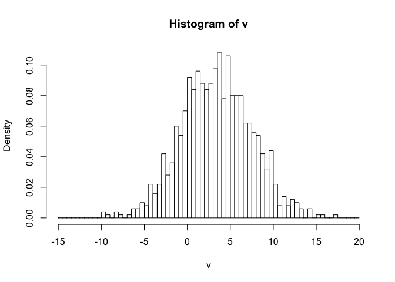

A quantile-quantile or "Q-Q" plot can be used to look at whether a set of data seem to follow a normal distribution. A Q–Q plot is a graphical method for generally comparing two probability distributions. To examine a set of data for normality graphically, you plot the quantiles for your actual data (as the y values) versus the theoretical quantiles (as the x values) pulled from a normal distribution. If the two distributions being compared are similar, the points in the plot will approximately lie on the line y = x.

In this case, this **should** be apparent since you have simulated a vector of data from a distribution normal distribution.

To quickly do a Q-Q plot, call the two ***R*** functions `qqnorm()` and `qqline()` using the vector of data you want to examine as an argument.

``` r
> qqnorm(v, main = "Normal QQ plot random normal variables")
> qqline(v, col = "gray")
```


This is the same as doing the following:

Step 1: Generate a sequence of probability points in the interval from 0 to 1 equivalent in length to vector v

``` r
> p <- ppoints(length(v))
> head(p)
```

    ## [1] 0.0005 0.0015 0.0025 0.0035 0.0045 0.0055

``` r
> tail(p)
```

    ## [1] 0.9945 0.9955 0.9965 0.9975 0.9985 0.9995

Step 2: Calculate the theoretical quantiles for this set of probabilities based on a the distribution you want to compare to (in this case, the normal distribution)

``` r
> theoretical_q <- qnorm(ppoints(length(v)))
```

Step 3: Calculate the quantiles for your set of observed data for the same number of points

``` r
> observed_q <- quantile(v, ppoints(v))
```

Step 4: Plot these quantiles against one another

``` r
> plot(theoretical_q, observed_q, main = "Normal QQ plot random normal variables", 
+     xlab = "Theoretical Quantiles", ylab = "Sample Quantiles")
```

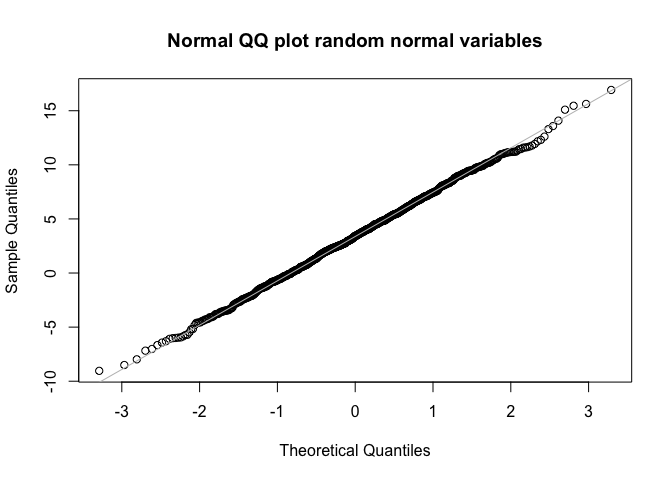

#### CHALLENGE 7:

What happens if you simulate fewer observations in your vectors? Or if you simulate observations from a *different* distribution?

#### The "Standard Normal"" Distribution

Any normal distribution with mean *μ* and standard deviation *σ* can be converted into what is called the **standard normal** distribution, where the mean is zero and the standard deviation is 1. This is done by subtracting the mean from all observations and dividing all observations by the standard deviation. The resultant values are referred to a *Z* scores, and they reflect the number of standard deviations an observation is from the mean.

``` r
> x <- rnorm(10000, mean = 5, sd = 8)  # simulate from a normal distribution with mean 5 and SD 8
> hist(x)
```

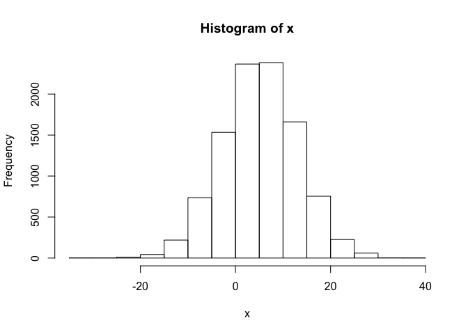

``` r
> mean(x)  # really close to 5
```

    ## [1] 5.016068

``` r
> sd(x)  # really close to 8
```

    ## [1] 8.032362

``` r
> z <- (x - mean(x))/sd(x)  # standardized!
> hist(z)
```

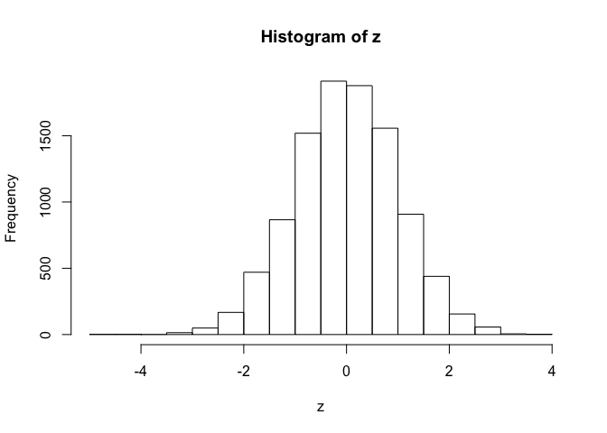

``` r
> mean(z)  # really close to zero
```

    ## [1] -4.440348e-17

``` r
> sd(z)  # really close to 1
```

    ## [1] 1

Sample Distributions and Population Distributions
-------------------------------------------------

It is important to recognize that, above, we were dealing with probability distributions of discrete and continuous random variables as they relate to *populations*. But, as we have talked about before, we almost never measure entire populations; instead, we measure *samples* from populations and we characterize our samples using various *statistics*. The theoretical probability distributions described above (and others) are *models* for how we connect observed sample data to populations, taking into account various assumptions, and this is what allows us to do many types of inferential statistics. The most fundamental assumption we make is that the observations we make are *independent* from one another and are *identically distributed*, an assumption often abbreviated as **iid**. Obvious cases of violation of this assumption are rife in the scientific literature, and we should always be cautious about making this assumption!

The important thing for us to know is that we can get unbiased estimates of population level parameters on the basis of sample statistics.

Let's imagine a population of 1 million zombies whose age at zombification is characterized by a normal distribution with a mean of 25 years and a standard deviation of 5 years. Below, we set up our population:

``` r
> set.seed(1)
> x <- rnorm(1e+06, 25, 5)
> hist(x, probability = TRUE)
```

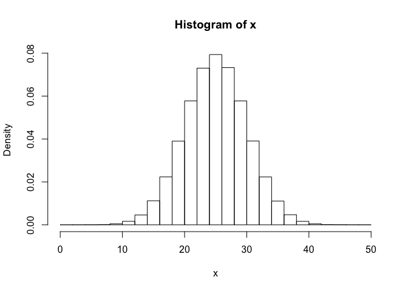

``` r
> mu <- mean(x)
> sigma <- sqrt(sum((x - mean(x))^2)/length(x))
```

Note: We don't use the `sd()` function as this would divide by `length(x)-1`. Check that out using `sd(x)`

Suppose we now sample the zombie population by trapping sets of zombies and determining the mean age in each set. We sample without replacement from the original population for each set. Let's do that 100 times with samples of size 5 and store these in a list.

``` r
> k <- 1000  # number of samples
> n <- 5  # size of each sample
> s <- NULL  # dummy variable to hold each sample
> for (i in 1:k) {
+     s[[i]] <- sample(x, size = n, replace = FALSE)
+ }
> head(s)
```

    ## [[1]]
    ## [1] 17.47736 22.15211 20.66016 28.87249 18.32963
    ## 
    ## [[2]]
    ## [1] 23.30484 30.52004 25.70979 23.75251 21.40976
    ## 
    ## [[3]]
    ## [1] 18.58791 29.41845 20.97167 18.86795 32.34301
    ## 
    ## [[4]]
    ## [1] 21.22700 14.25054 13.33307 22.74164 29.70400
    ## 
    ## [[5]]
    ## [1] 27.85483 31.57261 18.46467 28.12085 30.25311
    ## 
    ## [[6]]
    ## [1] 30.24572 28.44619 25.22456 30.53983 19.21535

For each of these samples, we can then calculate a mean, which is a statistic describing each sample. That statistic itself is a random variable with a mean and distribution. This is the *sampling distribution*. How does the sampling distribution compare to the population distribution? The mean of the two is pretty close to the same! The sample mean is an unbiased estimator for the population mean.

``` r
> m <- NULL
> for (i in 1:k) {
+     m[i] <- mean(s[[i]])
+ }
> mean(m)  # this is the mean of the sampling distribution = average sample mean; this should be the same as the population mean
```

    ## [1] 24.95602

#### The Standard Error

The standard deviation of the *sampling distribution*, i.e., of all possible means of samples of size *n* from a population, is referred to as the *standard error*. If the population standard deviation (sigma) is known, then the standard error can be calculated as population standard deviation / sqrt(sample size) = *σ*/*n*

``` r
> sigma/sqrt(n)
```

    ## [1] 2.236481

If the population standard deviation isn't known, however, the standard error can be estimated from the standard deviation of a given sample (or, presumably, as the average standard deviation across samples). Recall the *standard error of the mean* for a sample is:

    sample standard deviation/sqrt(sample size) = $s$/$n$

So, the standard error of the mean for an individual sample can used as an estimator of the *standard error*, i.e., the standard deviation of the sampling distribution.

Despite their similarities, the standard error of the mean and the standard deviation tell us different things about a sample. The *standard error of the mean* is an estimate of how far a given sample mean is likely to be from the population mean. The *standard deviation* of the sample is a measure of the degree to which individuals within the sample differ from the sample mean.

Where does all this get us?

In Module 7, we calculated confidence intervals for one of our estimates of a population parameter (the population mean, our *estimand*), based on a sample statistic (the sample mean, our *estimator*). Let's revist that process...

A general way to define a confidence interval is as:

    statistic being considered ± critical value $\times standard error,

where the statistic is the sample statistic under scrutiny (e.g., the mean), the critical value is a value from the standardized version of the sampling distribution that corresponds to the 100 \* (1 - *α* level), e.g., 1-0.05 = 0.95 for the 95% CI, and the standard error is the standard deviation of the sampling distribution (which is often estimated from a sample itself).

#### CHALLENGE 8:

For vector *v* from CHALLENGE 6, use the `sample()` function with `size=30` and `replace=FALSE` to select a sample.

-   Calculate the mean, standard deviation, and standard error of the mean (SEM) based on your sample.
-   Using the SEM, calculate the 95% confidence interval around your estimate of the mean.
-   How does the SEM estimated from your sample compare to the estimate of the standard error you would make based on the knowledge of the population standard deviation, *σ* = 4?

``` r
> s <- sample(v, size = 30, replace = FALSE)
> m <- mean(s)
> m
```

    ## [1] 3.23723

``` r
> sd <- sd(s)
> sd
```

    ## [1] 3.92326

``` r
> sem <- sd(s)/sqrt(length(s))
> sem
```

    ## [1] 0.7162861

``` r
> lower <- m - qnorm(1 - 0.05/2) * sem  # (1-alpha)/2 each in upper and lower trail of distribution
> upper <- m + qnorm(1 - 0.05/2) * sem  # (1-alpha)/2 each in upper and lower trail of distribution
> ci <- c(lower, upper)
> ci
```

    ## [1] 1.833335 4.641125

``` r
> pop_se <- sigma/sqrt(length(s))
> pop_se
```

    ## [1] 0.9130396

#### HOMEWORK PROBLEM 2:

Using different `.Rmd` file than you used for Problem 1 pushing both the Markdown and knitted `.html` file to the same "homework-week-4" repository, do the following:

Load in the dataset "zombies.csv" from my ***GitHub*** repo at <https://github.com/difiore/ADA2016>. This data includes the first and last name and gender of the entire population of 1000 people who have survived the zombie apocalypse and are now ekeing out an existence somewhere on the East Coast, along with several other variables (height, weight, age, number of years of education, number of zombies they have killed, and college major [see here for info on major](http://www.thebestschools.org/magazine/best-majors-surviving-zombie-apocalypse/)

f &lt;- file.choose() d &lt;- read.csv(f, sep=",", header=TRUE)

\[1\] Calculate the *population* mean and standard deviation for each quantitative random variable (height, weight, age, number of zombies killed, and years of education). NOTE: You will not want to use the built in `var()` and `sd()` commands as these are for *samples*.

\[2\] Use ggplot and make boxplots of each of these variable by gender.

\[3\] Use ggplot and make a scatterplots of height and weight in relation to age. Do these variables seem to be related? In what way?

\[4\] Using histograms and Q-Q plots, check whether the quantitative variables seem to be drawn from a normal distribution. Which seem to be and which do not (hint: not all are drawn from the normal distribution)? For those that are not, can you determine what common distribution they are drawn from?

\[5\] Now use the `sample()` function to sample ONE subset of 30 zombies (without replacement) from this population and calculate the mean and sample standard deviation for each variable. Also estimate the standard error for each variable and construct the 95% confidence interval for each mean. Note that for the variables that are not drawn from the normal distribution, you will need to base your estimate of the CIs on some different distribution.

\[6\] Now drawn 99 more random samples of 30 zombies out and calculate the mean for each of the these samples. Together with the first sample you drew out, you now have a set of 100 means for each variable (each based on 30 observations), which constitutes a sampling distribution for each variable. What are the means and standard deviations of this distribution for each variable? How do the standard deviations compare to the standard errors estimated in \[5\]? What do these sampling distributions look like? Are they normally distributed? What about for those variables that you concluded were not originally drawn from a normal distribution?
