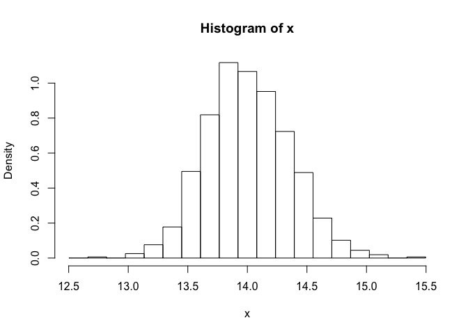
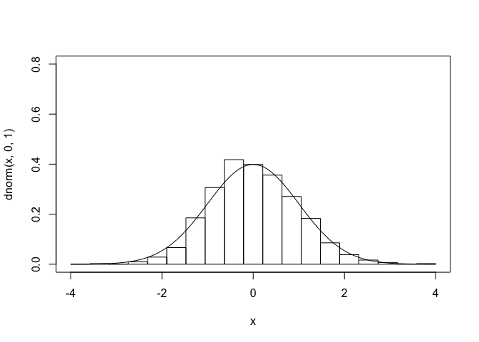
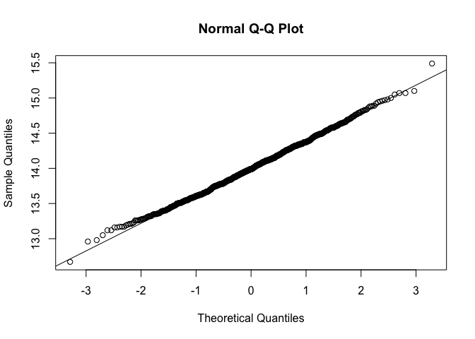
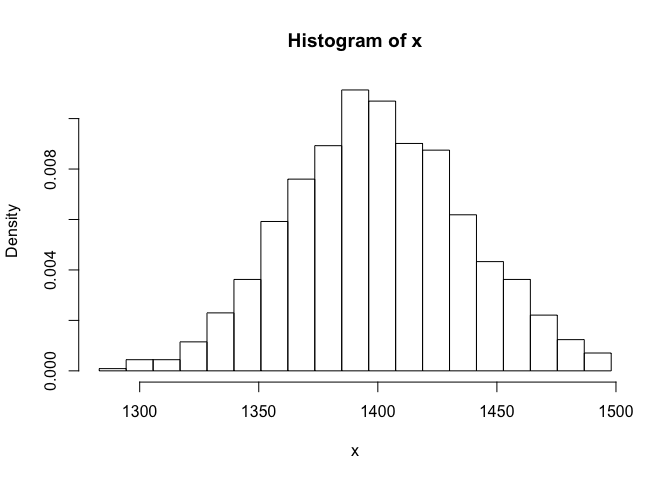
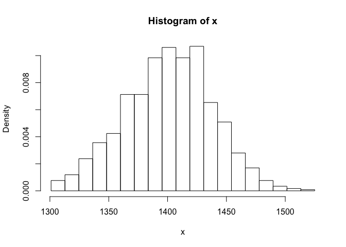
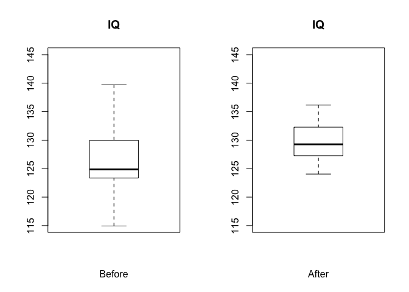

Module 09
================

Statistical Inference and Basic Hypothesis Testing
==================================================

Preliminaries
-------------

-   Install this package in ***R***: {curl}

Objectives
----------

> The objective of this module is to continue our discussion of *statistical inference* and introduce basic *hypothesis testing* from a frequentist/classical statistics approach.

Standard Errors and Confidence Intervals
========================================

To recap some of what we have covered in the last two modules, standard errors are key to calculating confidence intervals and to basic inferential statistics.

In Module 7, we calculated confidence intervals for one of our estimates of a population parameter (the population mean, our **estimand**), based on a sample statistic (the sample mean, our **estimator**). Let's revist that process...

The general way to define a confidence interval based on data from a sample is as the value of the **statistic** being considered (e.g., the mean) ± some **critical value** × the **standard error** of the statistic.

The **critical value** is derived from the standardized version of a sampling distribution (e.g., the normal distribution) that corresponds the quantile limits we are interested in. For example, for the 95% CI around the mean, the critical value corresponds the range of quantiles above and below which we expect to see only 5% of the distribution of statistic values. This is equivalent to the ± 1 - (*α*/2), where *α* = 0.05, thuse corresponding to the ± 0.975 quantile.

The **standard error** is the standard deviation of the sampling distribution, which, as noted above, is often estimated from the sample itself but can also be calculated directly from the population standard deviation, if that is known.

#### CHALLENGE:

As we did in Module 8, create a vector, *v*, containing **n** random numbers selected from a normal distribution with mean *μ* and standard deviation *σ*. Use 1000 for **n**, 3.5 for *μ*, and 4 for *σ*.

-   Calculate the mean, standard deviation, and standard error of the mean (SEM) based on your sample.
-   Using the SEM, calculate the 95% confidence interval around your estimate of the mean, basing your estimate on quantiles derived from the normal distribution.
-   How does the SEM estimated from your sample compare to the estimate of the standard error you would make based on the knowledge of the population standard deviation, *σ* = 4?

``` r
> n <- 1000
> mu <- 3.5
> sigma <- 4
> v <- rnorm(n, mu, sigma)
> s <- sample(v, size = 30, replace = FALSE)
> m <- mean(s)
> m
```

    ## [1] 2.81692

``` r
> sd <- sd(s)
> sd
```

    ## [1] 3.785812

``` r
> sem <- sd(s)/sqrt(length(s))
> sem
```

    ## [1] 0.6911915

``` r
> lower <- m - qnorm(1 - 0.05/2) * sem  # (1-alpha)/2 each in upper and lower trail of distribution
> upper <- m + qnorm(1 - 0.05/2) * sem  # (1-alpha)/2 each in upper and lower trail of distribution
> ci <- c(lower, upper)
> ci
```

    ## [1] 1.462209 4.171630

``` r
> pop_se <- sigma/sqrt(length(s))
> pop_se
```

    ## [1] 0.7302967

#### HOMEWORK PROBLEM:

Using a new `.Rmd` file than you used for Problem 1 pushing both the Markdown and knitted `.html` file to the same "homework-week-4" repository, do the following:

Load in the dataset "zombies.csv" from my ***GitHub*** repo at <https://github.com/difiore/ADA2016>. This data includes the first and last name and gender of the entire population of 1000 people who have survived the zombie apocalypse and are now ekeing out an existence somewhere on the East Coast, along with several other variables (height, weight, age, number of years of education, number of zombies they have killed, and college major [see here for info on important post-zombie apocalypse majors](http://www.thebestschools.org/magazine/best-majors-surviving-zombie-apocalypse/)

``` r
> library(curl)
> f <- f <- curl("https://raw.githubusercontent.com/difiore/ADA2016/master/zombies.csv")
> d <- read.csv(f, header = TRUE, sep = ",", stringsAsFactors = FALSE)
> head(d)
```

    ##   X.2 X.1 X id first_name last_name gender   height   weight
    ## 1   1   1 1  1      Sarah    Little Female 62.88951 132.0872
    ## 2   2   2 2  2       Mark    Duncan   Male 67.80277 146.3753
    ## 3   3   3 3  3    Brandon     Perez   Male 72.12908 152.9370
    ## 4   4   4 4  4      Roger   Coleman   Male 66.78484 129.7418
    ## 5   5   5 5  5      Tammy    Powell Female 64.71832 132.4265
    ## 6   6   6 6  6    Anthony     Green   Male 71.24326 152.5246
    ##   zombies_killed years_of_education                           major
    ## 1              2                  1                medicine/nursing
    ## 2              5                  3 criminal justice administration
    ## 3              1                  1                       education
    ## 4              5                  6                  energy studies
    ## 5              4                  3                       logistics
    ## 6              1                  4                  energy studies
    ##        age
    ## 1 17.64275
    ## 2 22.58951
    ## 3 21.91276
    ## 4 18.19058
    ## 5 21.10399
    ## 6 21.48355

\[1\] Calculate the *population* mean and standard deviation for each quantitative random variable (height, weight, age, number of zombies killed, and years of education). NOTE: You will not want to use the built in `var()` and `sd()` commands as these are for *samples*.

\[2\] Use {ggplot} and make boxplots of each of these variable by gender.

\[3\] Use {ggplot} and make scatterplots of height and weight in relation to age. Do these variables seem to be related? In what way?

\[4\] Using histograms and Q-Q plots, check whether the quantitative variables seem to be drawn from a normal distribution. Which seem to be and which do not (hint: not all are drawn from the normal distribution)? For those that are not, can you determine what common distribution they are drawn from?

\[5\] Now use the `sample()` function to sample ONE subset of 30 zombies (without replacement) from this population and calculate the mean and sample standard deviation for each variable. Also estimate the standard error for each variable and construct the 95% confidence interval for each mean. Note that for the variables that are not drawn from the normal distribution, you will need to base your estimate of the CIs on some different distribution.

\[6\] Now draw 99 more random samples of 30 zombies out and calculate the mean for each of the these samples. Together with the first sample you drew out, you now have a set of 100 means for each variable (each based on 30 observations), which constitutes a sampling distribution for each variable. What are the means and standard deviations of this distribution for each variable? How do the standard deviations compare to the standard errors estimated in \[5\]? What do these sampling distributions look like? Are they normally distributed? What about for those variables that you concluded were not originally drawn from a normal distribution?

The Central Limit Theorem
-------------------------

Thus far, our construction of CIs has taken advantage of one of the most important theorems in statistics, the Central Limit Theorem. The key importance of the CLT for us is that it states that the distribution of averages (or sums or other summary statistics...) of **iid** random variables becomes normal as the sample size increases. It is this fact that allows us to have a good sense of the average event and of the distribution of average events in a population even though we only observe one set of events and do not know what actual population distribution is. The CLT says nothing about the probability distribution for events in the original population, and that is exactly where its usefulness lies... that distribution can be normal, skewed, all kinds of odd! But we can assume normality for the distribution of **sample mean** (or sum or mode...) no matter what kind of distribution we have in the initial population we have, as long as our sample size is large enough and our samples are independent. It is thus the CLT that allows us to make inferences about a population based on a sample.

Just to explore this a bit, let's do some simulations. We are going to take lots of averages of samples from a particular non-normal distribution and then look at the distribution of those averages. Imagine we have some event that occurs in a population according to some probability mass function like the Poisson where we know $= 4 and the expectations of *μ* and *σ*<sup>2</sup> are thus both = 4.

Now let's imagine taking samples of size 10 from this population. We will take 1000 random samples of this size, calculate the average of each sample, and plot a histogram of those averages... it will be close to normal and the standard deviation of the sampling distribution is roughly equal to the estimated standard error, the square root of (*λ*/*n*).

``` r
> lambda <- 14
> n <- 10
> pop_se <- sqrt(lambda/n)  # the estimated SE
> pop_se
```

    ## [1] 1.183216

``` r
> x <- NULL
> for (i in 1:1000) {
+     x[i] <- mean(rpois(n = n, lambda = lambda))
+ }
> hist(x, breaks = seq(from = lambda - 4 * sqrt(lambda)/sqrt(n), to = lambda + 
+     4 * sqrt(lambda)/sqrt(n), length.out = 20), probability = TRUE)
```



``` r
> sd <- sd(x)  # st dev of the sampling distribution
> sd
```

    ## [1] 1.214119

``` r
> qqnorm(x)
> qqline(x)
```

 We can do this for samples of size 100, too... the mean stays the same, the distribute is still normal, but the standard deviation of the sampling distribution is lower.

``` r
> n <- 100
> pop_se <- sqrt(lambda/n)  # the estimated SE
> pop_se
```

    ## [1] 0.3741657

``` r
> x <- NULL
> for (i in 1:1000) {
+     x[i] <- mean(rpois(n = n, lambda = lambda))
+ }
> hist(x, breaks = seq(from = lambda - 4 * sqrt(lambda)/sqrt(n), to = lambda + 
+     4 * sqrt(lambda)/sqrt(n), length.out = 20), probability = TRUE)
```



``` r
> sd <- sd(x)  # st dev of the sampling distribution
> sd
```

    ## [1] 0.3859288

``` r
> qqnorm(x)
> qqline(x)
```



We can normalize these distributions by subtracting off the expected population mean and dividing by the population standard error and then plotting the histogram along with a normal curve.

``` r
> curve(dnorm(x, 0, 1), -4, 4, ylim = c(0, 0.8))
> z <- (x - lambda)/pop_se
> hist(z, breaks = seq(from = -4, to = 4, length.out = 20), probability = TRUE, 
+     add = TRUE)
```



Pretty normal looking, right?

Here's an example using `sum()` instead of `mean()`...

``` r
> n <- 100
> x <- NULL
> for (i in 1:1000) {
+     x[i] <- sum(rpois(n = n, lambda = lambda))
+ }
> hist(x, breaks = seq(min(x), max(x), length.out = 20), probability = TRUE)
```



Again, pretty normal looking!

**Take Home Points:**

\[1\] The CLT states that, regardless of the underlying distribution, the distribution of averages based on a large number of independent, identically distributed variables...

-   will be approximately normal,
-   centered at the population mean, – with standard deviation equal to the standard error of the mean.

Additionally, variables that are expected to be the sum of multiple independent processes (such as measurement errors) will also have distributions that are nearly normal.

\[2\] Taking the mean and adding and subtracting the relevant standard normal quantile × the standard error yields a confidence interval for the mean, which gets wider as the coverage increases and gets narrower with less variability or larger sample sizes.

\[3\] As sample size increases, the standard error of the mean decreases and the distribution becomes more and more normal (i.e., has less skew and kurtosis, which are higher order moments of the distribution).

Check out [this website](http://onlinestatbook.com/stat_sim/sampling_dist/index.html) for a nice interactive simulation demonstrating the Central Limit Theorem.

Confidence Intervals for Sample Proportions
-------------------------------------------

So far, we've talked about CIs for sample means, but what about for other statistics, e.g., sample proportions. For example, if you have a sample of **n** trials where you record the success or failure of a binary event, you obtain an estimate of the proportion of successes, *x*/*n*. If you perform another **n** trials, the new estimate could vary in the same way that a repeated means of the same variable (e.g., zombie age) can vary from sample to sample. Taking a similar approach as above, we can generate confidence intervals for this variability in the proportion of successes across trails.

In this case, the expectation of random binary variable *x*, which we will denote as *π* (analogous to *μ*) \[*π* for proportion versus *μ* for mean\] in a population is simply the average number of successes across multiple trials.

The expected distribution of *x* is approximately normal and equal to sqrt(*π*(1 − *π*)/*n*).

This is an okay assumption to make if both *n* × *π* and *n* × (1 − *π*) are greater than roughly 5.

This is akin to calculating the standard error the same was as we did above, as the square root of (the expected variance in a binary variable / sample size). And, as above, if we do not have a population estimate for *π*, we can estimate this from our sample.

#### CHALLENGE:

Suppose a polling group in the United States is interested in the proportion of voting-age citizens in their state that already know they will vote for Hillary Clinton in the upcoming presidential election. The group obtains a yes or no answer from 1000 suitable randomly selected individuals. Of these individuals, 856 say they know how they’ll vote. How would we characterize the mean and variability associated with this proportion?

``` r
> n <- 1000
> x <- 856
> pi <- x/n
> pi
```

    ## [1] 0.856

Are *n* × *π* and *n* × (1 − *π*) both &gt; 5? Yes!

``` r
> n * (x/n)
```

    ## [1] 856

``` r
> n * (1 - x/n)
```

    ## [1] 144

``` r
> pop_se <- sqrt((x/n) * (1 - x/n)/n)
```

What is the 95% CI around our estimate of the proportion of people who already know how they will vote?

``` r
> curve(dnorm(x, mean = pi, sd = pop_se), pi - 4 * pop_se, pi + 4 * pop_se)
> upper <- pi + qnorm(0.975) * pop_se
> lower <- pi - qnorm(0.975) * pop_se
> ci <- c(lower, upper)
> polygon(cbind(c(ci[1], seq(from = ci[1], to = ci[2], length.out = 1000), ci[2]), 
+     c(0, dnorm(seq(from = ci[1], to = ci[2], length.out = 1000), mean = pi, 
+         sd = pop_se), 0)), border = "black", col = "gray")
> abline(v = ci)
> abline(h = 0)
```


Small Sample Confidence Intervals
---------------------------------

Thus far, we have discussed creating a confidence interval based on the CLT and the normal distribution and our intervals took the form:

*mean* ± *Z* (the quantile from the standard normal curve) × *standard error of the mean*

But, when the size of our sample is small (n &lt; 30), instead of using the normal distribution to calculate our CIs, we typically use a different distribution to generate the relevant quantiles to multiply the standard error by... the **t distribution** (a.k.a., Gosset's t or Student's t distribution).

Note that this is the **typical** case that we will encounter, as we often do not have information about the population that a sample is drawn from.

The t distribution is thus a continuous probability distribution very similar in shape to the normal that we generally use when dealing with statistics (such as means and standard deviations) that are estimated from a sample. Any particular t distribution looks a lot like a normal distribution in that it is bell-shaped, symmetric, unimodal, and zero-centered.

The choice of the appropriate t distribution to use in any particular statistical test is based on the number of **degrees of freedom (df)**, i.e., the number of individual components in the calculation of a given statistic (such as the standard deviation) that are “free to change”.

We can think of the t distribution as representing a family of curves that, as the number of degrees of freedom increases, approaches the normal or Gaussian curve. At low numbers of degrees of freedom, the tails of the distribution get fatter.

Confidence intervals based on the t distribution are of the form:

*mean* ± *t* (the quantile from the t distribution) × *standard error of the mean*

The only change from those based on the normal distribution is that we’ve replaced the Z quantile of the standard normal with a t quantile.

Let's explore this a bit...

Recall that a standard normal distribution can be generated by normalizing our sample (subtracting the population mean from each observation and then dividing all of these differences by the population standard deviation)...

(mean(x)-*μ*)/*σ*

If we subtract the population mean from each observation but then divide each difference, instead, by the standard error of the mean, (mean(x)-*μ*)/SEM$, the result is not a normal distribution, but rather a t distribution! We are taking into account sample size by dividing by the standard error of the mean rather than the population standard deviation.

The code below plots a standard normal distribution and then t distributions with varying degrees of freedom, specified using the `df=` argument. As for other distributions, ***R*** implements `density`, cumulative `probability`, `quantile`, and `random` functions for the t distribution.

``` r
> mu <- 0
> sigma <- 1
> curve(dnorm(x, mu, 1), mu - 4 * sigma, mu + 4 * sigma, main = "Normal = red\nStudent's t = blue", 
+     xlab = "x", ylab = "f(x)", col = "red", lwd = 3)
> for (i in c(1, 2, 3, 4, 5, 10, 20, 100)) {
+     curve(dt(x, df = i), mu - 4 * sigma, mu + 4 * sigma, main = "t Curve", xlab = "x", 
+         ylab = "f(x)", add = TRUE, col = "blue", lty = 5)
+ }
```


The fatter tails of the t distibution lead naturally to more extreme quantile values given a specific probability than in the normal distribution. If we define a CI based on quantiles of the t distribution, they will be correspondingly slightly wider than those based on the normal distribution for small values of df.

Last time, we estimated the 95% CI for a sample drawn from a normal distribution as follows:

``` r
> n <- 1e+05
> mu <- 3.5
> sigma <- 4
> sample_size <- 30
> x <- rnorm(n, mu, sigma)
> s <- sample(x, size = sample_size, replace = FALSE)
> m <- mean(s)
> m
```

    ## [1] 4.380291

``` r
> sd <- sd(s)
> sd
```

    ## [1] 3.734951

``` r
> sem <- sd(s)/sqrt(length(s))
> sem
```

    ## [1] 0.6819056

``` r
> lower <- m - qnorm(1 - 0.05/2) * sem  # (1-alpha)/2 each in upper and lower trail of distribution
> upper <- m + qnorm(1 - 0.05/2) * sem  # (1-alpha)/2 each in upper and lower trail of distribution
> ci <- c(lower, upper)
> ci
```

    ## [1] 3.043781 5.716801

Now, let's examine the difference in the CIs calculated based on a sample of size 30 versus one of size 5 using the normal versus t distributions as the basis for estimating the confidence interval. For size 30, the difference is negligible... for size 5, the CI based on the t distribution is wider.

``` r
> sample_size <- 30
> s <- sample(x, size = sample_size, replace = FALSE)
> m <- mean(s)
> m
```

    ## [1] 2.707421

``` r
> sd <- sd(s)
> sd
```

    ## [1] 4.700817

``` r
> sem <- sd(s)/sqrt(length(s))
> sem
```

    ## [1] 0.8582478

``` r
> lower <- m - qnorm(1 - 0.05/2) * sem  # (1-alpha)/2 each in upper and lower trail of distribution
> upper <- m + qnorm(1 - 0.05/2) * sem  # (1-alpha)/2 each in upper and lower trail of distribution
> ci_norm <- c(lower, upper)
> ci_norm
```

    ## [1] 1.025286 4.389556

``` r
> lower <- m - qt(1 - 0.05/2, df = sample_size - 1) * sem  # (1-alpha)/2 each in upper and lower trail of distribution
> upper <- m + qt(1 - 0.05/2, df = sample_size - 1) * sem  # (1-alpha)/2 each in upper and lower trail of distribution
> ci_t <- c(lower, upper)
> ci_t
```

    ## [1] 0.9521069 4.4627348

``` r
> sample_size <- 5
> s <- sample(x, size = sample_size, replace = FALSE)
> m <- mean(s)
> m
```

    ## [1] 2.251042

``` r
> sd <- sd(s)
> sd
```

    ## [1] 3.974043

``` r
> sem <- sd(s)/sqrt(length(s))
> sem
```

    ## [1] 1.777246

``` r
> lower <- m - qnorm(1 - 0.05/2) * sem  # (1-alpha)/2 each in upper and lower trail of distribution
> upper <- m + qnorm(1 - 0.05/2) * sem  # (1-alpha)/2 each in upper and lower trail of distribution
> ci_norm <- c(lower, upper)
> ci_norm
```

    ## [1] -1.232297  5.734380

``` r
> lower <- m - qt(1 - 0.05/2, df = sample_size - 1) * sem  # (1-alpha)/2 each in upper and lower trail of distribution
> upper <- m + qt(1 - 0.05/2, df = sample_size - 1) * sem  # (1-alpha)/2 each in upper and lower trail of distribution
> ci_t <- c(lower, upper)
> ci_t
```

    ## [1] -2.683385  7.185468

Hypothesis Testing
==================

Classical, frequentist hypothesis testing (a.k.a. parametric statistics) involves formally stating a claim - the **null hypothesis** - which is then followed up by statistical evaluation of the null versus an alternative hypotheses. The null hypothesis is interpreted as a baseline hypothesis and is the claim is assumed to be true. The **alternative hypothesis** is the conjecture that we are testing.

We need some kind of statistical evidence to reject the null hypothesis in favor of an alternative hypothesis. This evidence is, in classicical frequentist approaches, some measure of how unexpected it would be for the sample to have been drawn from a given distribution.

**Ho = null hypothesis** = a sample shows no deviation from what is expected or neutral **Ha = alternative hypothesis** = a sample deviates more than expected by chance (either greater than, less than, or simply unequal with no directionality presumed) from what is expected or neutral

Ha &gt; Ho is an upper one-tailed test Ha &lt; Ho is a lower one-tailed test Ha ≠ Ho is a two-tailed test

There are four possible outcomes to our statistical decision:

<table style="width:88%;">
<colgroup>
<col width="18%" />
<col width="20%" />
<col width="48%" />
</colgroup>
<thead>
<tr class="header">
<th>What is True</th>
<th>What We Decide</th>
<th>Result</th>
</tr>
</thead>
<tbody>
<tr class="odd">
<td>Ho</td>
<td>Ho</td>
<td>Correctly accept the null</td>
</tr>
<tr class="even">
<td>Ho</td>
<td>Ha</td>
<td>Falsely reject the null (Type I error)</td>
</tr>
<tr class="odd">
<td>Ha</td>
<td>Ho</td>
<td>Falsely accept (or, better, falsely fail to reject) the null (Type II error)</td>
</tr>
<tr class="even">
<td>Ha</td>
<td>Ha</td>
<td>Correctly reject the null</td>
</tr>
</tbody>
</table>

In classical frequentist (a.k.a. parametric) inference, we perform hypothesis testing by trying to minimize our probability of Type I error... we aim for having a high bar for falsely rejecting the null (e.g., for incorrectly finding an innocent person guilty). When we set a high bar for falsely rejecting the null, we lower the bar for falsely failing to reject the null (e.g., for concluding that a guilty person is innocent).

To do our test, we typically calculate a **test statistic** based on our data which we compare to some appropriate standardized sampling distribution to yield a **p value**.

**p value** = the probability of our obtaining that test statistic or a more extreme on by chance, if the null hypothesis were true.


We compare the p value associated with our test statistic to some significance level, *α*, typically 0.05 or 0.01.

***α*** = the criteria we use to determine whether we reject or fail to reject the null.

If p &lt; *α*, we decide that there is sufficient evidence for rejecting Ho.

How do we calculate the p value?

1.  Specify a test statistic (e.g., the mean)

2.  Specify our null distribution

3.  Calculate the tail probability, i.e., the probability of obtaining a statistic as or more extreme than was observed based on that distribution

One Sample Z and T Tests
------------------------

Let's do an example where we try to evaluate whether the mean of a single set of observations is significantly different than expected... i.e., this is a ONE-SAMPLE test.

Suppose we have a vector describing the adult weights of vervet monkeys trapped in South Africa during the 2015 trapping season. We have the sense they are heavier than vervets we trapped in previous years, which averaged 4.9 kilograms. The mean is 5.324 kilograms. Is the mean significantly greater than our expectation?

``` r
> f <- curl("https://raw.githubusercontent.com/difiore/ADA2016/master/vervet-weights.csv")
> d <- read.csv(f, header = TRUE, sep = ",", stringsAsFactors = FALSE)
> head(d)
```

    ##   id weight
    ## 1  1   5.17
    ## 2  2   7.13
    ## 3  3   4.70
    ## 4  4   6.10
    ## 5  5   6.36
    ## 6  6   4.93

``` r
> mean(d$weight)
```

    ## [1] 5.323922

-   What is our Ho?
-   What is our Ha?
-   What is the hypothesis we want to test? Is it two-tailed? Upper-tailed? Lower-tailed?
-   Calculate the mean, standard deviation, and SEM from our sample

``` r
> mu <- 4.9
> x <- d$weight
> m <- mean(x)
> s <- sd(x)
> n <- length(x)
> sem <- s/sqrt(n)
```

Our test statistic takes a familiar form... it is effectively the standard normalized position of our sample mean (m) in a distribution centered around the expected population mean (*μ*), where we use the standard error of the mean of our sample (sem) as an estimate of the population standard deviation.

z = (mean of our sample - *μ*)/(standard error of the mean) z = (m - *μ*)/(sem)

``` r
> z <- (m - mu)/sem
> z
```

    ## [1] 3.103753

In this case, z is a quantile... the estimated number of standard errors of the mean away from the population mean that our sample falls.

If we then want to see if z is significant, we need to calculate the probability of seeing a deviation from the mean as high or higher than this by chance. To do this, we can use the `pnorm()` function. Because we have converted our sample mean to the standard normal scale, the `mean=` and `sd=` arguments of `pnorm()` are the defaults of 0 and 1, respectively.

We want the probability of seeing a z statistic this large or larger by chance.

``` r
> p <- 1 - pnorm(z)
> p
```

    ## [1] 0.0009554144

``` r
> p <- pnorm(z, lower.tail = FALSE)
> p
```

    ## [1] 0.0009554144

However, as noted above, our sample size from a population is typically limited. So, instead of using the normal distribution to determine the p value of our statistic, we should use the t distribution, which, as we've seen, has slightly fatter tails.

``` r
> p <- 1 - pt(z, df = n - 1)
> p
```

    ## [1] 0.001570945

``` r
> p <- pt(z, df = n - 1, lower.tail = FALSE)
> p
```

    ## [1] 0.001570945

***R*** has built into it single function, `t.test()`, that lets us do all this in one line. We give it our data and the expected population mean, *μ*, along with the kind of test we want to do.

``` r
> t <- t.test(x = x, mu = mu, alternative = "greater")
> t
```

    ## 
    ##  One Sample t-test
    ## 
    ## data:  x
    ## t = 3.1038, df = 50, p-value = 0.001571
    ## alternative hypothesis: true mean is greater than 4.9
    ## 95 percent confidence interval:
    ##  5.095021      Inf
    ## sample estimates:
    ## mean of x 
    ##  5.323922

Note that we can also use the `t.test()` function to calculate t distribution based CIs for us easily!

``` r
> lower <- m - qt(1 - 0.05/2, df = n - 1) * sem
> upper <- m + qt(1 - 0.05/2, df = n - 1) * sem
> ci <- c(lower, upper)
> ci  # by hand
```

    ## [1] 5.049585 5.598258

``` r
> t <- t.test(x = x, mu = mu, alternative = "two.sided")
> ci <- t$conf.int
> ci  # using t test
```

    ## [1] 5.049585 5.598258
    ## attr(,"conf.level")
    ## [1] 0.95

#### CHALLENGE:

Adult lowland woolly monkeys are reported to an average body weight of 7.2 kilograms. You are working with an isolated population of woolly monkeys from the Colombian Andes that you think may be a different species from lowland form, and you collect a sample of 15 weights of from adult individuals at that site. From your sample, you calculate a mean of 6.43 kilograms and a standard deviation of 0.98 kilograms. Perform a hypothesis test to test whether body weights in your population are different from the reported average for lowland woolly monkeys by setting up a "two-tailed" hypothesis, carrying out the analysis, and interpreting the p value (assume the significance level is *α* = 0.05). Your sample is &lt; 30, so you should use the t distribution and do a t test. Do your calculations both by hand and using the `t.test()` function and confirm that they match.

``` r
> f <- curl("https://raw.githubusercontent.com/difiore/ADA2016/master/woolly-weights.csv")
> d <- read.csv(f, header = TRUE, sep = ",", stringsAsFactors = FALSE)
> head(d)
```

    ##   id weight
    ## 1  1   6.14
    ## 2  2   6.19
    ## 3  3   7.08
    ## 4  4   5.67
    ## 5  5   4.83
    ## 6  6   6.83

``` r
> x <- d$weight
> m <- mean(x)
> s <- sd(x)
> n <- length(x)
> sem <- s/sqrt(n)
> mu <- 7.2
> t <- (m - mu)/sem
> t
```

    ## [1] -3.336805

``` r
> alpha <- 0.05
> crit <- qt(1 - alpha/2, df = n - 1)  # identify critical values
> test <- t < -crit || t > crit  # boolean test
> test <- abs(t) > crit
> t.test(x = x, mu = mu, alternative = "two.sided")
```

    ## 
    ##  One Sample t-test
    ## 
    ## data:  x
    ## t = -3.3368, df = 14, p-value = 0.004891
    ## alternative hypothesis: true mean is not equal to 7.2
    ## 95 percent confidence interval:
    ##  5.930689 6.923978
    ## sample estimates:
    ## mean of x 
    ##  6.427333

Two Sample Tests - Comparing Means
----------------------------------

Sometimes we want to compare two groups of measurements to one another, which boils down to a hypothesis test for the difference between two means, *μ*1 and *μ*2. The null hypothesis is that the difference between the means is zero.

Before getting to the appropriate test, there are a couple of things that we need to consider:

\[1\] How, if at all, are the two samples related to one another? Sometimes we may have PAIRED samples (e.g., the same individuals before and after some treatment) and sometimes the samples are UNPAIRED or INDEPENDENT (e.g., weights for different samples of black-and-white colobus monkeys collected in the rainy versus dry seasons).

\[2\] Are the variances in the two samples roughly equal or not? E.g., if we are comparing male and female heights, are the variances comparable?

### Unequal Variances

For the most generic case, where the two samples are independent and we cannot assume the variances of the two samples are equal, we can do what is called **Welch's t test** where our test statistic is:

t = (mean(sample 2) - mean(sample 1) - *μ*) / sqrt \[ (variance in sample 2) / (sample 2 size) + (variance in sample 1) / (sample 1 size) \]

Note that *μ* here is the expected difference between the means under the null hypothesis, which is zero.

#### CHALLENGE:

Let's do example. Load in a file of black-and-white colobus weights and examine the `str()` of the file. Then, create 2 vectors, x and y, for male and female weights. Plot these in boxplots side by side and then calculate the mean, sd, and sample size for both males and females.

``` r
> f <- curl("https://raw.githubusercontent.com/difiore/ADA2016/master/colobus-weights.csv")
> d <- read.csv(f, header = TRUE, sep = ",", stringsAsFactors = FALSE)
> head(d)
```

    ##   id weight  sex
    ## 1  1   7.24 male
    ## 2  2   6.09 male
    ## 3  3   6.97 male
    ## 4  4   6.98 male
    ## 5  5   6.08 male
    ## 6  6   6.22 male

``` r
> x <- d$weight[d$sex == "male"]
> y <- d$weight[d$sex == "female"]
> par(mfrow = c(1, 2))
> boxplot(x, ylim = c(4.5, 8), main = "Weight (kg)", xlab = "Males")
> boxplot(y, ylim = c(4.5, 8), main = "Weight (kg)", xlab = "Females")
```


``` r
> m1 <- mean(x)
> m2 <- mean(y)
> mu <- 0  # you could leave this out... the default argument value is 0
> s1 <- sd(x)
> s2 <- sd(y)
> n1 <- length(x)
> n2 <- length(y)
```

Now calculate the t statistic and test the two-tailed hypothesis that the sample means differ.

``` r
> t <- (m2 - m1 - mu)/sqrt(s2^2/n2 + s1^2/n1)
> t
```

    ## [1] -11.45952

``` r
> alpha <- 0.05
> crit <- qt(1 - alpha/2, df = n - 1)  # identify critical values
> crit
```

    ## [1] 2.144787

``` r
> test <- t < -crit || t > crit  # boolean test
> test <- abs(t) > crit
> test
```

    ## [1] TRUE

Note that for this test, the number of degrees of freedom is calculated as:

``` r
> df <- (s2^2/n2 + s1^2/n1)^2/((s2^2/n2)^2/(n2 - 1) + (s1^2/n1)^2/(n1 - 1))
> df
```

    ## [1] 31.21733

Do the same using the `t.test()` function.

``` r
> t <- t.test(x = x, y = y, mu = 0, alternative = "two.sided")
> t
```

    ## 
    ##  Welch Two Sample t-test
    ## 
    ## data:  x and y
    ## t = 11.46, df = 31.217, p-value = 1.023e-12
    ## alternative hypothesis: true difference in means is not equal to 0
    ## 95 percent confidence interval:
    ##  1.191186 1.706814
    ## sample estimates:
    ## mean of x mean of y 
    ##     6.689     5.240

### Equal Variances

There's a simpler t statistic we can use if the variances of the two samples are more or less equal.

t = (mean(sample 2) - mean(sample 1) - *μ*) / sqrt \[ (pooled variance of sample 1 and sample 2) × (1/n1 + 1/n2) \]

``` r
> s <- sqrt((((n1 - 1) * s1^2) + ((n2 - 1) * s2^2))/(n1 + n2 - 2))
> t <- (m2 - m1 - mu)/(sqrt(s^2 * (1/n1 + 1/n2)))
> t
```

    ## [1] -11.45952

``` r
> df <- n1 + n2 - 2
> df
```

    ## [1] 38

``` r
> t <- t.test(x = x, y = y, mu = 0, var.equal = TRUE, alternative = "two.sided")
> t
```

    ## 
    ##  Two Sample t-test
    ## 
    ## data:  x and y
    ## t = 11.46, df = 38, p-value = 6.787e-14
    ## alternative hypothesis: true difference in means is not equal to 0
    ## 95 percent confidence interval:
    ##  1.193025 1.704975
    ## sample estimates:
    ## mean of x mean of y 
    ##     6.689     5.240

A crude test for equality of variances is to divide the larger by the smaller and if the result is &lt; 2, you can go ahead and used the pooled variance version of the test (which has many fewer degrees of freedom).

In our case, we cannot...

``` r
> var(x)/var(y)
```

    ## [1] 2.746196

We can use the `var.test()` function to conduct an actual statistical test on the ratio of variances, which compares the ratio test statistic we just calculated to an **F distribution**. The F distribution is often used to model *ratios* of random variables and thus is useful in regression applications and, as here, for testing whether variances from two samples are different. It is dependent upon the specification of a pair of degrees of freedom values supplied as the arguments `df1=` and `df2=` (or inferred from the number of observations in each sample).

Below, the results of `var.test()` are saved to a variable. Calling the variable provides a brief descriptive summary.

``` r
> vt <- var.test(x, y)
> vt
```

    ## 
    ##  F test to compare two variances
    ## 
    ## data:  x and y
    ## F = 2.7462, num df = 19, denom df = 19, p-value = 0.03319
    ## alternative hypothesis: true ratio of variances is not equal to 1
    ## 95 percent confidence interval:
    ##  1.086978 6.938128
    ## sample estimates:
    ## ratio of variances 
    ##           2.746196

### Paired Samples

For a paired sample test, the null hypothesis is that the mean of individual paired differences between the two samples (e.g., before and after) is zero.

Our test statistic is:

t = (mean(difference) - *μ*) / (standard error of difference)

Again, note that *μ* here is the expected difference between the means under the null hypothesis, which is zero.

#### CHALLENGE:

Let's play with a sample... IQs of individuals taking a certain statistics course pre and post a lecture on significance testing. Load in the `iqs.csv` data file, look at it, plot a barchart of values before and after and construct a paired t test to evaluate the means before and after.

``` r
> f <- curl("https://raw.githubusercontent.com/difiore/ADA2016/master/iqs.csv")
> d <- read.csv(f, header = TRUE, sep = ",", stringsAsFactors = FALSE)
> head(d)
```

    ##   id IQ.before IQ.after
    ## 1  1    124.54   133.50
    ## 2  2    125.98   131.93
    ## 3  3    126.93   129.15
    ## 4  4    114.93   129.38
    ## 5  5    122.41   132.77
    ## 6  6    123.64   126.80

``` r
> x <- d$IQ.before - d$IQ.after
> m <- mean(x)
> mu <- 0  # can leave this out
> s <- sd(x)
> n <- length(x)
> sem <- s/sqrt(n)
> par(mfrow = c(1, 2))
> boxplot(d$IQ.before, ylim = c(115, 145), main = "IQ", xlab = "Before")
> boxplot(d$IQ.after, ylim = c(115, 145), main = "IQ", xlab = "After")
```



``` r
> t <- (m - mu)/sem
> t
```

    ## [1] -1.789636

``` r
> alpha <- 0.05
> crit <- qt(1 - alpha/2, df = n - 1)  # identify critical values
> crit
```

    ## [1] 2.093024

``` r
> test <- t < -crit || t > crit  # boolean test
> test
```

    ## [1] FALSE

``` r
> t.test(x, df = n - 1, alternative = "two.sided")
```

    ## 
    ##  One Sample t-test
    ## 
    ## data:  x
    ## t = -1.7896, df = 19, p-value = 0.08946
    ## alternative hypothesis: true mean is not equal to 0
    ## 95 percent confidence interval:
    ##  -6.762409  0.528409
    ## sample estimates:
    ## mean of x 
    ##    -3.117
