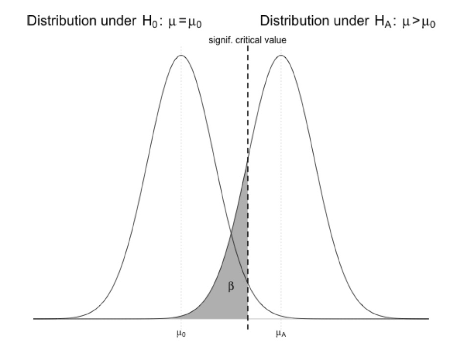

```{r setup, include=FALSE}
knitr::opts_chunk$set(
	echo=TRUE,
	warning=FALSE,
	comment="##",
	prompt=TRUE,
	tidy=TRUE,
	tidy.opts=list(width.cutoff=75),
	fig.path="img/"
)
```
# Statistical Inference and Basic Hypothesis Testing

## Preliminaries
- Install this package in ***R***: {curl}

## Summary

Z and T Statistics for the One Sample Case (testing an observed sample mean for a continuous normally distributed variable compared to a null expectation)

T = \frac{\bar{x} - \mu_0}{(s/\sqrt{n})}

where:
\bar{x} = mean of sample observations
\mu_0 = expected mean
s = sample standard deviation
n = number of sample observations


Z and T Statistics for the Two Sample Case (comparing two means for a continuous normally distributed variable)


Assumptions:
- Dealing with normally distributed continuous variables (or those that can be approximated closely by the normal distribution)
- When sample size > 30 we can use the Z distribution, but for < 30, use the T distribution

- CI = mean ± T 1-alpha/2 x SE 
- REJECT Ho if 1-alpha CI around test statistic does not include zero
- REJECT Ho if p value for obtaining the given test statistic is < alpha


For nonnormally distributed variables...

The same principles apply. Let's consider a proportion...

Or a Poisson CI...

Recall the the Poisson distribution models counts and is determined by a single parameter, $\lambda$. The Poisson distribution is also useful for modeling rates, or counts that occur over units of time. If we imagine a variable X ∼ Poisson(λt) where λ = E[X/t] = the expected count per unit of time and t is the total monitoring time and 

Remember that if X ∼ Poisson(λt) then our estimate of λ is λˆ = X/t. Furthermore, we know that V ar(λˆ) = λ/t and so the natural estimate is λˆ/t. While it’s not immediate how the CLT applies in this case, the interval is of the familiar form
So our Poisson interval is:
Example
Estimate ± Z1−α/2SE. λˆ ± Z 1 − α / 2   λˆ


What about other data types, like proportions?

Remember for proportion data, the average proportion = $\pi$ and the standard error of the average proportion was sqrt($\pi(1-\pi)/n$)

The Z statistic is equivalent to the T statistic


## Errors and Power

Let's return to the concepts of error and power. Recall that Type I error occurs when you incorrectly reject a true $H_0$. In any given hypothesis test, the probability of a Type I error is equivalent to the significance level, $\alpha$. Type II error occurs when you incorrectly fail to reject a false $H_0$ (in other words, fail to find evidence in support of a true $H_A$). Since we do not know what the true $H_A$ actually is, the probability of committing such an error, labeled $\beta$, is not usually known in practice.


### Type I Error and the Multiple Testing Problem

Because of how we define $\alpha$, the chance probabilty of falsely rejecting $H_0$, we would expect to find some "significant" results if we run enough independent hypothesis tests. For example, if we set $\alpha$ at 0.05, we expect to find one "significant" result in roughly every 20 tests we run, just by chance. The relation of $\alpha$ to the distribution of a variable under a null hypothesis ($\mu$ = $\mu_0$) versus an alternative hypothesis ($\mu$ > $\mu_0$) is shown in the figure below (this is an example for a one-tailed test). It should be clear that we can reduce the chance of Type I error by decreasing $\alpha$.


Let's explore this via simulation.

We will write some code to simulate a bunch of random datasets from a normal distribution where we set the expected population mean ($\mu_0$) and standard deviation and then calculate a T statistic and p value for each one. We will then look at the "Type I" error rate... the proportion of times that, based on our sample, we would conclude that it was not drawn from the distribution we know to be true.

First, let's set up a skeleton function we will call `typeI()`. It should take, as arguments, the parameters of the normal distribution for the null hypothesis we want to simulate from ($\mu_0$ and $\sigma$), our sample size, our alpha level, and the number of simulated datasets we want to generate. Type in the code below (and note that we set default values for $\alpha$ and number of simulations).

``` {r}
typeI <- function(mu0,sigma,n,alpha=0.05,sims=10000){
}
```

Now, we will add the body of the function.

``` {r}
typeI <- function(mu0,sigma,n,alpha=0.05,k=10000){
	p <- rep(NA,k) # sets up a vector of empty p values
	for(i in 1:k){ # sets up a loop to run k simulations
		x <- rnorm(n=n,mean=mu0,sd=sigma) # draws a sample from our distribution
		m <- mean(x) # calculates the mean
		s <- sd(x) # calculates the standard deviation
		t <- (m-mu0)/(s/sqrt(n)) # calculates the T statistic for the sample mean relative to the null
		p[i] <- pt(t,df=n-1,lower.tail=FALSE) # calculates the associated p value
		# print(p[i])
		}
	return(length(p[p<alpha])/k) # returns the proportion of simulations where p < alpha
}
```

Now, run our Type I error test function with a couple of different values of $\mu_0$, $\sigma$, and $\alpha$. What error rate is returned? It should be close to $\alpha$!

``` {r}
e <- typeI(mu0=3, sigma=4, alpha = 0.05, n=10)
e
```

#### CHALLENGE:
How does the Type I error rate change with $n$?

### Bonferroni Correction
We can address the multiple testing problem by using what is called the Bonferroni correction, which suggests that when doing a total of $N$ independent hypothesis tests, each with a significance level of $\alpha$, we should adjusted the $\alpha$ level we use to interpret statistical significance as follow: $\alpha_B$ = $\alpha/N$.

For example, if we run 10 independent hypothesis tests, then we should set our adjusted $\alpha$ level for each test as 0.05/10 = 0.005. Note that many statisticians consider the Bonferroni correction to be a particularly conservative one, and there are other corrections we might use to account for multiple testing.

## Type II Error

By reducing the $\alpha$ level we use as our criterion for statistical significance, we can reduce the chance of committing Type I, but doing so directly increases our chance of committing a Type II error. The shaded area in this figure below, $\beta$, is the probability of incorrectly failing to reject the null...



It should be clear in this figure that if the critical value (which is defined by $\alpha$) is shifted right or $\mu$ under the alternative hypothesis shifts left, then $\beta$, the area under the curve to the left of the critical value, increases! Intuitively, this makes sense: the lower the difference between the true $\mu_A$ value and $\mu_0$ and/or the smaller the $\alpha$ level, the harder it will be to reject the null hypothesis that $\mu$ = $\mu_0$.

In practice, we cannot usually calculate $\beta$ because of the need to know where the true distribution is really centered (i.e., what is the value of $\mu_A$). However, using our data, we can explore what $\beta$ is expected to look like under different sample sizes, $\alpha$ levels, and expected $\mu_A$.

Let's also explore this by simulation using the approach we developed above. Again, we will write some code to simulate a bunch of random datasets, this time drawn from a normal distribution associated with a particular alternative hypothesis, $H_A$, i.e., where we know that the expected population mean is $\mu_A$ and the standard deviation is $\sigma_A$. We then calculate a T statistic based on each sample dataset relative to $\mu_0$, the expected mean under $H_0$, and determine the associated p value for each one. Based on this, we can calculate the Type II error rate... the proportion of times that, based on our sample, we would conclude that it was drawn from the $H_0$ rather than the $H_A$ distribution we know to be true.

``` {r}
typeII <- function(mu0,muA,sigmaA,n,alpha=0.05,k=1000){
	p <- rep(NA,k) # sets up a vector of empty p values
	for(i in 1:k){
		x <- rnorm(n=n,mean=muA,sd=sigmaA)
		m <- mean(x)
		s <- sd(x)
		t <- (m-mu0)/(s/sqrt(n)) # calculates the T statistic for the sample mean relative to the null
		p[i] <- pt(t,df=n-1,lower.tail=FALSE)
		# print(p[i])
		}
	return(length(p[p>=alpha])/k)
}
```

``` {r}
e <- typeII(mu0=-1, muA=4, sigmaA=4, n=10)
e
```

#### CHALLENGE:
Explore the effects of increasing the variability ($\sigma$) in a given sample and the impact of increasing sample size ($n$). How do each of these impact the Type II error rate?

``` {r}
library(ggplot2)
n <- 1:100
s <- seq(from=1, to=5, by=1)
p <- matrix(data=NA,nrow=length(n),ncol=length(s))
p <- as.data.frame(p)
for (i in 1:length(n)) {
	for (j in 1:length(s)){
	p[i,j] <- 1 - typeII(mu0=2,muA=4,sigmaA=j,alpha=0.05,n=i)
	}
}
p <- cbind(n,p)
g <- ggplot(data=p, aes(x=,y=p), xlab = "sample size n", ylab = "Power = 1 - Beta") + ylim(0,1) + geom_point(aes(x=n,y=p),colour="blue", alpha=1/2) + geom_line(aes(x=n,y=p),colour="blue") + geom_line(y=0.8, lty=3)
g

for (i in 1:length(n)) {
	p[i] <- 1 - typeII(mu0=2,muA=4,sigmaA=2,alpha=0.01,n=i)
}
d <- as.data.frame(cbind(n,p))
g <- g + geom_point(data=d,aes(x=n,y=p), colour="red", alpha=1/2)+ geom_line(data=d,aes(x=n,y=p), colour="red")
g

for (i in 1:length(n)) {
	p[i] <- 1 - typeII(mu0=2,muA=4,sigmaA=1,alpha=0.01,n=i)
}
d <- as.data.frame(cbind(n,p))
g <- g + geom_point(data=d,aes(x=n,y=p), colour="green", alpha=1/2)+ geom_line(data=d,aes(x=n,y=p), colour="green")
g


n <- 100
s <- seq(from=0.25, to=5, by=0.25)
p <- rep(NA,max(n)) # sets up a vector of empty p values
for (i in 1:length(n)) {
	p[i] <- 1 - typeII(mu0=2,muA=4,sigmaA=2,alpha=0.01,n=i)
}
d <- as.data.frame(cbind(n,p))
g <- ggplot(data=d,aes(x=n,y=p),xlab = "sample size n", ylab = "Power = 1 - Beta") + ylim(0,1) + geom_point() + geom_line(y=0.8)
g


the Type I error rate matches the predefined significance level and so can be decreased by reducing ↵. In contrast, controlling the Type II error rate is a complex balancing act that can involve sample size, significance level, observation variability, and magni- tude of the difference between the true value and the null.


Power

Power is the probability of correctly rejecting a null hypothesis that is untrue. For a test that has a Type II error rate of beta , the statistical power is found simply with 1 - beta. Power of .8 or greater is considered high.

Simulating power...

Let's write a function to do a power simulation for samples of different size. We want a function where we can give it our sample mean, our sample standard deviation, our sample size, and an alternative mean and have it return power.

