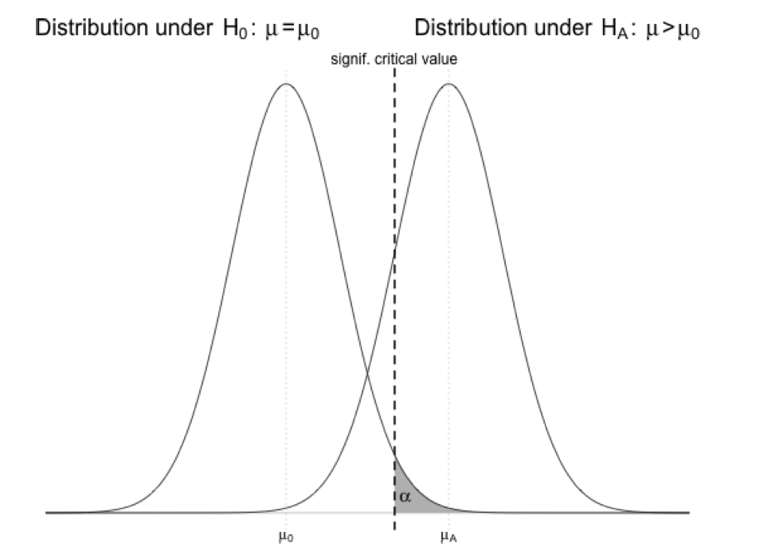
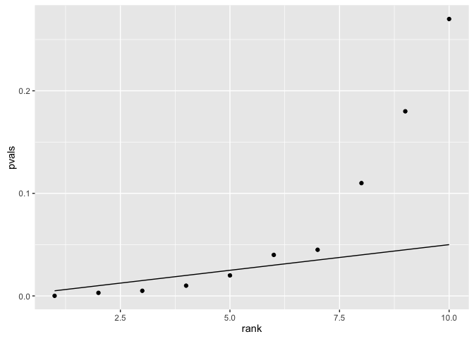
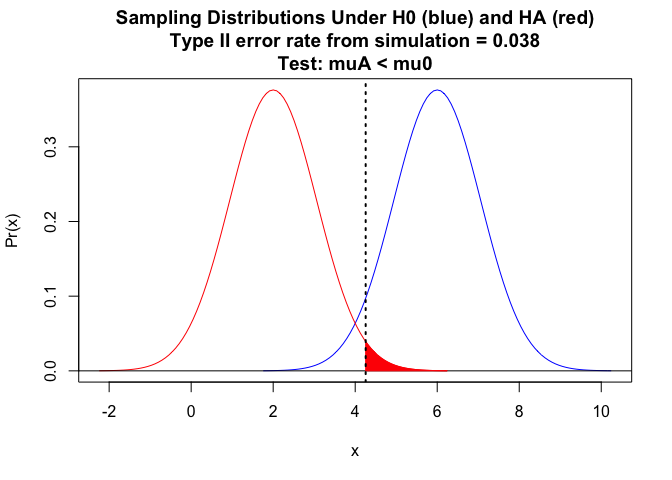

Module 11
================

Type I and II Errors and Statistical Power
==========================================

Preliminaries
-------------

-   Install these packages in ***R***: {curl}, {ggplot2}, {manipulate}

Overview
--------

Let's return to the concepts of **error** and **power**. Recall that Type I error occurs when you **incorrectly reject a true *H*<sub>0</sub>**. In any given hypothesis test, the probability of a Type I error is equivalent to the significance level, *α*, and it is this type of error we are often trying to minimize when we are doing classical statistical inference. Type II error occurs when you **incorrectly fail to reject a false *H*<sub>0</sub>** (in other words, fail to find evidence in support of a true *H*<sub>*A*</sub>). Since we do not know what the true *H*<sub>*A*</sub> actually is, the probability of committing such an error, labeled *β*, is not usually known in practice.

| What is True      | What We Decide    | Result                                    |
|-------------------|-------------------|-------------------------------------------|
| *H*<sub>0</sub>   | *H*<sub>0</sub>   | Correctly 'accept' the null               |
| *H*<sub>0</sub>   | *H*<sub>*A*</sub> | Falsely reject the null (Type I error)    |
| *H*<sub>*A*</sub> | *H*<sub>0</sub>   | Falsely 'accept' the null (Type II error) |
| *H*<sub>*A*</sub> | *H*<sub>*A*</sub> | Correctly reject the null                 |

Type I Error and the Multiple Testing Problem
---------------------------------------------

Because of how we define *α*, the chance probabilty of falsely rejecting *H*<sub>0</sub> when *H*<sub>0</sub> is actually true, we would expect to find some "significant" results if we run enough independent hypothesis tests. For example, if we set *α* at 0.05, we would expect to find one "significant" result in roughly every 20 tests we run, just by chance. The relation of *α* to the distribution of a variable under a null hypothesis (*μ* = *μ*<sub>0</sub>) versus an alternative hypothesis (e.g., *μ* &gt; *μ*<sub>0</sub>) is shown in the figure below (this example is for an upper one-tailed test). It should be clear that we can reduce the chance of Type I error by decreasing *α* (shifting the critical value to the right in the *H*<sub>0</sub> distribution). Type I error will also be reduced as the means get further apart or as the standard deviation of the distributions shrinks.



Let's explore this via simulation.

We will write some code to simulate a bunch of random datasets from a normal distribution where we set the expected population mean (*μ*<sub>0</sub>) and standard deviation (*σ*) and then calculate a T statistic and p value for each one. We will then look at the "Type I" error rate... the proportion of times that, based on our sample, we would conclude that it was not drawn from the distribution we know to be true.

First, let's set up a skeleton function we will call `typeI()` to evaluate the Type I error rate. It should take, as arguments, the parameters of the normal distribution for the null hypothesis we want to simulate from (*μ*<sub>0</sub> and *σ*), our sample size, our alpha level, what type of t test we want to do ("greater", "less", "two.tailed") and the number of simulated datasets we want to generate. Type in the code below (and note that we set default values for *α* and the number of simulations).

``` r
> typeI <- function(mu0, sigma, n, type = "two.tailed", alpha = 0.05, k = 10000) {
+ }
```

Now, we will add the body of the function.

``` r
> typeI <- function(mu0, sigma, n, type = "two.tailed", alpha = 0.05, k = 1000) {
+     p <- rep(NA, k)  # sets up a vector of empty p values
+     for (i in 1:k) {
+         # sets up a loop to run k simulations
+         x <- rnorm(n = n, mean = mu0, sd = sigma)  # draws a sample from our distribution
+         m <- mean(x)  # calculates the mean
+         s <- sd(x)  # calculates the standard deviation
+         t <- (m - mu0)/(s/sqrt(n))  # calculates the T statistic for the sample drawn from the null distribution relative to the null distribution
+         if (type == "less") {
+             p[i] <- pt(t, df = n - 1, lower.tail = TRUE)  # calculates the associated p value
+         }
+         if (type == "greater") {
+             p[i] <- pt(t, df = n - 1, lower.tail = FALSE)
+         }
+         if (type == "two.tailed") {
+             if (t > 0) {
+                 p[i] <- 2 * pt(t, df = n - 1, lower.tail = FALSE)
+             }
+             if (t < 0) {
+                 p[i] <- 2 * pt(t, df = n - 1, lower.tail = TRUE)
+             }
+         }
+     }
+     
+     curve(dnorm(x, mu0, sigma/sqrt(n)), mu0 - 4 * sigma/sqrt(n), mu0 + 4 * sigma/sqrt(n), 
+         main = paste("Sampling Distribution Under the Null Hypothesis\nType I error rate from simulation = ", 
+             length(p[p < alpha])/k, sep = ""), xlab = "x", ylab = "Pr(x)", col = "blue", 
+         xlim = c(mu0 - 4 * sigma/sqrt(n), mu0 + 4 * sigma/sqrt(n)), ylim = c(0, 
+             dnorm(mu0, mu0, sigma/sqrt(n))))
+     abline(h = 0)
+     
+     if (type == "less") {
+         polygon(cbind(c(mu0 - 4 * sigma/sqrt(n), seq(from = mu0 - 4 * sigma/sqrt(n), 
+             to = mu0 - qnorm(1 - alpha) * sigma/sqrt(n), length.out = 100), 
+             mu0 - qnorm(1 - alpha) * sigma/sqrt(n))), c(0, dnorm(seq(from = mu0 - 
+             4 * sigma/sqrt(n), to = mu0 - qnorm(1 - alpha) * sigma/sqrt(n), 
+             length.out = 100), mean = mu0, sd = sigma/sqrt(n)), 0), border = "black", 
+             col = "blue")
+         q <- pnorm(mu0 - qnorm(1 - alpha) * sigma/sqrt(n), mean = mu0, sd = sigma/sqrt(n)) - 
+             pnorm(mu0 - 4 * sigma/sqrt(n), mean = mu0, sd = sigma/sqrt(n))
+     }
+     if (type == "greater") {
+         polygon(cbind(c(mu0 + qnorm(1 - alpha) * sigma/sqrt(n), seq(from = mu0 + 
+             qnorm(1 - alpha) * sigma/sqrt(n), to = mu0 + 4 * sigma/sqrt(n), 
+             length.out = 100), mu0 + 4 * sigma/sqrt(n))), c(0, dnorm(seq(from = mu0 + 
+             qnorm(1 - alpha) * sigma/sqrt(n), to = mu0 + 4 * sigma/sqrt(n), 
+             length.out = 100), mean = mu0, sd = sigma/sqrt(n)), 0), border = "black", 
+             col = "blue")
+         q <- pnorm(mu0 + 4 * sigma/sqrt(n), mean = mu0, sd = sigma/sqrt(n)) - 
+             pnorm(mu0 + qnorm(1 - alpha) * sigma/sqrt(n), mean = mu0, sd = sigma/sqrt(n))
+     }
+     if (type == "two.tailed") {
+         polygon(cbind(c(mu0 - 4 * sigma/sqrt(n), seq(from = mu0 - 4 * sigma/sqrt(n), 
+             to = mu0 - qnorm(1 - alpha/2) * sigma/sqrt(n), length.out = 100), 
+             mu0 - qnorm(1 - alpha/2) * sigma/sqrt(n))), c(0, dnorm(seq(from = mu0 - 
+             4 * sigma/sqrt(n), to = mu0 - qnorm(1 - alpha/2) * sigma/sqrt(n), 
+             length.out = 100), mean = mu0, sd = sigma/sqrt(n)), 0), border = "black", 
+             col = "blue")
+         polygon(cbind(c(mu0 + qnorm(1 - alpha/2) * sigma/sqrt(n), seq(from = mu0 + 
+             qnorm(1 - alpha/2) * sigma/sqrt(n), to = mu0 + 4 * sigma/sqrt(n), 
+             length.out = 100), mu0 + 4 * sigma/sqrt(n))), c(0, dnorm(seq(from = mu0 + 
+             qnorm(1 - alpha/2) * sigma/sqrt(n), to = mu0 + 4 * sigma/sqrt(n), 
+             length.out = 100), mean = mu0, sd = sigma/sqrt(n)), 0), border = "black", 
+             col = "blue")
+         q <- pnorm(mu0 - qnorm(1 - alpha/2) * sigma/sqrt(n), mean = mu0, sd = sigma/sqrt(n)) - 
+             pnorm(mu0 - 4 * sigma/sqrt(n), mean = mu0, sd = sigma/sqrt(n)) + 
+             pnorm(mu0 + 4 * sigma/sqrt(n), mean = mu0, sd = sigma/sqrt(n)) - 
+             pnorm(mu0 + qnorm(1 - alpha/2) * sigma/sqrt(n), mean = mu0, sd = sigma/sqrt(n))
+     }
+     # print(round(q,digits=3)) # this prints area in the shaded portion(s) of
+     # the curve
+     return(length(p[p < alpha])/k)  # returns the proportion of simulations where p < alpha
+ }
```

Can you explain what each step of this code is doing?

Now, run our Type I error test function with a couple of different values of *μ*<sub>0</sub>, *σ*, and *α*. What error rates are returned? They should be always be close to *α*!

``` r
> eI <- typeI(mu0 = -3, sigma = 2, n = 5000, type = "two.tailed", alpha = 0.05)
```


#### CHALLENGE:

How does the Type I error rate change with *n*? With *σ*? With *α*? HINT: It shouldn't change much... the Type I error rate is defined by *α*!

### Bonferroni Correction

We can address the multiple testing problem discussed above by using what is called the Bonferroni correction, which suggests that when doing a total of *k* independent hypothesis tests, each with a significance level of *α*, we should adjusted the *α* level we use to interpret statistical significance as follow: *α*<sub>*B*</sub> = *α*/*k*.

For example, if we run 10 independent hypothesis tests, then we should set our adjusted *α* level for each test as 0.05/10 = 0.005. Note that many statisticians consider the Bonferroni correction to be a particularly conservative one, and there are other corrections we might use to account for multiple testing.

Type II Error
-------------

By reducing the *α* level we use as our criterion for statistical significance, we can reduce the chance of committing a Type I error (incorrectly rejecting the null), but doing so directly increases our chance of committing a Type II error (incorrectly ***failing*** to reject the null). The shaded area in this figure below, *β*, is the probability of incorrectly failing to reject the null...


It should be clear from this figure that if the critical value (which, again, is defined by *α*) is shifted to the left, or if *μ* under the alternative hypothesis shifts left, then *β*, the area under the null hypothesis distribution curve to the left of the critical value, increases! Intuitively, this makes sense: the lower the difference between the true *μ*<sub>*A*</sub> value and *μ*<sub>0</sub> and/or the higher the *α* level, the harder it will be to reject the null hypothesis that *μ* = *μ*<sub>0</sub>.

In practice, we cannot usually calculate *β* because of the need to know where the true distribution is really centered (i.e., we need to know the value of *μ*<sub>*A*</sub>, which is often unknown). However, we can explore via simulation what *β* is expected to look like under different alternative hypotheses (e.g., under different *μ*<sub>*A*</sub>) and under different sample sizes and *α* levels.

Let's do this using the simulation approach we developed above. Again, we will write some code to simulate a bunch of random datasets, this time drawn from a normal distribution associated with a particular alternative hypothesis, *H*<sub>*A*</sub>, that we define... i.e., where we specify *μ*<sub>*A*</sub>. We then calculate a T statistic based on each sample dataset relative to *μ*<sub>0</sub>, the expected mean under *H*<sub>0</sub>, and determine the associated p value for each one. Based on this, we can calculate the Type II error rate... the proportion of times that, based on our samples, we would conclude that it was drawn from the *H*<sub>0</sub> distribution rather than the *H*<sub>*A*</sub> distribution that we set to be true.

``` r
> typeII <- function(mu0, muA, sigma, n, type = "two.tailed", alpha = 0.05, k = 1000) {
+     p <- rep(NA, k)  # sets up a vector of empty p values
+     for (i in 1:k) {
+         x <- rnorm(n = n, mean = muA, sd = sigma)  # draw from Ha
+         m <- mean(x)
+         s <- sd(x)
+         t <- (m - mu0)/(s/sqrt(n))  # calculates the T statistic for the sample drawn from Ha relative to the null distribution
+         if (type == "less") {
+             p[i] <- pt(t, df = n - 1, lower.tail = TRUE)  # calculates the associated p value
+             hyp <- "muA < mu0"
+         }
+         if (type == "greater") {
+             p[i] <- pt(t, df = n - 1, lower.tail = FALSE)
+             hyp <- "muA > mu0"
+         }
+         if (type == "two.tailed") {
+             if (t > 0) {
+                 p[i] <- 2 * pt(t, df = n - 1, lower.tail = FALSE)
+             }
+             if (t < 0) {
+                 p[i] <- 2 * pt(t, df = n - 1, lower.tail = TRUE)
+             }
+             hyp <- "muA ≠ mu0"
+         }
+     }
+     
+     curve(dnorm(x, mu0, sigma/sqrt(n)), mu0 - 4 * sigma/sqrt(n), mu0 + 4 * sigma/sqrt(n), 
+         main = paste("Sampling Distributions Under H0 (blue) and HA (red)\nType II error rate from simulation = ", 
+             length(p[p >= alpha])/k, "\nTest: ", hyp, sep = ""), xlab = "x", 
+         ylab = "Pr(x)", col = "blue", xlim = c(min(c(mu0 - 4 * sigma/sqrt(n), 
+             muA - 4 * sigma/sqrt(n))), max(c(mu0 + 4 * sigma/sqrt(n), muA + 
+             4 * sigma/sqrt(n)))), ylim = c(0, max(c(dnorm(mu0, mu0, sigma/sqrt(n))), 
+             dnorm(muA, muA, sigma/sqrt(n)))))
+     
+     curve(dnorm(x, muA, sigma/sqrt(n)), muA - 4 * sigma/sqrt(n), muA + 4 * sigma/sqrt(n), 
+         col = "red", add = TRUE)
+     abline(h = 0)
+     
+     if (type == "less") {
+         polygon(cbind(c(mu0 - qnorm(1 - alpha) * sigma/sqrt(n), seq(from = mu0 - 
+             qnorm(1 - alpha) * sigma/sqrt(n), to = muA + 4 * sigma/sqrt(n), 
+             length.out = 100), muA + 4 * sigma/sqrt(n))), c(0, dnorm(seq(mu0 - 
+             qnorm(1 - alpha) * sigma/sqrt(n), to = muA + 4 * sigma/sqrt(n), 
+             length.out = 100), mean = muA, sd = sigma/sqrt(n)), 0), border = "red", 
+             col = "red")
+         abline(v = mu0 - qnorm(1 - alpha) * sigma/sqrt(n), col = "black", lty = 3, 
+             lwd = 2)
+     }
+     
+     if (type == "greater") {
+         polygon(cbind(c(muA - 4 * sigma/sqrt(n), seq(from = muA - 4 * sigma/sqrt(n), 
+             to = mu0 + qnorm(1 - alpha) * sigma/sqrt(n), length.out = 100), 
+             mu0 + qnorm(1 - alpha) * sigma/sqrt(n))), c(0, dnorm(seq(from = muA - 
+             4 * sigma/sqrt(n), to = mu0 + qnorm(1 - alpha) * sigma/sqrt(n), 
+             length.out = 100), mean = muA, sd = sigma/sqrt(n)), 0), border = "red", 
+             col = "red")
+         abline(v = mu0 + qnorm(1 - alpha) * sigma/sqrt(n), col = "black", lty = 3, 
+             lwd = 2)
+     }
+     
+     if (type == "two.tailed") {
+         abline(v = mu0 - qnorm(1 - alpha/2) * sigma/sqrt(n), col = "black", 
+             lty = 3, lwd = 2)
+         abline(v = mu0 + qnorm(1 - alpha/2) * sigma/sqrt(n), col = "black", 
+             lty = 3, lwd = 2)
+         
+         if (t > 0) {
+             # greater
+             polygon(cbind(c(muA - 4 * sigma/sqrt(n), seq(from = muA - 4 * sigma/sqrt(n), 
+                 to = mu0 + qnorm(1 - alpha/2) * sigma/sqrt(n), length.out = 100), 
+                 mu0 + qnorm(1 - alpha/2) * sigma/sqrt(n))), c(0, dnorm(seq(from = muA - 
+                 4 * sigma/sqrt(n), to = mu0 + qnorm(1 - alpha/2) * sigma/sqrt(n), 
+                 length.out = 100), mean = muA, sd = sigma/sqrt(n)), 0), border = "red", 
+                 col = "red")
+         }
+         
+         # less
+         if (t < 0) {
+             polygon(cbind(c(mu0 - qnorm(1 - alpha/2) * sigma/sqrt(n), seq(from = mu0 - 
+                 qnorm(1 - alpha/2) * sigma/sqrt(n), to = muA + 4 * sigma/sqrt(n), 
+                 length.out = 100), muA + 4 * sigma/sqrt(n))), c(0, dnorm(seq(mu0 - 
+                 qnorm(1 - alpha/2) * sigma/sqrt(n), to = muA + 4 * sigma/sqrt(n), 
+                 length.out = 100), mean = muA, sd = sigma/sqrt(n)), 0), border = "red", 
+                 col = "red")
+         }
+     }
+     
+     return(length(p[p >= alpha])/k)
+ }
```

Explore this function using different values of *μ*<sub>0</sub>, *σ*, *n*, and different types of one- and two-tailed tests.

``` r
> eII <- typeII(mu0 = 2, muA = 5, sigma = 3, n = 6, type = "greater")  # Ha > H0
```



``` r
> eII <- typeII(mu0 = 6, muA = 2, sigma = 3, n = 8, type = "less")  # Ha < H0
```



``` r
> eII <- typeII(mu0 = 7, muA = 5, sigma = 2, n = 15, type = "two.tailed")  # Ha ≠ H0
```


Power
-----

Power is the probability of correctly rejecting a null hypothesis that is untrue. For a test that has a Type II error rate of *β*, the statistical power is defined, simply, as 1 − *β*. Power values of 0.8 or greater are considered high.

#### CHALLENGE:

Using the code below, which graphs the Type II error rate (*β*) and Power (1 − *β*) for T tests (using the `power.t.test()` function), explore the effects of changing *α*, within sample variability (*σ*), and the differece between sample means (i.e., *μ*<sub>0</sub> and *μ*<sub>*A*</sub> for a one sample test or, equivalently, *μ*<sub>1</sub> and *μ*<sub>2</sub> for a two sample test). The graph shows the effect size, given the difference between the means, (i.e., |(*μ*<sub>0</sub> − *μ*<sub>*A*</sub>)|/*σ*) and the sample size (*n*) needed to achieve a power of 0.8.

``` r
> library(ggplot2)
> library(manipulate)
> power.test <- function(mu0, muA, sigma, alpha = 0.05, type, alternative) {
+     p <- 0
+     for (i in 2:200) {
+         x <- power.t.test(n = i, delta = abs(muA - mu0), sd = sigma, sig.level = alpha, 
+             power = NULL, type = type, alternative = alternative)
+         p <- c(p, x$power)
+     }
+     d <- data.frame(cbind(1:200, p, 1 - p))
+     critn <- 0
+     for (i in 1:199) {
+         if (p[i] < 0.8 && p[i + 1] >= 0.8) {
+             critn <- i + 1
+         } else {
+             critn <- critn
+         }
+     }
+     names(d) <- c("n", "power", "beta")
+     g <- ggplot(data = d) + xlab("sample size n") + ylab("Type II Error Rate, Beta  (Red)\nand\nPower, 1-Beta (Blue)") + 
+         ggtitle("Power for T Tests\n(assuming equal n and variance across groups)") + 
+         ylim(0, 1) + geom_point(aes(x = n, y = power), colour = "blue", alpha = 1/2) + 
+         geom_line(aes(x = n, y = power), colour = "blue", alpha = 1/2) + geom_line(aes(x = n, 
+         y = 0.8), colour = "red", lty = 3) + geom_point(aes(x = n, y = beta), 
+         colour = "red", alpha = 1/2) + geom_line(aes(x = n, y = beta), colour = "red", 
+         alpha = 1/2) + geom_linerange(aes(x = critn, ymin = 0, ymax = 0.8), 
+         colour = "blue", alpha = 1/4) + annotate("text", x = 150, y = 0.5, label = paste("effect size = ", 
+         round(abs(mu0 - muA)/sigma, digits = 3), "\ncritical n = ", critn, sep = ""))
+     print(g)
+ }
```

``` r
> manipulate(power.test(mu0, muA, sigma, alpha, type, alternative), mu0 = slider(-10, 
+     10, initial = 3, step = 1), muA = slider(-10, 10, initial = 0, step = 1), 
+     sigma = slider(1, 10, initial = 3, step = 1), alpha = slider(0.01, 0.1, 
+         initial = 0.05, step = 0.01), type = picker("two.sample", "paired", 
+         "one.sample"), alternative = picker("two.sided", "one.sided"))
```
