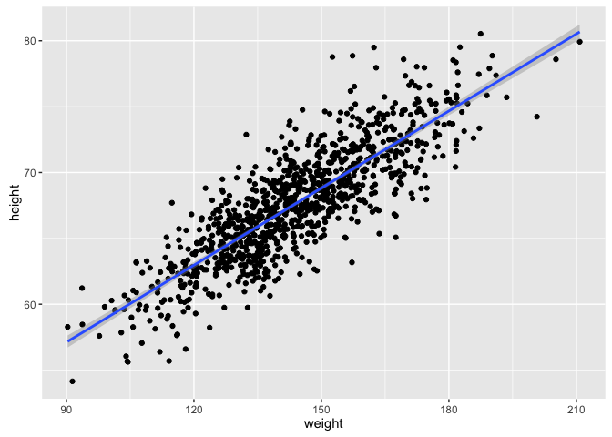
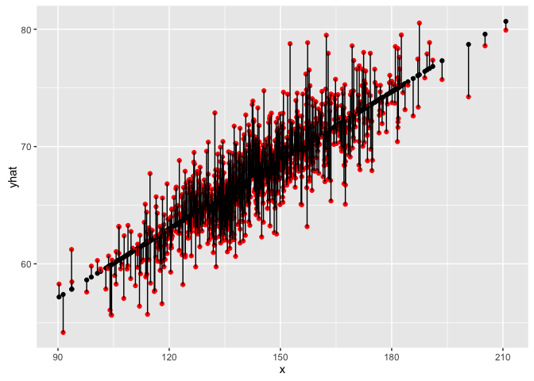
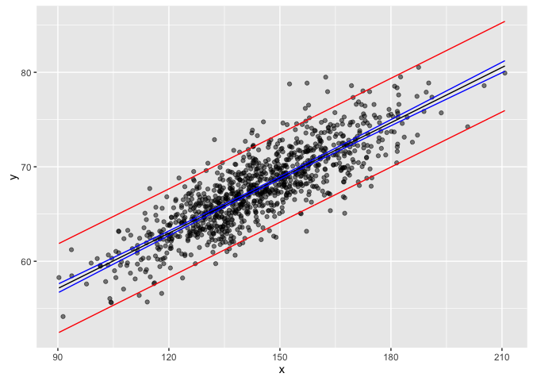

Module 12
================

Introduction to Linear Regression
=================================

Preliminaries
-------------

-   Install these packages in ***R***: {curl}, {ggplot2}, {gridExtra}, {manipulate}

Covariance and Correlation
--------------------------

So far, we have looked principally at single variables, but one of the main things we are often interested in is the relationships among two or more variables. Regression modeling is one of the most powerful and important set of tools for looking at relationships among more than one variable. With our zombies dataset, we started to do this using simple bivariate scatterplots... let's look at those data again and do a simple bivariate plot of height by weight.

``` r
> library(curl)
> library(ggplot2)
> f <- curl("https://raw.githubusercontent.com/difiore/ADA2016/master/zombies.csv")
> d <- read.csv(f, header = TRUE, sep = ",", stringsAsFactors = FALSE)
> head(d)
```

    ##   id first_name last_name gender   height   weight zombies_killed
    ## 1  1      Sarah    Little Female 62.88951 132.0872              2
    ## 2  2       Mark    Duncan   Male 67.80277 146.3753              5
    ## 3  3    Brandon     Perez   Male 72.12908 152.9370              1
    ## 4  4      Roger   Coleman   Male 66.78484 129.7418              5
    ## 5  5      Tammy    Powell Female 64.71832 132.4265              4
    ## 6  6    Anthony     Green   Male 71.24326 152.5246              1
    ##   years_of_education                           major      age
    ## 1                  1                medicine/nursing 17.64275
    ## 2                  3 criminal justice administration 22.58951
    ## 3                  1                       education 21.91276
    ## 4                  6                  energy studies 18.19058
    ## 5                  3                       logistics 21.10399
    ## 6                  4                  energy studies 21.48355

``` r
> plot(data = d, height ~ weight)
```


These variables clearly seem to be related to one another, in that as weight increases, height increases. There are a couple of different ways we can quantify the relationship between these variables. One is the **covariance**, which expresses how much two numeric variables “change together” and whether that change is positive or negative.

Recall that the variance in a variable is simply the sum of the squared deviatiations of each observation from the mean divided by sample size (**n** for population variance or **n-1** for sample variance). Thus, sample variance is:


Similarly, the **covariance** is simply the product of the deviations of each of two variables from their respective means divided by sample size. So, for two vectors, *x* and *y*, each of length *n* representing two variables describing a sample...


#### CHALLENGE:

What is the covariance between zombie weight and zombie height? What does it mean if the covariance is positive versus negative? Does it matter if you switch the order of the two variables?

``` r
> w <- d$weight
> h <- d$height
> n <- length(w)  # or length(h)
> cov_wh <- sum((w - mean(w)) * (h - mean(h)))/(n - 1)
> cov_wh
```

    ## [1] 66.03314

The built-in ***R*** function `cov()` yields the same.

``` r
> cov(w, h)
```

    ## [1] 66.03314

We often describe the relationship between two variables using the **correlation** coefficient, which is a standardized form of the covariance, which summarizes on a standard scale, -1 to +1, both the strength and direction of a relationship. The correlation is simply the covariance divided by the product of the standard deviation of both variables.


#### CHALLENGE:

Calculate the correlation between zombie height and weight.

``` r
> sd_w <- sd(w)
> sd_h <- sd(h)
> cor_wh <- cov_wh/(sd_w * sd_h)
> cor_wh
```

    ## [1] 0.8325862

Again, there is a built-in ***R*** function `cor()` which yields the same.

``` r
> cor(w, h)
```

    ## [1] 0.8325862

This formulation of the correlation coefficient is referred to as **Pearson’s product-moment correlation coefficient** and is often abbreviated as ***ρ***.

Regression
----------

Regression is the set of tools that lets us explore the relationships between variables further. In regression analysis, we are typically identifying and exploring linear models, or functions, that describe the relationship between variables. There are a couple of main purposes for undertaking regression analyses:

-   To use one or more variables to **predict** the value of another
-   To develo and choose among different **models** of the relationship between variables
-   To do **analyses of covariation** among sets of variables to identify their relative explanatory power

The general purpose of linear regression is to come up with a model or function that estimates the mean value of one variable,i.e., the **response** or **outcome** variable, given the particular value(s) of another variable or set of variables, i.e., the **predictor** variable(s).

We're going to start off with simple bivariate regression, where we have a single predictor and a single response variable. In our case, we may be interested in coming up with a linear model that estimates the mean value for zombie height (as the response variable) given zombie weight (as the predictor variable). That is, we want to explore functions that link these two variables and choose the best one.

Looking at our scatterplot above, it seems pretty clear that there is indeed some linear relationship among these variables, and so a reasonable function to connect height to weight should simply be some kind of line of best fit. Recall that the general formula for a line is:


where  = our predicted y given a value of x

In regression parlance...


\[see equation 20.2 in ***The Book of R***\]

Here, *β*<sub>1</sub> and *β*<sub>0</sub> are referred to as the **regression coefficients**, and it is those that our regression analysis is trying to estimate. This process of estimation is called "fitting the model."

We can imagine a family of lines of different *β*<sub>1</sub> and *β*<sub>0</sub> going through this cloud of points, but the best fit criterion we typically use for linear regression is to find the line whose coefficients minimize the sum of the squared deviations of each observation from that predicted by the line. This is the basis of **ordinary least squares** regression.

So, we want to find *β*<sub>1</sub> and *β*<sub>0</sub> that minimizes...


or, equivalently,


In our variables, this is...


Let's fit the model by hand... The first thing to do is estimate the slope, which we can do if we first "center" each of our variables by subtracting the mean from each value (this shifts the distribution to eliminate the intercept term).

``` r
> y <- h - mean(h)
> x <- w - mean(w)
> z <- data.frame(cbind(x, y))
> g <- ggplot(data = z, aes(x = x, y = y)) + geom_point()
> g
```


Now, we just need to minimize...


We can explore finding the best slope (*β*<sub>1</sub>) for this line using an interactive approach...

``` r
> slope.test <- function(beta1) {
+     g <- ggplot(data = z, aes(x = x, y = y))
+     g <- g + geom_point()
+     g <- g + geom_abline(intercept = 0, slope = beta1, size = 1, colour = "blue", 
+         alpha = 1/2)
+     ols <- sum((y - beta1 * x)^2)
+     g <- g + ggtitle(paste("Slope = ", beta1, "\nSum of Squared Deviations = ", 
+         round(ols, 3)))
+     g
+ }
```

``` r
> manipulate(slope.test(beta1), beta1 = slider(-1, 1, initial = 0, step = 0.005))
```

Similarly, analytically...


\[see equation 20.3 in ***The Book of R***\]

``` r
> beta1 <- cor(w, h) * (sd(h)/sd(w))
> beta1
```

    ## [1] 0.1950187

``` r
> beta1 <- cov(w, h)/var(w)
> beta1
```

    ## [1] 0.1950187

``` r
> beta1 <- sum((h - mean(h)) * (w - mean(w)))/sum((w - mean(w))^2)
> beta1
```

    ## [1] 0.1950187

To find *β*0, we can simply plug back into our original regression model. The line of best fit has to run through the mean of x and the mean of x, so we can use the following:


which, rearranged to solve for *β*<sub>0</sub> gives...


``` r
> beta0 <- mean(h) - beta1 * mean(w)
> beta0
```

    ## [1] 39.56545

### The `lm()` Function

The function `lm()` in ***R*** makes all of these calculations very easy! Below, we pass the zombies dataframe and variables directly to `lm()` and assign the result to an ***R*** object called **m**. We can then look at the various elements that ***R*** calculates about this model.

``` r
> m <- lm(height ~ weight, data = d)
> m
```

    ## 
    ## Call:
    ## lm(formula = height ~ weight, data = d)
    ## 
    ## Coefficients:
    ## (Intercept)       weight  
    ##      39.565        0.195

``` r
> names(m)
```

    ##  [1] "coefficients"  "residuals"     "effects"       "rank"         
    ##  [5] "fitted.values" "assign"        "qr"            "df.residual"  
    ##  [9] "xlevels"       "call"          "terms"         "model"

``` r
> m$coefficients
```

    ## (Intercept)      weight 
    ##  39.5654460   0.1950187

``` r
> head(m$model)
```

    ##     height   weight
    ## 1 62.88951 132.0872
    ## 2 67.80277 146.3753
    ## 3 72.12908 152.9370
    ## 4 66.78484 129.7418
    ## 5 64.71832 132.4265
    ## 6 71.24326 152.5246

In {ggplot}, we can easily create a plot that adds the linear model along with confidence intervals around the estimated value of **y**, or  at each **x**. Those intervals are important for when we move on to talking about inference in the regression context.

``` r
> g <- ggplot(data = d, aes(x = weight, y = height))
> g <- g + geom_point()
> g <- g + geom_smooth(method = "lm", formula = y ~ x)
> g
```



#### CHALLENGE:

Using the zombies dataset, work with a partner to...

-   Plot zombie height as a function of age
-   Derive by hand the ordinary least squares regression coefficients *β*1 and *β*0 for these data.
-   Confirm that you get the same results using the `lm()` function
-   Repeat the analysis above for males and females separately. Do your regression coefficients differ? How might you determine this?

``` r
> plot(data = d, height ~ age)
```


``` r
> head(d)
```

    ##   id first_name last_name gender   height   weight zombies_killed
    ## 1  1      Sarah    Little Female 62.88951 132.0872              2
    ## 2  2       Mark    Duncan   Male 67.80277 146.3753              5
    ## 3  3    Brandon     Perez   Male 72.12908 152.9370              1
    ## 4  4      Roger   Coleman   Male 66.78484 129.7418              5
    ## 5  5      Tammy    Powell Female 64.71832 132.4265              4
    ## 6  6    Anthony     Green   Male 71.24326 152.5246              1
    ##   years_of_education                           major      age
    ## 1                  1                medicine/nursing 17.64275
    ## 2                  3 criminal justice administration 22.58951
    ## 3                  1                       education 21.91276
    ## 4                  6                  energy studies 18.19058
    ## 5                  3                       logistics 21.10399
    ## 6                  4                  energy studies 21.48355

``` r
> beta1 <- cor(d$height, d$age) * sd(d$height)/sd(d$age)
> beta1
```

    ## [1] 0.9425086

``` r
> beta0 <- mean(d$height) - beta1 * mean(d$age)
> beta0
```

    ## [1] 48.73566

``` r
> m <- lm(height ~ age, data = d)
```

### Statistical Inference in Regression

Once we have our linear model and associated regression coefficients, we want to know a bit more about it. First, we want to be able to evaluate whether there is **statistical evidence** that there is indeed a relationship between these variables. If so, then our regression coefficients can indeed allow us to estimate or predict the value of one variable given another. Additionally, we also would like to be able to extend our estimates from our sample out to the population they are drawn from. These next steps involve the process of statistical inference.

The output of the `lm()` function provides a lot of information useful for inference. Run the command `summary()` on the output of `lm(data=d,height~weight)`

``` r
> m <- lm(data = d, height ~ weight)
> summary(m)
```

    ## 
    ## Call:
    ## lm(formula = height ~ weight, data = d)
    ## 
    ## Residuals:
    ##     Min      1Q  Median      3Q     Max 
    ## -7.1519 -1.5206 -0.0535  1.5167  9.4439 
    ## 
    ## Coefficients:
    ##              Estimate Std. Error t value Pr(>|t|)    
    ## (Intercept) 39.565446   0.595815   66.41   <2e-16 ***
    ## weight       0.195019   0.004107   47.49   <2e-16 ***
    ## ---
    ## Signif. codes:  0 '***' 0.001 '**' 0.01 '*' 0.05 '.' 0.1 ' ' 1
    ## 
    ## Residual standard error: 2.389 on 998 degrees of freedom
    ## Multiple R-squared:  0.6932, Adjusted R-squared:  0.6929 
    ## F-statistic:  2255 on 1 and 998 DF,  p-value: < 2.2e-16

One of the outputs for the model, seen in the 2nd to last line in the output above, is the "R-squared" value, or the **coefficient of determination**, which is a summary of the total amount of variation in the **y** variable that is explained by the **x** variable. In our regression, ~69% of the variation in zombie height is explained by zombie weight.

Another output is the **standard error** of the estimate of each regression coefficient, along with a corresponding **t value** and **p value**. Recall that t statistics are calculated as the difference between an observed and expected value divided by a standard error. The p value comes from evaluating the magnitude of the t statistic against a t distribution with **n-2** degrees of freedom. We can confirm this by hand calculating t and p based on the estimate and the standard error of the estimate.

``` r
> t <- coef(summary(m))
> t <- data.frame(unlist(t))
> colnames(t) <- c("Est", "SE", "t", "p")
> t
```

    ##                    Est          SE        t             p
    ## (Intercept) 39.5654460 0.595814678 66.40562  0.000000e+00
    ## weight       0.1950187 0.004106858 47.48611 2.646279e-258

``` r
> t$calct <- (t$Est - 0)/t$SE
> t$calcp <- 2 * pt(t$calct, df = 998, lower.tail = FALSE)  # x2 because is 2-tailed test
> t
```

    ##                    Est          SE        t             p    calct
    ## (Intercept) 39.5654460 0.595814678 66.40562  0.000000e+00 66.40562
    ## weight       0.1950187 0.004106858 47.48611 2.646279e-258 47.48611
    ##                     calcp
    ## (Intercept)  0.000000e+00
    ## weight      2.646279e-258

We can get confidence intervals for our estimates easily, too, using either the approach we've used before by hand or by using a built in function.

``` r
> t$lower <- t$Est - qt(0.975, df = 998) * t$SE
> t$upper <- t$Est + qt(0.975, df = 998) * t$SE
> ci <- c(t$lower, t$upper)  # by hand
> ci
```

    ## [1] 38.3962527  0.1869597 40.7346393  0.2030778

``` r
> ci <- confint(m, level = 0.95)  # using the results of lm()
> ci
```

    ##                  2.5 %     97.5 %
    ## (Intercept) 38.3962527 40.7346393
    ## weight       0.1869597  0.2030778

### Interpreting Regression Coefficients and Prediction

Estimating our regression coefficients is pretty straightforward... but what do they mean?

-   The intercept, *β*<sub>0</sub>, is the PREDICTED value of **y** when the value of **x** is zero.
-   The slope, *β*<sub>1</sub> is EXPECTED CHANGE in units of **y** for every 1 unit of change in **x**.
-   The overall equation allows us to calculate PREDICTED values of **y** for new observations of **x**. We can also calculate CONFIDENCE INTERVALS around the predicted mean value of y for each value of x.

#### CHALLENGE:

-   If zombie weight is measured in *pounds* and zombie height is measured in *inches*, what is the expected height of a zombie weighing 150 pounds?
-   If zombie age is measure in *years* and height is measured in *inches*, what is the predicted difference in height between a zombie who turned at age 25 versus age 20?

``` r
> beta0 <- t$Est[1]
> beta1 <- t$Est[2]
> predicted_h <- beta1 * 150 + beta0
> predicted_h
```

    ## [1] 68.81825

The `predict()` function allows us to generate predicted (i.e., ) values for a vector of values of x. Note the structure of the 2nd argument in the function... it includes the x variable name, and we pass it a vector of values. Here, I pass it a vector of actual x values.

``` r
> m <- lm(data = d, height ~ weight)
> p_height <- predict(m, newdata = data.frame(weight = d$weight))
> dnew <- data.frame(cbind(d$weight, d$height, p_height))
> str(dnew)
```

    ## 'data.frame':    1000 obs. of  3 variables:
    ##  $ V1      : num  132 146 153 130 132 ...
    ##  $ V2      : num  62.9 67.8 72.1 66.8 64.7 ...
    ##  $ p_height: num  65.3 68.1 69.4 64.9 65.4 ...

``` r
> names(dnew) <- c("x", "y", "yhat")
> head(dnew)
```

    ##          x        y     yhat
    ## 1 132.0872 62.88951 65.32492
    ## 2 146.3753 67.80277 68.11137
    ## 3 152.9370 72.12908 69.39103
    ## 4 129.7418 66.78484 64.86753
    ## 5 132.4265 64.71832 65.39109
    ## 6 152.5246 71.24326 69.31059

``` r
> g <- ggplot(data = dnew, aes(x = x, y = yhat))
> g <- g + geom_point()
> g <- g + geom_point(aes(x = x, y = y), colour = "red")
> g <- g + geom_segment(aes(x = x, y = yhat, xend = x, yend = y))
> g
```

 Each vertical line in the figure above represents a **residual**, the difference between the observed and the fitted or predicted value of y at the given x values.

The `predict()` function also allows us to generate confidence intervals around our predicted y values easily.

``` r
> predicted_ci <- predict(m, newdata = data.frame(weight = 150), interval = "confidence", 
+     level = 0.95)  # for a single value
> predicted_ci
```

    ##        fit      lwr     upr
    ## 1 68.81825 68.66211 68.9744

``` r
> predicted_ci <- predict(m, newdata = data.frame(weight = d$weight), interval = "confidence", 
+     level = 0.95)  # for a vector of values
> head(predicted_ci)
```

    ##        fit      lwr      upr
    ## 1 65.32492 65.14872 65.50111
    ## 2 68.11137 67.96182 68.26092
    ## 3 69.39103 69.22591 69.55615
    ## 4 64.86753 64.68044 65.05462
    ## 5 65.39109 65.21636 65.56582
    ## 6 69.31059 69.14691 69.47428

``` r
> dnew <- cbind(dnew, predicted_ci)
> g <- ggplot(data = dnew, aes(x = x, y = y))
> g <- g + geom_point(alpha = 1/2)
> g <- g + geom_line(aes(x = x, y = fit), colour = "black")
> g <- g + geom_line(aes(x = x, y = lwr), colour = "blue")
> g <- g + geom_line(aes(x = x, y = upr), colour = "blue")
> g
```


#### CHALLENGE:

Predict the heights and CIs around these heights for a vector of zombie ages, `v <- seq(from=10, to=30, by=1)`. Then, plot your points, your regression line, and lines for the lower and upper limits of the CI

``` r
> v <- seq(from = 10, to = 30, by = 1)
> m <- lm(data = d, height ~ age)
> predicted_ci <- predict(m, newdata = data.frame(age = v), interval = "confidence", 
+     level = 0.95)
> plot(data = d, height ~ age)
> lines(x = v, y = predicted_ci[, 1], col = "red")
> lines(x = v, y = predicted_ci[, 2], col = "blue")
> lines(x = v, y = predicted_ci[, 3], col = "blue")
```



``` r
> # or
> require(gridExtra)
```

    ## Loading required package: gridExtra

``` r
> require(ggplot2)
> ci <- data.frame(cbind(v, predicted_ci))
> g1 <- ggplot(data = d, aes(x = age, y = height))
> g1 <- g1 + geom_point(alpha = 1/2)
> g1 <- g1 + geom_line(data = ci, aes(x = v, y = fit), colour = "blue", lwd = 1)
> g1 <- g1 + geom_line(data = ci, aes(x = v, y = lwr), colour = "red")
> g1 <- g1 + geom_line(data = ci, aes(x = v, y = upr), colour = "red")
> g2 <- ggplot(data = d, aes(x = age, y = height))
> g2 <- g2 + geom_point(alpha = 1/2)
> g2 <- g2 + geom_smooth(method = "lm", formula = y ~ x)
> grid.arrange(g1, g2, ncol = 2)
```


### Residuals

From our plots above, it's clear that our model is not explaining all of the variation we see in our dataset... our **y** points do not all fall on the **yhat** line but rather are distributed around it. The distance of each of these points from the predicted value for **y** at that value of **x** is known as the "residual". We can think about the residuals as "what is left over"" after accounting for the predicted relationship between **x** and **y**. Residuals are often thought of as estimates of the "error" term in a regression model, and most regression analyses assume that residuals are random normal variables with uniform variance across the range of **x** values (more on this below). In ordinary least squares regression, the line of best fit minimizes the sum of the squared residuals, and the expected value for a residual is 0.

Residuals are also used to create "covariate adjusted" variables, as they can be thought of as the response variable, **y**, with the linear effect of the predictor variable(s) removed. We'll return to this idea when we move on to multivariate regression.
