Module 13
================

Elements of Regression Analysis
===============================

Preliminaries
-------------

-   Install this package in ***R***: {curl}

ANOVA Tables
------------

In our linear models, we can separate or "partition" the total variation in our **y** variable (the *sum of squares of y*, or SSY) into that explained by our model (the regression sum of squares, or SSR) and that which is left over as "error" (the error sum of squares, or SSE): *S**S**Y* = *S**S**R* + *S**S**E*.

Graphically...


Let's make sure we have our zombie data loaded...

``` r
> library(curl)
> f <- curl("https://raw.githubusercontent.com/difiore/ADA2016/master/zombies.csv")
> d <- read.csv(f, header = TRUE, sep = ",", stringsAsFactors = FALSE)
```

Now, we run a straightforward bivariate regression model and, using the raw data (which are duplicated in the model object), we calculate the various sums of squares of our variables and identtify the numbers of degrees of freedom.

``` r
> m <- lm(data = d, height ~ weight)
> SSY <- sum((m$model$height - mean(m$model$height))^2)  # height - mean(height)
> SSY
```

    ## [1] 18558.61

``` r
> SSR <- sum((m$fitted.values - mean(m$model$height))^2)  # predicted height - mean height
> SSR
```

    ## [1] 12864.82

``` r
> SSE <- sum((m$model$height - m$fitted.values)^2)  # height - predicted height
> SSE
```

    ## [1] 5693.785

From here, we can calculate the variance in each of these components, typically referred to as the *mean square*, by dividing each sum of squares by its corresponding degrees of freedom (recall that a variance can be thought of as an average "sum of squares").

The degrees of freedom for the regression sum of squares (SSR) is equal to the number of predictor variables, in this case one (if we know the value of one predictor variable, then we know the predicted value of the response variable). The degrees of freedom for the error sum of squares (SSE) is equal to *n* − 2; we need to estimate two parameters from our data (*β*<sub>0</sub> and *β*<sub>1</sub>) from our data before we can calculate the error sum of squares. Finally, the number of degrees of freedom for the total sum of squares (SSY) is *n* − 1... we need to estimate one parameter from our data (the mean value of **y**) before we can calculate SSY.

The last item in the table, the **F ratio**, is the ratio of the variance explained by the regression to the remaining, unexplained variance: MSR/MSE.

``` r
> df_regression <- 1
> df_error <- 998
> df_y <- 999
> MSR <- SSR/df_regression
> MSE <- SSE/df_error
> MSY <- SSY/df_y
```

These values form the main entries in the **ANOVA Table** for our regression.

|   Source   | Sum of Squares | Degrees of Freedom | Mean Squares (SS/df) |  F Ratio |
|:----------:|:--------------:|:------------------:|:--------------------:|:--------:|
| Regression | SSR = 12864.82 |          1         |    MSR = 12864.82    | 2254.139 |
|    Error   |  SSE = 5693.79 |    *n* − 2 = 998   |     MSE = 5.7072     |          |
|    Total   | SSY = 18558.61 |    *n* − 1 = 999   |    MSY = 18.57719    |          |

We can test the overall significance of our regression model by evaluating the F ratio with an F test, which evaluates a ratio of two variances according to the F distribution, taking into account the number of degrees of freedom in each. The critical value is given by `qf(p,df1,df2)`, where **p** is 1-*α* and **df1** and **df2** are the degrees of freedom in the sources being compared (regression versus error).

``` r
> fratio <- qf(p = 0.95, df1 = 1, df2 = 998)
> fratio
```

    ## [1] 3.850793

For our data, then, the value for the F ratio exceeds this critical value.

Alternatively, we can use...

``` r
> 1 - pf(q = 2254.139, df1 = 1, df2 = 998)
```

    ## [1] 0

... and we find the p value associated with this high of an F ratio is infintessimally small.

Using the ***R*** function `summary.aov()` with our model as an argument will provide the same results as we calculated by hand above.

``` r
> summary.aov(m)
```

    ##              Df Sum Sq Mean Sq F value Pr(>F)    
    ## weight        1  12865   12865    2255 <2e-16 ***
    ## Residuals   998   5694       6                   
    ## ---
    ## Signif. codes:  0 '***' 0.001 '**' 0.01 '*' 0.05 '.' 0.1 ' ' 1

Note that the this table also shows the coefficient of determination, or the "R-squared value", which we identified above as the fraction of the total variation explained by the mode. This is simply SSR/SSY, and the correlation coefficient, *ρ*, is simply the square root of this value.

``` r
> r_squared <- SSR/SSY
> r_squared
```

    ## [1] 0.6931998

``` r
> rho <- sqrt(r_squared)
> rho
```

    ## [1] 0.8325862

Standard Errors of Regression Coefficients
------------------------------------------

We can calculate standard errors for each of the various components of our regression model, i.e., the slope and intercept, and each predicted value of **y**.

The standard error of the regression slope, *β*<sub>1</sub>, is calculated as:


``` r
> SSX <- sum((m$model$weight - mean(m$model$weight))^2)
> se_beta1 <- sqrt(MSE/SSX)
> se_beta1
```

    ## [1] 0.004106858

The standard error of the intercept, *β*<sub>0</sub>, is calculated as:


``` r
> se_beta0 <- sqrt((MSE * sum(m$model$weight^2))/(1000 * SSX))
> se_beta0
```

    ## [1] 0.5958147

Finally, the standard error of each predicted value of y is calculated as:


``` r
> se_yhat <- sqrt(MSE * (1/1000 + (m$model$weight - mean(m$model$weight))^2/SSX))
> head(se_yhat)  # just the first 6 rows
```

    ## [1] 0.08978724 0.07620966 0.08414480 0.09533986 0.08904151 0.08341218

These same standard errors for *β*<sub>0</sub> and *β*<sub>1</sub> are exactly what are returned by the `lm()` function.

``` r
> summary(m)
```

    ## 
    ## Call:
    ## lm(formula = height ~ weight, data = d)
    ## 
    ## Residuals:
    ##     Min      1Q  Median      3Q     Max 
    ## -7.1519 -1.5206 -0.0535  1.5167  9.4439 
    ## 
    ## Coefficients:
    ##              Estimate Std. Error t value Pr(>|t|)    
    ## (Intercept) 39.565446   0.595815   66.41   <2e-16 ***
    ## weight       0.195019   0.004107   47.49   <2e-16 ***
    ## ---
    ## Signif. codes:  0 '***' 0.001 '**' 0.01 '*' 0.05 '.' 0.1 ' ' 1
    ## 
    ## Residual standard error: 2.389 on 998 degrees of freedom
    ## Multiple R-squared:  0.6932, Adjusted R-squared:  0.6929 
    ## F-statistic:  2255 on 1 and 998 DF,  p-value: < 2.2e-16

Model Checking
--------------

So far, we've derived a bunch of summary statistics describing our model and we've looked at ways of testing whether those summary statistics are significantly different from zero. That is...

-   We've seen whether our overall regression model explains a significant portion of the variance in **y** by means of the F ratio test
-   We've calculated standard errors for our *β*<sub>1</sub> and *β*<sub>0</sub> estimates and seen whether they are significantly different from zero by means of t tests
-   We've calculated standard errors for our prediction of **y** () at each value of **x**
-   We've estimated the proportion of the total variance in **y** explained by our model (i.e., "R squared")

What we haven't done yet, however, is checked our model fit critically in other ways... particularly, we haven't seen whether two assumptions of linear modeling are met: that our residuals are normally distributed and that there is constancy of variance in our **y** values across the range of **x**s.

We can investigate our residuals as one way of assessing model fit.

#### CHALLENGE:

Calculate the residuals from the regression of zombie height on weight and plot these in relation to weight (the **x** variable). There are lots of ways to do this quickly.

``` r
> m <- lm(data = d, height ~ weight)
> plot(x = d$weight, y = m$residuals)
```

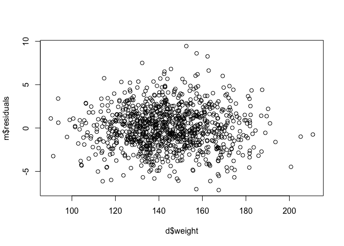

``` r
> # or
> e <- resid(m)
> plot(x = d$weight, y = e)
```


Now, plot a histogram of your residuals... ideally they are normally distributed!

``` r
> hist(e, xlim = c(-4 * sd(e), 4 * sd(e)), breaks = 20, main = "Histogram of Residuals")
```

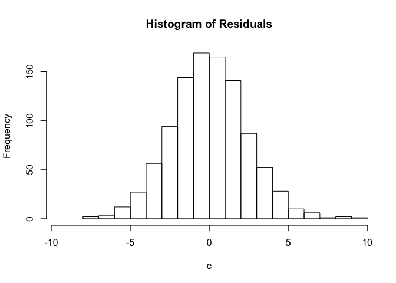

An additional way to quickly examine your residuals is to use the `plot()` function with your model as an argument. This prints out 4 plots that each tell you something.

``` r
> plot(m$model$weight, m$residuals)
```


``` r
> par(mfrow = c(2, 2))
> plot(m)
```

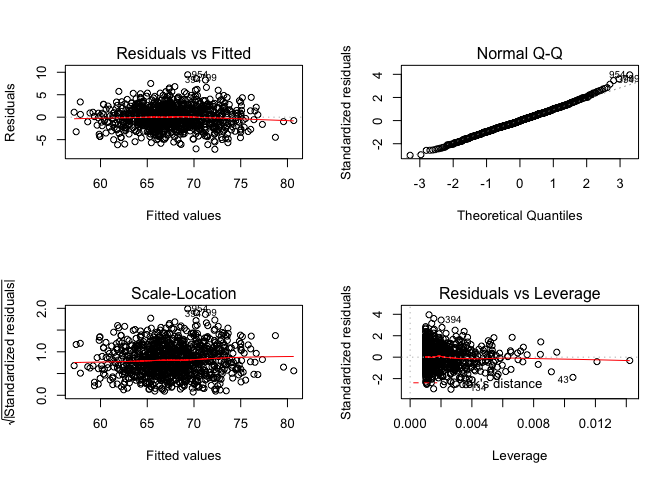 The first plot of fitted values () versus residuals should, like the plot of **x** versus residuals, not show any structure. We hope to see equally spread residuals around a horizontal line without distinct patterns. The second plot is a Q-Q plot of theoretical quantiles versus standardized quantiles for the residual values. These should fall on roughly a straight line, if the residuals are normally distributed. The third plot graphs the square root of the standardized residuals versus **x** and shows whether or not residuals are spread equally along the ranges of **x**s. It is good if you see a horizontal line with equally spread points rather than a decrease or increase in spread with **x**, which would indicate that the error variance increases or decreases with **x**. The fourth plot highlights whether there are particular observations that influence the results. In particular, we look to see if there are cases that fall in the upper or lower right portion of the plot.

#### CHALLENGE:

Load in the "KamilarAndCooper.csv" dataset and develop a linear model to look at the relationship between "weaning age" and "female body mass". You will probably need to look at the data and variable names again to find the appropriate variables to examine.

-   Using the procedures outlined above and in Module 12, calculate estimates of *β*<sub>0</sub> and *β*<sub>1</sub> by hand \***and** using the `lm()` function. Are the regression coefficients estimated under a simple linear model statistically significantly different from zero?
-   Construct an ANOVA table by hand and compare your values to the results of running `lm()` and then looking at `summary.aov(lm())`.
-   Generate the residuals for your linear model by hand, plot them in relation to female body weight, and make a histogram of the residuals. Do they appear to be normally distributed?
-   Run the `plot()` command on the result of `lm()` and examine the 4 plots produced. Again, based on examination of the residuals, does it look like your model has good fit?

``` r
> f <- curl("https://raw.githubusercontent.com/difiore/ADA2016/master/KamilarAndCooperData.csv")
> d <- read.csv(f, header = TRUE, sep = ",", stringsAsFactors = FALSE)
> head(d)
```

    ##               Scientific_Name          Family          Genus      Species
    ## 1 Allenopithecus_nigroviridis Cercopithecidae Allenopithecus nigroviridis
    ## 2         Allocebus_trichotis Cercopithecidae      Allocebus    trichotis
    ## 3           Alouatta_belzebul        Atelidae       Alouatta     belzebul
    ## 4             Alouatta_caraya        Atelidae       Alouatta       caraya
    ## 5            Alouatta_guariba        Atelidae       Alouatta      guariba
    ## 6           Alouatta_palliata        Atelidae       Alouatta     palliata
    ##   Brain_Size_Species_Mean Brain_Size_Female_Mean   Brain_size_Ref
    ## 1                   58.02                  53.70 Isler et al 2008
    ## 2                      NA                     NA                 
    ## 3                   52.84                  51.19 Isler et al 2008
    ## 4                   52.63                  47.80 Isler et al 2008
    ## 5                   51.70                  49.08 Isler et al 2008
    ## 6                   49.88                  48.04 Isler et al 2008
    ##   Body_mass_male_mean Body_mass_female_mean Mass_Dimorphism
    ## 1                6130                  3180           1.928
    ## 2                  92                    84           1.095
    ## 3                7270                  5520           1.317
    ## 4                6525                  4240           1.539
    ## 5                5800                  4550           1.275
    ## 6                7150                  5350           1.336
    ##                 Mass_Ref MeanGroupSize AdultMales AdultFemale
    ## 1       Isler et al 2008            NA         NA          NA
    ## 2 Smith and Jungers 1997          1.00       1.00         1.0
    ## 3       Isler et al 2008          7.00       1.00         1.0
    ## 4       Isler et al 2008          8.00       2.30         3.3
    ## 5       Isler et al 2008          6.53       1.37         2.2
    ## 6       Isler et al 2008         12.00       2.90         6.3
    ##   AdultSexRatio
    ## 1            NA
    ## 2            NA
    ## 3          1.00
    ## 4          1.43
    ## 5          1.61
    ## 6          2.17
    ##                                                     Social_Organization_Ref
    ## 1                                                                          
    ## 2                                                             Kappeler 1997
    ## 3                                                       Campbell et al 2007
    ## 4 van Schaik et al. 1999; Kappeler and Pereira 2003; Nunn & van Schaik 2000
    ## 5                                                       Campbell et al 2007
    ## 6 van Schaik et al. 1999; Kappeler and Pereira 2003; Nunn & van Schaik 2000
    ##   InterbirthInterval_d Gestation WeaningAge_d MaxLongevity_m LitterSz
    ## 1                   NA        NA       106.15          276.0     1.01
    ## 2                   NA        NA           NA             NA     1.00
    ## 3                   NA        NA           NA             NA       NA
    ## 4               337.62       187       323.16          243.6     1.01
    ## 5                   NA        NA           NA             NA       NA
    ## 6               684.37       186       495.60          300.0     1.02
    ##    Life_History_Ref GR_MidRangeLat_dd Precip_Mean_mm Temp_Mean_degC
    ## 1 Jones et al. 2009             -0.17         1574.0           25.2
    ## 2                              -16.59         1902.3           20.3
    ## 3                               -6.80         1643.5           24.9
    ## 4 Jones et al. 2009            -20.34         1166.4           22.9
    ## 5                              -21.13         1332.3           19.6
    ## 6 Jones et al. 2009              6.95         1852.6           23.7
    ##   AET_Mean_mm PET_Mean_mm       Climate_Ref HomeRange_km2
    ## 1      1517.8      1589.4 Jones et al. 2009            NA
    ## 2      1388.2      1653.7 Jones et al. 2009            NA
    ## 3      1286.6      1549.8 Jones et al. 2009            NA
    ## 4      1193.1      1404.9 Jones et al. 2009            NA
    ## 5      1225.7      1332.2 Jones et al. 2009          0.03
    ## 6      1300.0      1633.9 Jones et al. 2009          0.19
    ##        HomeRangeRef DayLength_km     DayLengthRef Territoriality Fruit
    ## 1                             NA                              NA    NA
    ## 2                             NA                              NA    NA
    ## 3                             NA                              NA  57.3
    ## 4                           0.40 Nunn et al. 2003             NA  23.8
    ## 5 Jones et al. 2009           NA                              NA   5.2
    ## 6 Jones et al. 2009         0.32 Nunn et al. 2003         0.6506  33.1
    ##   Leaves Fauna             DietRef1 Canine_Dimorphism
    ## 1                                               2.210
    ## 2                                                  NA
    ## 3   19.1   0.0 Campbell et al. 2007             1.811
    ## 4   67.7   0.0 Campbell et al. 2007             1.542
    ## 5   73.0   0.0 Campbell et al. 2007             1.783
    ## 6   56.4   0.0 Campbell et al. 2007             1.703
    ##   Canine_Dimorphism_Ref  Feed  Move  Rest Social  Activity_Budget_Ref
    ## 1   Plavcan & Ruff 2008    NA    NA    NA     NA                     
    ## 2                          NA    NA    NA     NA                     
    ## 3   Plavcan & Ruff 2008 13.75 18.75 57.30  10.00 Campbell et al. 2007
    ## 4   Plavcan & Ruff 2008 15.90 17.60 61.60   4.90 Campbell et al. 2007
    ## 5   Plavcan & Ruff 2008 18.33 14.33 64.37   3.00 Campbell et al. 2007
    ## 6   Plavcan & Ruff 2008 17.94 12.32 66.14   3.64 Campbell et al. 2007

``` r
> plot(data = d, WeaningAge_d ~ Body_mass_female_mean)
```

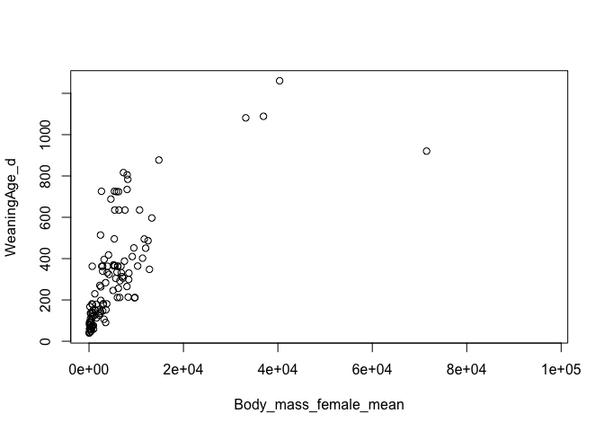

``` r
> model <- lm(data = d, WeaningAge_d ~ Body_mass_female_mean)
> summary(model)
```

    ## 
    ## Call:
    ## lm(formula = WeaningAge_d ~ Body_mass_female_mean, data = d)
    ## 
    ## Residuals:
    ##     Min      1Q  Median      3Q     Max 
    ## -720.39 -115.48  -54.05   58.11  471.22 
    ## 
    ## Coefficients:
    ##                        Estimate Std. Error t value Pr(>|t|)    
    ## (Intercept)           2.016e+02  2.012e+01   10.02   <2e-16 ***
    ## Body_mass_female_mean 2.013e-02  1.927e-03   10.44   <2e-16 ***
    ## ---
    ## Signif. codes:  0 '***' 0.001 '**' 0.01 '*' 0.05 '.' 0.1 ' ' 1
    ## 
    ## Residual standard error: 183.4 on 114 degrees of freedom
    ##   (97 observations deleted due to missingness)
    ## Multiple R-squared:  0.489,  Adjusted R-squared:  0.4845 
    ## F-statistic: 109.1 on 1 and 114 DF,  p-value: < 2.2e-16

``` r
> plot(model)
```

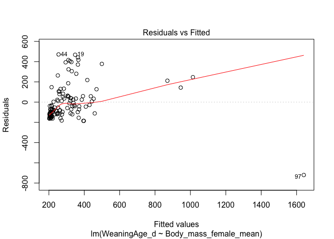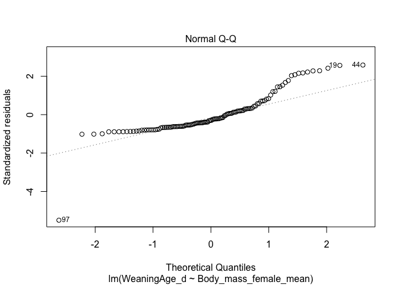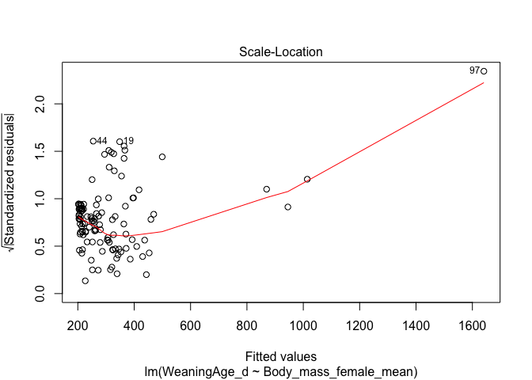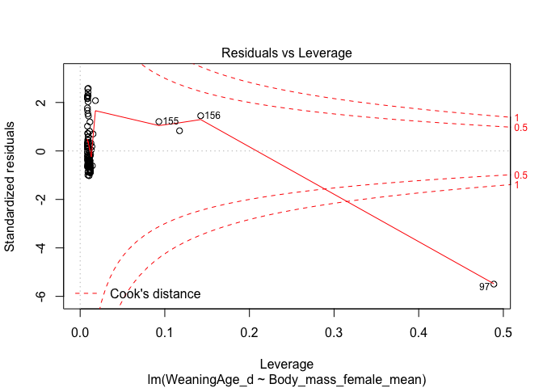

Data Transformations
--------------------

Return to the "Kamilar and Cooper"" dataset you were looking at above and log transform both of your variables and then run your linear model. Do you notice a difference?

``` r
> d$logWeaningAge <- log(d$WeaningAge_d)
> d$logFemaleBodyMass <- log(d$Body_mass_female_mean)
> plot(data = d, logWeaningAge ~ logFemaleBodyMass)
```

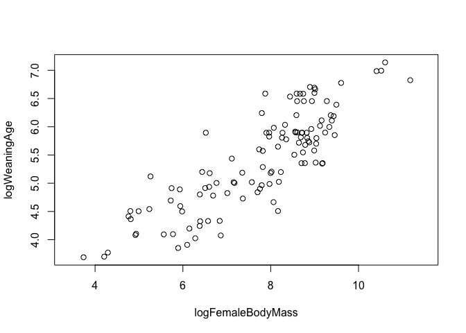

``` r
> model <- lm(data = d, logWeaningAge ~ logFemaleBodyMass)
> summary(model)
```

    ## 
    ## Call:
    ## lm(formula = logWeaningAge ~ logFemaleBodyMass, data = d)
    ## 
    ## Residuals:
    ##      Min       1Q   Median       3Q      Max 
    ## -1.10639 -0.32736  0.00848  0.32214  1.11010 
    ## 
    ## Coefficients:
    ##                   Estimate Std. Error t value Pr(>|t|)    
    ## (Intercept)         1.7590     0.2196   8.011 1.08e-12 ***
    ## logFemaleBodyMass   0.4721     0.0278  16.983  < 2e-16 ***
    ## ---
    ## Signif. codes:  0 '***' 0.001 '**' 0.01 '*' 0.05 '.' 0.1 ' ' 1
    ## 
    ## Residual standard error: 0.4532 on 114 degrees of freedom
    ##   (97 observations deleted due to missingness)
    ## Multiple R-squared:  0.7167, Adjusted R-squared:  0.7142 
    ## F-statistic: 288.4 on 1 and 114 DF,  p-value: < 2.2e-16

``` r
> plot(model)
```

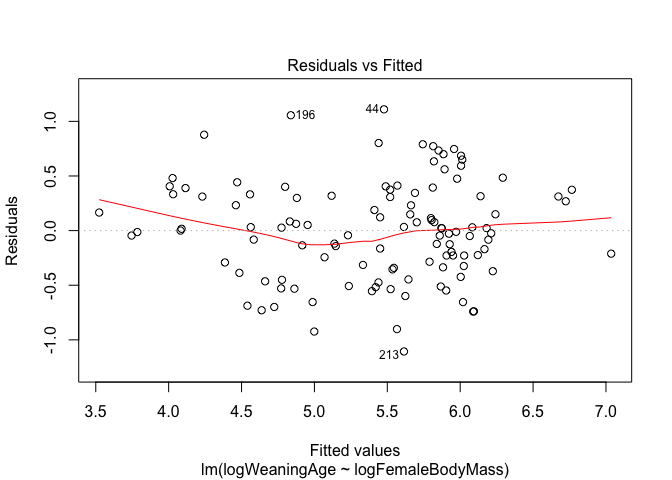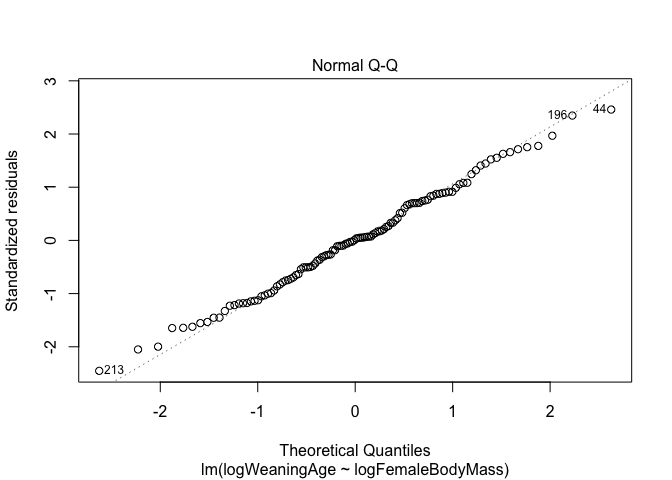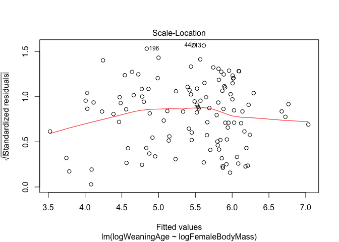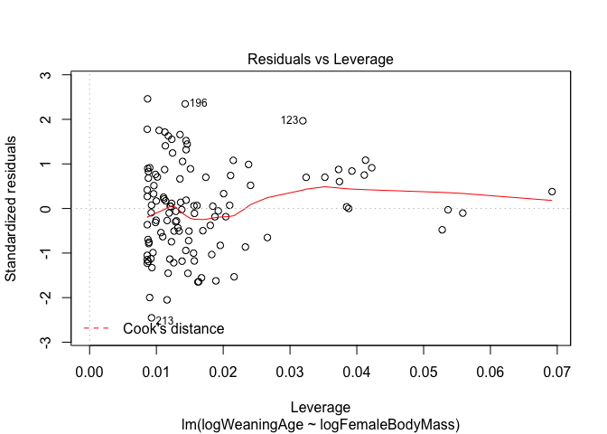

In many cases, the data we have are not normally distributed, but we can often apply some kind of mathematical transformation to our data to changes the distribution to more closely approximate the normal.

The logarithmic or "log" transformation which we used above (taking some log value of each data point) is often applied to positive numeric variables with heavy skew to dramatically reduce the overall range of the data and bring extreme observations closer to a measure of centrality. The logarithm for a number is the power to which you must raise a base value (e.g., *e*, for the natural log) in order to obtain that number.

The following chart shows some other common transformations.


